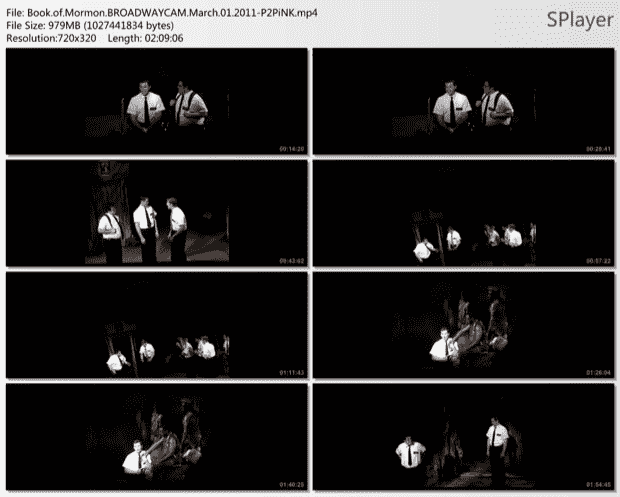

# 没有什么是神圣的吗？第一个百老汇凸轮表面 TechCrunch

> 原文：<https://web.archive.org/web/http://techcrunch.com/2011/07/11/is-nothing-sacred-first-broadway-cam-surfaces/>

# 没有什么是神圣的吗？第一百老汇凸轮曲面

看来《摩门经》是第一部受到流行盗版对待的百老汇音乐剧。截至昨天，有一个该节目的盗版版本在分享网站上流传，并附有如何改善观看体验的说明。

一名私酒贩子在 2011 年 3 月用摄像机拍摄了这场表演，因此给它起了个绰号叫 BROADWAYCAM 是盗版者偷偷拍摄的视频。具有讽刺意味的是，人们可以说，随着精通音频的盗录者录制和发行现场表演，盗录的兴起导致了感恩而死乐队和其他果酱乐队的复兴。然而，到目前为止，百老汇的节目还没有受到这种大规模盗窃的影响，尽管我怀疑下一个受到这种待遇的节目将会是《蜘蛛侠》音乐剧。

公平地说，*《摩门经》*是一场完美的盗版风暴。出处、炒作和创作者都使它成为极客集的必看之作，事实上门票已经售罄，在纽约的唯一演出将鼓励人们下载它。而我怀疑*猫*还是*妈妈咪呀！我很惊讶几年前巨蟒剧团的音乐剧没有作为一个摇摇欲坠的摄像头出现在网络上。*

