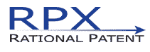
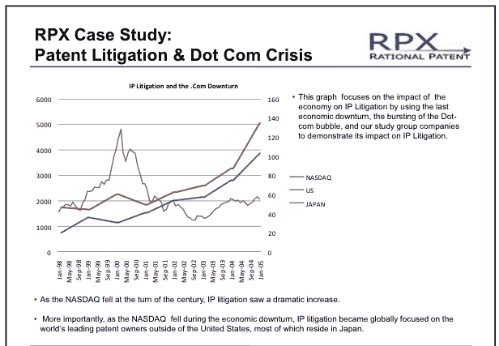
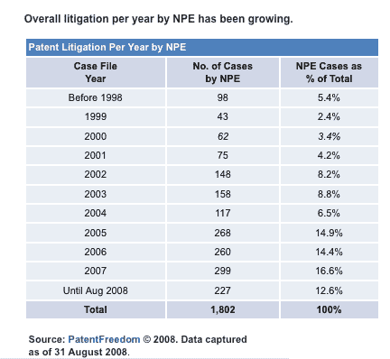

# RPX 的“防御性专利聚合”仅仅是另一种名称的专利勒索吗？

> 原文：<https://web.archive.org/web/https://techcrunch.com/2008/11/24/is-rpxs-defensive-patent-aggregation-simply-patent-extortion-by-another-name/>

专利诉讼变得如此糟糕，以至于一家新的创业公司 [RPX 公司](https://web.archive.org/web/20221003222349/http://www.rpxcorp.com/index.html)(又名 Rational Patent)正在准备帮助公司专门针对专利流氓(购买专利组合的组织，其明确意图是迫使其他公司许可这些专利或面临诉讼)进行辩护。RPX 将自己标榜为“防御性专利聚合者”它购买自己的专利，或者代表其成员达成许可协议，并向公司收取每年 3.5 万至 490 万美元的专利永久许可费。

换句话说，现在付钱，RPX 专利组合中的任何专利都不能用于对你公司的诉讼。RPX 显然不像某些更令人震惊的专利流氓，甚至不像内森·迈赫瓦尔德的[智力投资](https://web.archive.org/web/20221003222349/http://www.intellectualventures.com/)这样的专利基金那么糟糕。事实上，它承诺永远不会在针对公司的诉讼中使用其专利，而且显然存在对其服务的需求。(思科和 IBM 已经签约了)。最终，它的业务仍然归结为保护费。一个开明的，也许，但仍然是一个保护球拍。

RPX 已经投资 4000 万美元买下了近 200 项专利(其中 150 项已经发布)。它计划在头 12 个月内在专利上总共花费 1 亿美元。该公司去年 9 月从 Kleiner Perkins 和 Charles River Ventures 筹集了一笔未披露金额的资金，同时也有其他资金来源，包括债务和信用额度。

RPX 的模式借鉴了一点智力投资(首席执行官约翰·阿姆斯特来自那里)，但有所改变。阿姆斯特曾负责 intelligent Ventures 的专利收购，该公司收购价值数十亿美元的专利，然后让公司获得整个组合的许可。如果公司决定不合作，大规模专利诉讼的威胁就悬而未决。对于 RPX，阿姆斯特采取了一种更具防御性的模式。他这样向我解释两者的区别:

> 内森的模式是通过专利授权赚钱。我们不是一只基金，我们没有需要返回的资本，然后在此基础上产生利润。他们表示，可以根据投资组合的价值提高收费。
> 
> 在进攻型模式中，你必须先建立投资组合，然后才能让任何人付钱给你。我们的定价是基于服务价值的价格卡，而服务价值是基于贵公司的规模。我们保证价格卡不会改变，除了 CPI 的调整。

正如我已经提到的，那张“收费卡”一年可以高达 500 万美元。但是对于许多公司来说，仅仅是为了避免 RPX 投资组合中的 200 项(以及不断增长的专利)的诉讼风险，这可能是值得的。即使是 RPX 每年向初创公司收取的 3.5 万美元，也不足以抵御一项专利索赔。

此外，值得注意的是，由于 RPX 的防御模式，它实际上不必购买所有这些专利。有时，它会从专利持有者那里购买一个许可证，以保护其所有成员免受诉讼。因此，仅仅因为 RPX 不会起诉专利并不意味着原所有者不会。获得保护的唯一方法是付钱。

即使一家公司真的付清了，RPX 也只会保护他们免于与其专利相关的诉讼。阿姆斯特首先承认 RPX 提出了一个漫无目的的建议:

> *它像蚊子。你怎么知道你打的那只会蜇我？它不是疫苗，也不完美。*

RPX 真正提供的是一个知道如何玩专利游戏的团队，代表其成员购买专利权。顺便提一下，他们知道这是怎么玩的，因为他们曾经为另一方效力。专利流氓，在法律术语中被称为“非执业实体”(NPEs)，在所有专利诉讼中所占的比例越来越大——去年接近 17%，高于本世纪初的 3%。在经济低迷时期，知识产权诉讼总是会增加(见下图)。RPX 的人们正准备与他们曾经为之工作的专利巨魔作战。阿姆斯特解释了 RPX 的专利收购战略:

> *我们不仅仅关注专利覆盖的技术，同样重要的是今天谁拥有它们。如果他们正坐在某人的阁楼上，我们不需要唤醒沉睡的巨龙。我们会在公开市场上买东西，在那里我们认为它们最终会落入主张它们的人手中。*

向 RPX 支付保护费的唯一合理之处在于，它的收费低于所有其他专利流氓。

