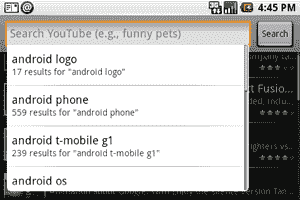

# 搜索是移动端最好的用户界面吗？

> 原文：<https://web.archive.org/web/https://techcrunch.com/2008/10/02/is-search-the-best-user-interface-for-mobile/>

# 搜索是移动端最好的用户界面吗？

谷歌发布了[更多关于](https://web.archive.org/web/20230307111336/http://googlemobile.blogspot.com/2008/10/google-on-android-search.html)如何将搜索整合到首款安卓手机 [T-Mobile G1](https://web.archive.org/web/20230307111336/https://techcrunch.com/2008/09/23/touching-the-android-its-no-iphone-but-its-close/) 中的信息，这款手机将于 10 月 22 日上市。

毫不奇怪，搜索功能遍布安卓系统，有一系列的查询方式(只需开始输入，点击用户界面上众多搜索按钮中的一个，或者按下 G1 专用的搜索键)。下拉建议也很容易获得，帮助您识别常见的 web 搜索查询或重用您最近运行的查询。

最重要的是，谷歌正在提供一个 API，开发者可以用它来“在他们的应用程序中实现基本的搜索能力——包括最近的查询建议”。开发商似乎希望让关键词搜索成为他们用户体验不可或缺的一部分，从而强化消费者心目中搜索为王的观念——不管是在手机上还是在其他地方。

但是关键词搜索真的是移动设备的最佳范例吗？在这么小的物体上打字是一件棘手且容易出错的事情，不管你是有真正的物理键盘还是塑料触摸屏。浏览和快速浏览 iPhone 普及的两种行为——需要更少的努力，并确保更高的精确度。不幸的是，它们是非常原始的行为，不能为设备提供太多数据。

看到谷歌或其他公司进行创新，将关键字搜索的强大功能与简单手指手势的可用性结合起来，将是一件非常有趣的事情。 [Swype](https://web.archive.org/web/20230307111336/http://www.swype.com/) ，一家[在 TechCrunch50 上推出](https://web.archive.org/web/20230307111336/https://techcrunch.com/2008/09/09/tc50-swype-truly-gesture-based-data-entry/)的公司，消除了“打字”时拿起手指的需要，是朝着正确方向迈出的一步。然而，它仍然没有动摇我们应该将单词和短语输入到我们的手持设备中以获得我们想要的结果的观念。

也许不可能看到谷歌把它的服务从键盘上解放出来，因为它们太需要输入了。尽管如此，创建一个可浏览的搜索引擎(用于网络、地图导航、电子邮件等)的实验还是很受欢迎的。

请看下面一位谷歌员工演示搜索目前在 Android 上是如何工作的。

【YouTube http://www.youtube.com/watch?v = zlxvqi 0 lrq 4 & color 1 = 0x B1 B1 b 1 & color 2 = 0x cfcfcf & HL = en & fs = 1]