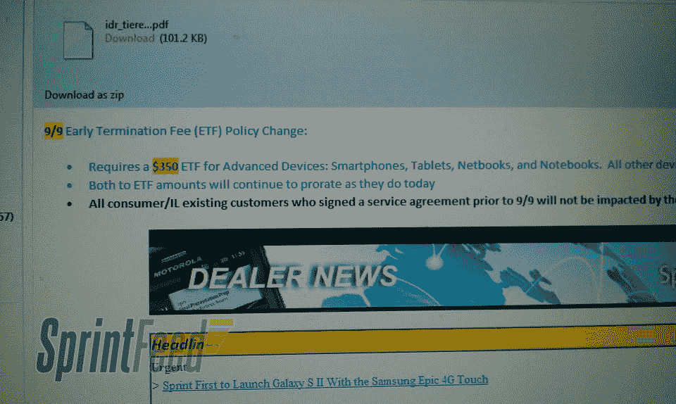

# Sprint 的提前终止费是跳到 350 美元了吗？(更新:已确认)

> 原文：<https://web.archive.org/web/http://techcrunch.com/2011/08/31/is-sprints-early-termination-fee-jumping-to-350/>

# Sprint 的提前终止费是跳到 350 美元了吗？(更新:已确认)

这整个两年合约和提前终止费的体系无疑是拥有和享受智能手机最糟糕的事情。诚然，合同降低了手机的实际价格相当多，但与一些全新的超级手机签约，几周后却有一些超级手机上市，这仍然非常令人恼火。如果合同本身还不够烦人，Sprint 决定将其提前终止费提高 150 美元。

多亏了 Sprint Feed 上的一双鹰眼，我们得以先睹为快，看到一些“交易商消息”，称 Sprint 目前 200 美元的 ETF 将变成 350 美元的 ETF。从 9 月 9 日开始，在任何智能手机、平板电脑、上网本和笔记本上毁约将导致你支付 350 美元。

【T2

这意味着如果你已经与 Sprint 签订了合同，并选择退出该合同，购买昨晚刚刚发布的 [Galaxy S II Epic 4G Touch](https://web.archive.org/web/20230205005830/https://techcrunch.com/2011/08/30/hands-on-samsungs-galaxy-s-ii-for-att-t-mobile-and-sprint/) ，你只需欠 Sprint 200 美元。但是，如果你正在考虑转向“现在网络”，你最好赶快行动。你只有一周多一点的时间把自己锁起来。

Sprint 一直将自己定位为仍能提供无限数据的运营商。在美国电话电报公司-T-Mobile 的合并提议之后，成为“为人民着想”的网络将对 Sprint 有很大帮助。但是，就连首席执行官丹·黑塞也说过[“没有什么是永远可以保证的。”](https://web.archive.org/web/20230205005830/http://www.brighthand.com/default.asp?newsID=17990&news=Sprint+Unlimited+Data)提前终止费的涨价是否预示着未来的发展？我们当然不希望如此，但只有时间能证明一切。

**更新:** Sprint 已经通过电子邮件与 [PhoneScoop](https://web.archive.org/web/20230205005830/http://www.phonescoop.com/articles/article.php?a=8746) 确认，事实上它将从 9 月 9 日开始将其 ETF 提高到 350 美元。以下是官方声明:

> 从 9 月 9 日开始，Sprint 为购买智能手机、平板电脑、笔记本电脑和上网本等高级设备的客户推出了新的 ETF 按比例分配政策。拥有这些高级设备的客户将获得 350 美元的 ETF，如果他们决定在服务协议到期前取消服务，将根据剩余月数按比例分配。