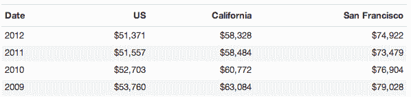
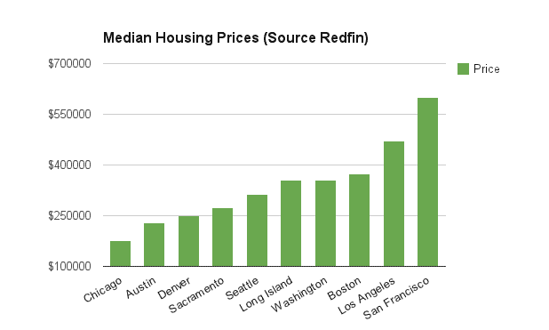

# 科技资金对旧金山的中产阶级有好处吗？经济学家的视角

> 原文：<https://web.archive.org/web/https://techcrunch.com/2014/02/15/is-tech-money-good-for-san-franciscos-middle-class-an-economists-perspective/>

旧金山湾区的自由仙境是全国财富最集中的地方之一。仅 Twitter 的首次公开募股就创造了大约 1600 名百万富翁。但是，当地居民有没有从 IPO 后的摇钱树上抓到任何一张美元钞票？

很难解读技术对普通旧金山人的更广泛影响，因为扣人心弦的轶事掩盖了故事。科技公司的批评者通过抗议谷歌的私人巴士，并间接将它们的存在与房屋拆迁的激增联系起来，成为头条新闻。“旧金山的街道上正在酝酿一场战争，”前旧金山市长威利布朗写道。

另一方面，科技冠军喜欢炫耀那些受益于将科技总部迁至该市历史悠久的市场区破败地区的小企业主。因此，为了减少精选的轶事，我问旧金山当地的经济学家他们的观点是什么，正如你所想象的，他们介于你有时在业内听到的技术乌托邦梦想和活动人士的可怕描述之间。

有一点是清楚的:他们相信流入旧金山的资金是一件好事，并且正在支撑当地的经济。

经济乐观主义中有一个“但是”,它大到需要两个飞机座位:飞涨的房租让许多当地人离开了这座城市。一些人设法将自己固定在租金控制的房产中，但许多人被强行驱逐出自己的家园。总的来说，技术资金已经建立了一个最坚固的经济庇护所，免受经济衰退的破坏，但那些受到打击的人，嗯，他们受到了沉重的打击。

**当地的乘数雨**

“我们的分析表明，自 2010 年以来，科技行业是旧金山经济增长的主要原因，”旧金山首席经济学家泰德·伊根说。“在 2010-2012 年，我们有完整数据的最近一年，当地通胀率为 2.6%，而所有工人的工资都增长了 4.5%。”大约 40，000 份新工作中的 2/3 不需要计算机科学学位或满满一柜子昂贵的运动鞋。

部分归功于科技行业，旧金山湾区的失业率(4.8%)在加州 58 个县中排名第三(T4)。这是什么原因呢？伯克利经济学家恩里科·莫雷蒂认为，技术专家与当地经济有着特殊的联系。

“只要旧金山的谷歌有软件工程师的职位空缺，对当地服务人员的需求就会增加，”他说。莫雷蒂说，平均而言，每一份技术工作在其他行业创造五个就业机会，而制造业只有两个。在某种程度上，因为技术工作工资更高，所以有更多的可支配收入花在女佣、律师和服装上。

“一定有人带来了财富，”莫雷蒂说。此外，与制造商的特殊需求不同，谷歌为其员工带来的所有发型师、洗车工和税务专家都是本地人。结果，旧金山人的工资增长速度是通货膨胀的两倍(工资增长 4.6%，通货膨胀 2.6%)。从人口普查数据来看，在经济衰退复苏期间，旧金山的表现比周边的加州邻居略好。“所以在科技行业之外，工人们受益于就业机会的增加和实际工资的上涨，”伊根总结道。

然而，不全是彩虹和阳光。我采访了一位当地服装店老板，他的故事是这座城市所有变化的缩影。这位不愿透露姓名的主人住在旧金山的巴伦西亚街(Valencia St ),这条超级时髦的街已经成为贫困的米申街(Mission St)和仅向东半个街区的米申街(Mission ST)的分界线。

随着价格超过 20 美元的别致餐馆开始涌入他的生意，它同样带来了新的客户，这些客户愿意为新形式的昂贵的湾区娱乐支付充足的娱乐预算。“燃烧的人，对我来说就像圣诞节，”他开玩笑说，指的是每年秋天在内华达沙漠举行的毒品友好艺术节，特别受谷歌员工的欢迎。

但是，他的长期固定客户被迫搬到海湾更便宜的地方。“我大多数顾客都开车走了，”他略带忧郁地说道。天价租金侵蚀了他的额外收入，也侵蚀了曾经光顾他商店的常客。

此外，这也是科技资金的快乐故事变得阴暗的地方:房价。

**为尚未入住的富人提供看家服务的房屋所有权**

技术专家们是[非零和世界](https://web.archive.org/web/20230405132325/http://politicalticker.blogs.cnn.com/2013/09/18/facebooks-zuckerberg-gives-himself-a-label/)的粉丝，但他们还没有发现一个可以在物理上扩展三藩市的应用，尽管有 [seasteading](https://web.archive.org/web/20230405132325/http://en.wikipedia.org/wiki/Seasteading) 。住房短缺导致了房租上涨的军备竞赛。

旧金山背负着全国最便宜的住房负担。只有 14%的房屋是中产阶级买得起的，两居室公寓的价格高于 3200 美元。据房地产网站 Redfin 报道，旧金山的房价是东部风城芝加哥的 3 倍多(17.7 万美元对 59.9 万美元)。对于旧金山的一些人来说，由于高昂的房价和房租，住房成本已经超过了工资上涨的速度。伊根说:“2012 年，平均租金(根据人口普查测算)增长了 7%以上，比大多数非科技行业的工资增长都要快。”

然而，“旧金山绝大多数出租单元都受到租金控制，因此自 2010 年以来没有搬出此类单元的工人，工资增长将远远快于租金增长。”

不幸的是，一些房东找到了驱逐长期居民的方法，由此引发的争斗使得科技行业成为了众矢之的。教会区的一位当地书店老板告诉我，租金上涨挑战了科技行业带来的一些好处。

“犯罪减少了，这很好；租金高得离谱，这非常非常糟糕，”他说。他说，如果没有租金控制，他将无法在目前的社区生活。

**我们需要经济适用房吗？**

市长呼吁为收入低于 72，947 美元[中位数收入](https://web.archive.org/web/20230405132325/http://quickfacts.census.gov/qfd/states/06/06075.html)(是的，这是 FML 三藩市的中位数收入)的苦苦挣扎的中产阶级家庭保留更多更便宜的单元。但是，不清楚需要多少，如果有的话，因为政府援助会导致官僚主义，而城市官僚主义往往会使事情缓慢到令人难以忍受的地步。

伯克利大学的经济学家恩里科·莫雷蒂告诉我，增加住房供应确实缓解了“各种收入阶层”的房租。他观察到，在西雅图大幅增加建设后，即使在就业繁荣超过旧金山的时期，租金上涨也有所放缓。

最重要的是，这种影响是线性的，也就是说每栋新房子都会影响其他房子的价格。我们建得越快，租金就越便宜，技术人员也不再与当地人争夺令人垂涎的租金控制单元。不幸的是，没有合理的经济模型让价格下降，86%的中等收入家庭已经买不起房子了。

**香港，加州**

我们热爱经济学家，但有时他们会忽略生活中无数的部分。旧金山有很长的限制住房的历史，以保持海湾古朴的维多利亚风格。“我们想让旧金山看起来像香港吗？”旧金山州立大学教授、前城市规划师贾斯珀·鲁宾问道。他说，该市从未真正试图量化需求，但将其描述为“等同于无限”

有足够的住房来容纳成千上万的技术工人和想成为企业家，旧金山将被重塑成一堵摩天大楼的墙。事实上，Firstcultural.com 的好人们模拟了如果南湾容纳了所有主要技术公司的员工，它的天空会是什么样子。有点香港的味道:

**感谢技术人员，但要帮助有需要的人**

对于大多数旧金山人来说，科技的存在为肆虐该国其他地区的衰退带来了喘息之机。但是，经济学家处理的是平均值；那些落在分配曲线左侧的人受制于资本主义俄罗斯轮盘赌游戏，他们的房子和社区任由富裕买家随心所欲。

我们不应该低估对科技行业的赞美，但我们也不应该忘记，如果没有他们的存在，旧金山的情况可能会更糟。

插图:布莱斯·德宾