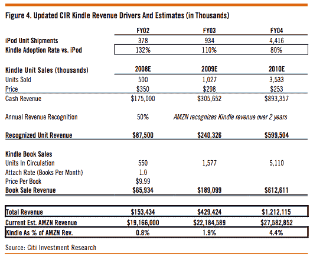

# Kindle 正在超越早期的 iPod 销售吗？

> 原文：<https://web.archive.org/web/https://techcrunch.com/2009/02/03/is-the-kindle-outpacing-early-ipod-sales/>

# Kindle 正在超越早期的 iPod 销售吗？

当 Kindle 在假期售罄时，我猜测亚马逊将在年底卖出 50 万本的电子书。我所做的只是将整个夏季售出的 240，000 辆车翻了一番。但现在花旗分析师马克·马哈尼利用更好的数据得出了同样的结论。

在今天的一份报告中，他引用了 Sprint 10 季度申报文件中的一些数字，表明第三季度有 21 万台设备被激活，第一和第二季度各有 10 万台。(每个 Kindle 都使用内置的 Sprint EVDO 天线无线下载书籍)。除了前三个季度的 410，000 个激活的 kindle，他估计亚马逊在 11 月中旬售罄之前总共出货了 500，000 个激活的 kindle。(奥普拉与此有关)。马哈尼认为，如果 Kindles 没有售罄，亚马逊在 2008 年可以卖出 75 万台。

但即使是 50 万台的估计也意味着，Kindle 在 iPod 上市的第一个整年里，销量超过了 iPod，当时它只卖出了 37.8 万台。这意味着，如果时光倒流，同时推出这两款产品，Kindle 的销量将比 iPod 高出 32%。马哈尼估计，2008 年总收入(设备加电子书销售额)达到 1.53 亿美元，但在 2010 年将增长近十倍，达到 12 亿美元。那是一个陡峭的斜坡。

好消息是亚马逊正准备在周一(T10)发布 Kindle 的第二个版本。下面是马哈尼的更新模型。

(狗狗照片由 [Nebbish1](https://web.archive.org/web/20221006024135/http://www.flickr.com/photos/81509206@N00/466440988/) )拍摄。

