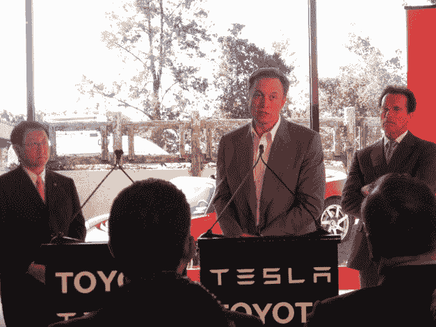

# 下一辆普锐斯会是特斯拉吗？

> 原文：<https://web.archive.org/web/https://techcrunch.com/2010/05/20/is-the-next-prius-going-to-be-a-tesla/>

# 下一辆普锐斯会是特斯拉吗？

丰田和[特斯拉](https://web.archive.org/web/20221006015844/http://www.teslamotors.com/)今天在特斯拉位于帕洛阿尔托的总部宣布了一项新的合作伙伴关系，这两家汽车制造商将在技术、新型电动汽车的开发方面进行合作，丰田将购买[特斯拉](https://web.archive.org/web/20221006015844/http://www.crunchbase.com/company/tesla-motors)5000 万美元的普通股(将在特斯拉即将上市后完成)。加利福尼亚州州长阿诺德·施瓦辛格、特斯拉首席执行官[埃隆·马斯克](https://web.archive.org/web/20221006015844/http://www.crunchbase.com/person/elon-musk)和 TMC 总裁丰田章男出席了新闻发布会。

施瓦辛格称之为加州的“爆发”(我认为他指的是积极意义上的，而不是终结者意义上的)，并将其视为加州环境议程和经济的胜利。他预计这将为该州陷入困境的经济创造 1000 个就业机会。

“丰田是一家以创新、质量和对可持续移动性的承诺为基础的公司。这是一种荣誉，也是对我们技术的有力认可，丰田将选择投资并与特斯拉合作，”马斯克在一份声明中说。"我们期待着学习和受益于丰田传奇的工程制造和生产专业知识."随着特斯拉转向更实惠的车型，两家汽车公司将在未来的电动汽车车型上进行合作。马斯克告诉我们，他希望在未来几年内(在丰田的帮助下)制造一款 3 万美元价位的汽车——相比之下，roadster 的零售价为 10 万美元以上。

值得注意的是，特斯拉[宣布](https://web.archive.org/web/20221006015844/http://www.teslamotors.com/media/press_room.php?id=2510)它将接管联合汽车制造公司(NUMMI)在弗里蒙特的新工厂，并预计从 2012 年开始在那里生产 Model S 电动车。NUMMI，以前是丰田和通用的合资企业，于 4 月份关闭，导致 4700 个工作岗位被取消。人们希望，一旦 Model S 的产量真正增加，特斯拉将从该工厂生产 2 万辆电动汽车(马斯克预测，从生产开始到达到这一水平，大约需要 12 个月)。该公司目前每月增加 50 名员工，以跟上未来几个月可能加速的扩张步伐。他表示，未来几年，预计特斯拉的员工人数将增长至 2000 人，其中大约一半在 NUMMI 工作，这是合理的。

据[报道](https://web.archive.org/web/20221006015844/http://www.sfgate.com/cgi-bin/article.cgi?f=/c/a/2010/05/20/BA8E1DI074.DTL&loc=interstitialskip)，今天早些时候，施瓦辛格出人意料地宣布(在山景城的另一场谷歌活动上)丰田正与特斯拉合作在加州生产电动汽车。这个可能是意外的宣布让特斯拉在太平洋时间下午 5 点的新闻发布会少了一些风头。

对丰田来说，这是一个讨好加州和更大的美国市场的机会，对特斯拉来说，汽车制造商获得丰田的技术和资源，帮助它从一个高度小众的参与者转变为国内汽车市场上更强大的力量。言简意赅:特斯拉想更像丰田，丰田也想更像特斯拉。马斯克表示，这种合作关系是大约六周前与丰田章男的一次会议的结果。马斯克让丰田章男试驾一辆特斯拉，丰田章男急切地接受了他的提议——马斯克对这位高管大胆的驾驶技术印象深刻(“他像驾驶一辆真正的跑车一样驾驶它”)，丰田章男对这辆车印象深刻。

当然，这不是特斯拉第一次与大型汽车制造商合作。据报道，去年，该公司与戴姆勒签署了一项协议，以大约 5，000 万美元的价格向戴姆勒提供 10%的股份和技术。马斯克表示，戴姆勒一直支持这项新交易，此前也承认特斯拉可以使用另一个大合作伙伴。

特斯拉在吸引资本方面没有遇到太多[的麻烦](https://web.archive.org/web/20221006015844/https://beta.techcrunch.com/2010/01/29/teslas-100m-ipo-losses-expected-until-at-least-2012-musk-taking-1-a-year/)，投资者包括谷歌的谢尔盖·布林、拉里·佩奇、Capricorn Management、Compass Technology、摩根大通——名单真的很长。就连美国能源部去年也拒绝了给特斯拉 4.65 亿美元的低息贷款。吸引资金是一回事，特斯拉真正的竞争是建立在这个基础上的。该公司几乎每个季度都录得净亏损——投资者应该预计会进一步亏损，直到特斯拉真正增加其更实惠的 Model S 轿车的生产和交付。