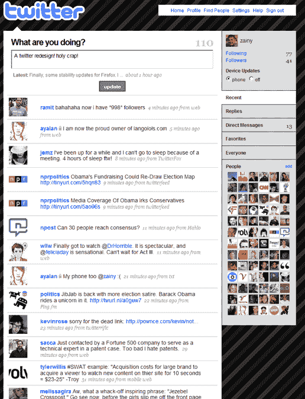
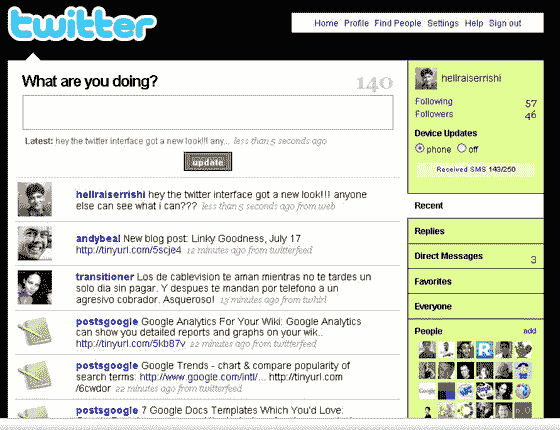

# Twitter 测试新设计 

> 原文：<https://web.archive.org/web/https://techcrunch.com/2008/07/17/is-twitter-bucket-testing-a-new-design/>

# Twitter 测试新设计

一些 [Twitter](https://web.archive.org/web/20221208222207/http://www.twitter.com/) 用户[今天在使用微博服务时遇到了](https://web.archive.org/web/20221208222207/http://search.twitter.com/search?q=twitter+redesign)一个新的设计……只是在他们刷新后才看到它消失了。

下面是 Zain Memon 在离开之前抓拍的截图。像“最近”、“回复”和“每个人”这样的标签被移到了右边的栏中。

总的来说，没什么大不了的。来自 SheGeeks [的姜维提出了](https://web.archive.org/web/20221208222207/http://shegeeks.net/twitters-new-redesign/)一些最明显的变化:

> 选项卡现在位于屏幕的右侧
> 
> 您可以看到您的直接消息数量(不确定之前是否有)
> 
> 时间戳和“从”戳用斜体表示
> 
> 最新推文已被推送到“消息框”下
> 
> 现在，当您将鼠标悬停在邮件上时，会显示回复和收藏的快捷方式
> 
> 如果有人通过文本发送消息，txt 链接会把你带到官方的 Twitter 命令页面
> 
> 之前的更新对 Twhirl、Twitterrific 和 Twittelator 也做了同样的事情。这意味着它会把你带到他们各自的主页
> 
> 搜索框也动了(感谢 Orli！)

有一件事明显不包括在新设计中:广告，就像你将在日本推特上看到的那样。

**更新:**另有来自
的评论: