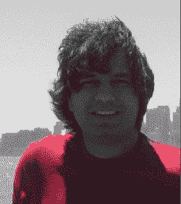

# Twitter 正在变成 MySpace 吗？

> 原文：<https://web.archive.org/web/https://techcrunch.com/2009/04/01/is-twitter-turning-into-myspace/>

# Twitter 正在变成 MySpace 吗？

***编者按**:以下客座博文由 Mrinal Desai 撰写，他是 LinkedIn 的早期员工，之后与人联合创办了由 El Dorado 和 Venrock 投资的初创公司 [CrossLoop](https://web.archive.org/web/20221005182144/http://www.crossloop.com/) 。你可以在推特上关注他。*

我尝试和测试了许多社交服务，自 2003 年以来，只有三个代表我——LinkedIn、脸书和 Twitter。MySpace 是我尝试过的一项服务，但它对我个人没有吸引力，原因只有一个——我想与真实的人联系，我没有在 MySpace 上“看到”他们。

我在 2007 年初开始使用 Twitter，它给了我在离线世界中所珍惜的东西——与分享我价值观的真实的人联系并向他们学习的能力。这也让我有机会接触那些我可能永远无法与之交谈的人。通过 Twitter，我与史蒂夫·凯斯和克雷格纽马克等人进行了交谈。我了解新的服务和工具，在新闻发生时阅读新闻，当比我聪明的人真正回答了“我的愚蠢问题”时，我立即感到满足。尽管我家里和办公室周围的人最初都持怀疑态度，但我非常喜欢 Twitter，也注意到它正在从脸书和谷歌阅读器等其他服务中“偷走”我。

然而，现在我开始质疑 Twitter 是否正在变成 MySpace。以下是我脑海中的五条平行线:

关注者之间的竞争[类似于在 Myspace 上收集“朋友”
在 Twitter 和 MySpace 上匿名是正常的，不像脸书
虚假的个人资料正在激增
真实的名人个人资料也在激增，但他们通常由其他人出于营销目的维护，l](https://web.archive.org/web/20221005182144/http://www.beta.techcrunch.com/2009/03/12/how-much-is-a-suggested-slot-on-twitter-worth-jason-calacanis-offers-250000/) [导致垃圾信息](https://web.archive.org/web/20221005182144/http://blogs.wsj.com/digits/2009/03/24/guy-kawasaki-can-handle-being-called-a-spammer/)
最后，一个最明显的视觉服务，如 Twitback、Twitback 和 Twitterimage 可以帮助您定制您的个人资料。你可以对比一下布兰妮·斯皮尔斯分别在 Twitter、MySpace 和脸书上的简介(见下图)

最近,《纽约时报》[揭露了](https://web.archive.org/web/20221005182144/http://www.nytimes.com/2009/03/27/technology/internet/27twitter.html?_r=2)的代笔人，比如安妮·科尔伯特为[盖伊·川崎](https://web.archive.org/web/20221005182144/http://twitter.com/guykawasaki)发微博，劳伦·科萨克有时为[布兰妮](https://web.archive.org/web/20221005182144/http://twitter.com/britneyspears)发微博，克里斯·罗梅罗为[50 美分发微博。](https://web.archive.org/web/20221005182144/http://twitter.com/50cent)

此外，假账正在浮出水面。Twitter 最近暂停(然后恢复，然后再次暂停)了一个似乎属于演员克里斯托弗·沃肯的账户，这让埃里克和他的 90，000 名粉丝感到沮丧。但它是由一个模仿者创建和维护的。另一方面，你有[蒂娜·菲](https://web.archive.org/web/20221005182144/http://twitter.com/tinafey)，她在推特上公开[承认](https://web.archive.org/web/20221005182144/http://nymag.com/daily/entertainment/2009/02/vulture_exclusive_tina_fey_res.html)不是她，但她的假账户目前有超过 216，000 名粉丝。最后，还有许多有问题的账户，像[奥普拉的账户，](https://web.archive.org/web/20221005182144/http://twitter.com/oprah)她有 9390 名粉丝，却没有一条推特——可能是因为她正在努力创建她的脸书粉丝页面[现在已经有超过 42 万粉丝了。最后，如果你真的很好奇，想知道从阿拉斯加是否真的能看到俄国，你可以@回复莎拉·佩林](https://web.archive.org/web/20221005182144/http://www.facebook.com/oprahwinfreyshow)[这里](https://web.archive.org/web/20221005182144/http://twitter.com/FakeSarahPalin)、[这里](https://web.archive.org/web/20221005182144/http://twitter.com/Sarah_Palin)或者[这里](https://web.archive.org/web/20221005182144/http://twitter.com/SarahPalin)。(只是不要指望真的达成真正的交易)。

所有这些虚假的个人资料让我想起了茱莉亚·安格温最近在*华尔街日报*、[的作品《把你最好的面孔展现出来》。](https://web.archive.org/web/20221005182144/http://online.wsj.com/article/SB123819495915561237.html)她指出，MySpace 是从否认匿名的 Friendster 的“Fakester 革命”中发展而来的。MySpace 成了那些希望匿名的人的乐土——这是有意为之的(双关语)。MySpace 是关于收集朋友的——像禁忌和提拉·特基拉这样的用户聚集了成千上万的朋友

MySpace 的所作所为是对 Friendster 的竞争优势。Twitter 并不一定想要选择朝这个方向发展——毕竟，它正在暂停虚假账户，并且[正在取消](https://web.archive.org/web/20221005182144/http://www.beta.techcrunch.com/2009/03/31/twitter-to-kill-off-the-auto-follow/)自我推销者青睐的自动关注功能。正如伊万·威廉姆斯[坦率地承认](https://web.archive.org/web/20221005182144/http://www.ted.com/index.php/talks/evan_williams_on_listening_to_twitter_users.html)的那样，我们在 Twitter 上看到的许多不同类型的活动不一定是设计好的——它是由意想不到的用途驱动的。也许个人资料上闪闪发光的东西、虚假账户或代笔人是意想不到的，但有时认识到用户并不总是知道他们想要什么也很重要。我同意马天如·l 的观点，坚持自己的愿景并挑战极限是你成为赢家的关键。

MySpace 有效地利用了 Friendster 的技术问题，但迄今为止，每当 Twitter 出现问题时，还没有人能做到这一点。我认为他们不会。Twitter 的致命弱点不是技术，而是体验(网站本身和其他用户)。

Twitter 想变得更像 MySpace 吗？MySpace 正在进行清理，以变得更像脸书，后者也想变得像 Twitter 一样。这三个人会在哪里相遇——打雷、闪电还是下雨？

