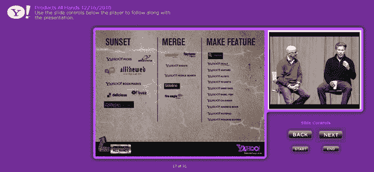
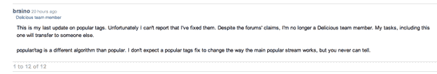

# 雅虎是在关闭 Del.icio.us 吗？【更新:Del.icio.us 回应】| TechCrunch

> 原文：<https://web.archive.org/web/https://techcrunch.com/2010/12/16/is-yahoo-shutting-down-del-icio-us/>

# 雅虎是在关闭 Del.icio.us 吗？【更新:Del.icio.us 回应】

几天来，我们一直听到谣言说[雅虎裁员](https://web.archive.org/web/20230327065254/https://techcrunch.com/2010/12/14/yahoo-confirms-layoffs/)包括整个 Delicious 团队。现在，前雅虎员工、即将成为创始人的安迪·拜奥在推特上发布了上面的雅虎！产品团队会议幻灯片似乎表明，雅虎！正在关闭或合并社会书签服务以及即将到来的，火鹰，MyBlogLog 和其他。

在某种奇怪的[创始人声援](https://web.archive.org/web/20230327065254/http://venturebeat.com/2010/12/16/yahoo-sunset-delicious/)中，这张幻灯片最初是由 MyBlogLog 创始人埃里克·马库利耶[发布在 Twitter](https://web.archive.org/web/20230327065254/http://twitter.com/#!/bpm140/status/15473591558602752) 上的。

列在不祥的“夕阳”下的有:Delicious，Altavista，MyBlogLog，Yahoo！书签，雅虎！选择

在“合并”下面是:即将到来的，FoxyTunes，sideness，FireEagle，雅虎事件和雅虎人物搜索。

看起来像雅虎交易和雅虎日历等各种各样的雅虎属性也将被制作成特色。

自从被雅虎收购后，Delicious、MyBlogLog 和 Upcoming 就被忽视了，创始人约书亚·沙赫特(Joshua Schachter)、马库利耶(Marcoullier)和拜奥都去做其他(更成功的)事情了。也许这是美味消失的一个信号？支持论坛现在[充斥着垃圾邮件](https://web.archive.org/web/20230327065254/http://support.delicious.com/forum/index.php)和团队签收邮件，比如下面的[。](https://web.archive.org/web/20230327065254/http://support.delicious.com/forum/comments.php?DiscussionID=5605&page=1#Item_12)

我已经给雅虎发了电子邮件询问更多的信息和验证，当我得到回复时，我会更新这篇文章。

**更新:** AllThingsD 的 Liz Gannes 报道说[雅虎产品事实上将被关闭](https://web.archive.org/web/20230327065254/http://networkeffect.allthingsd.com/20101216/following-layoffs-yahoo-cuts-products-mybloglog-delicious-yahoo-buzz/)并且幻灯片事实上源于昨天裁员后雅虎的全体会议。雅虎产品经理布莱克·埃文威胁要解雇泄露幻灯片的人。

雅虎的官方回应是:

*“我们组织精简的一部分包括削减对表现不佳或偏离战略的产品的投资，以便更好地专注于我们的核心优势，并在明年及以后资助新的创新。*

我们不断评估和优化我们的产品和服务组合，并计划在未来几个月关闭一些产品，如雅虎！Buzz、我们的流量 API 等。我们会在适当的时候传达具体的计划。"

对于你们中少数不知道这是公关发言，*“我们确认。”*

**更新 2:** 美味刚刚在[其博客](https://web.archive.org/web/20230327065254/http://blog.delicious.com/blog/2010/12/whats-next-for-delicious.html)上发布了以下[“美味的下一步是什么”](https://web.archive.org/web/20230327065254/http://blog.delicious.com/blog/2010/12/whats-next-for-delicious.html):

> ***“不，我们没有关停美味。虽然我们已经确定雅虎没有战略上的契合点。，我们相信 Delicious 在公司之外有一个理想的家，在那里它可以获得具有竞争力的资源。”***

 **今天早上，雅虎似乎已经下定决心，它将出售资产，而不是关闭资产。**