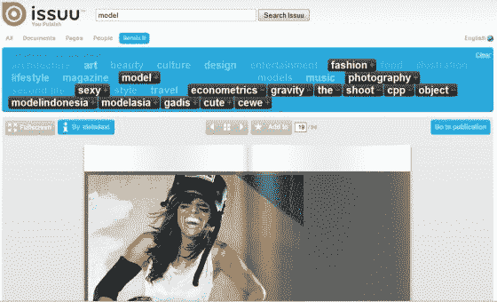

# Issuu 获得 500 万美元注资，增加功能和高级版本 TechCrunch

> 原文：<https://web.archive.org/web/http://techcrunch.com/2008/10/28/issuu-gets-5-million-infusion-adds-features-and-premium-version/>

# Issuu 获得 500 万美元注入，增加功能和高级版本

 [Issuu](https://web.archive.org/web/20230202235204/http://issuu.com/) 刚刚[宣布](https://web.archive.org/web/20230202235204/http://issuu.com/press/docs/2008-10-us)已经从 [Sunstone Capital](https://web.archive.org/web/20230202235204/http://www.sunstonecapital.com/) 获得了 500 万美元的 B 轮投资，后者在 2007 年初已经提供了 125 万美元的 A 轮融资。这家总部位于丹麦哥本哈根的初创公司还为其现有产品添加了一系列新功能，并为专业出版商推出了一个高级版本。

当我们第一次遇到 Issuu 时，它将上传的文件免费转化为交互式在线出版物，我们说这是同类服务中第一个[不差](https://web.archive.org/web/20230202235204/http://techcrunch.com/2008/02/06/finally-a-web-based-pdf-viewer-that-does-not-suck-issuu/)的服务。除了资金公告之外，该公司还将发布一项重大产品更新。

Issuu 极大地改进了搜索功能，使其更快、更吸引人、更容易过滤搜索结果。他们称之为“基于搜索的混合”的功能也很不错:这是一种将个人搜索结果显示为定制杂志的方式，结合上下文标签云来帮助调整结果。它从所有公开发行的文档中创建一个定制的动态数字杂志。[用这个搜索“汽车”的例子来试试](https://web.archive.org/web/20230202235204/http://issuu.com/search?q=car&ot=car,auto,magazine&nt=music,entertainment,carmusicproject,billmilbrodt,hacks,mod&mot=car,auto,magazine&lan=en&dsp=remix&num=10&st=document,page,user)其他值得注意的改进包括管理文档“库”的更简单方式，具有更多分析报告的新统计应用程序，支持更多文档格式，批量上传功能，以及使文档可以下载并伴有音乐的方式。

该公司最近还宣布了一个开发平台，被恰当地命名为 [Issuu Platform](https://web.archive.org/web/20230202235204/http://groups.google.com/group/issuu-platform?pli=1) ，它记录了出版商如何使用他们的标记语言定制浏览器应用程序。到目前为止，该平台还具有一个搜索 API，使开发人员能够使用 REST 请求和 XML 或 JSON 响应来搜索 Issuu 的数据库，以及一个用于其查看器产品的 API，使发布查看器能够使用 JavaScript 方法调用和事件从主机网页中进行控制。

最后但同样重要的是:该公司已经采取了一个明显的举措，为他们的服务增加了一个收入模式。从今天开始， [Issuu Pro](https://web.archive.org/web/20230202235204/http://issuu.com/business) 为专业出版商提供了一种将他们的杂志和报纸带到互联网上的方式，并通过各种数字功能和定制观看体验的能力来增强它们。出版物是无广告的(意味着在 Issuu 的 viewer 中没有广告——杂志或文件本身的任何广告都会保留),出版商只在他们的内容被查看时收费，定价从每 1000 次出版物查看 1.10 美元到 19 美元不等。还有一个新的[经销商计划](https://web.archive.org/web/20230202235204/http://issuu.com/business/reseller)，专为广告/网络代理、印刷店和媒体公司量身定制。

Issuu 有不少竞争对手试图成为“文档的 YouTube”，包括 [Scribd](https://web.archive.org/web/20230202235204/http://scribd.com/) 、 [Docstoc](https://web.archive.org/web/20230202235204/http://www.docstoc.com/) 和 [Calaméo](https://web.archive.org/web/20230202235204/http://calameo.com/) 。他们现在有额外的 500 万美元来争夺冠军，发布的更新已经使它成为一个严重的竞争者。尽管在这场斗争中，它可能会更好地坚持自己擅长的高调利基。

观看下面的视频，了解 Issuu 的概况。

[http://vimeo.com/moogaloop.swf?clip_id=2035231&server = vimeo . com&show _ title = 1&show _ byline = 1&show _ portrait = 0&color = 00 adef&full screen = 1](https://web.archive.org/web/20230202235204/http://vimeo.com/moogaloop.swf?clip_id=2035231&server=vimeo.com&show_title=1&show_byline=1&show_portrait=0&color=00ADEF&fullscreen=1)

