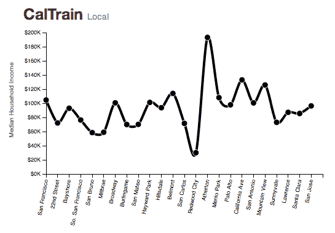
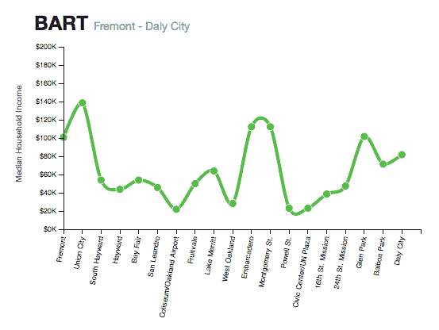
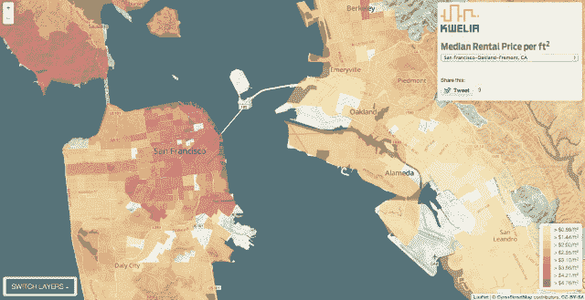

# 不一定非要这样

> 原文：<https://web.archive.org/web/https://techcrunch.com/2014/01/24/it-doesnt-have-to-be-this-way/>

在旧金山的科技行业里，有一个关于我们的故事被广为流传——我们有资格，或者我们被遗忘了。我不相信那是真的。或者我不相信这是真的。

我担心，如果我们不尽快进行一次民间讨论，局势将会变得暴力或不可收拾。我们已经看到了

[rocks smash windows](https://web.archive.org/web/20230404225716/http://blogs.kqed.org/newsfix/2013/12/20/eviction-protesters-oakland-san-francisco-target-silicon-valley-buses)

。现在，有了

[unidentified protesters stalking and harassing individual Google employees](https://web.archive.org/web/20230404225716/http://arstechnica.com/business/2014/01/protestors-show-up-at-the-doorstep-of-google-self-driving-car-engineer/)

在他们的家里。

过去几个月的巴士抗议是旧金山长期住房短缺的一个症状，随着过去十年有 75，000 人搬到这里，这一问题在 T2 变得尤为明显。[供应跟不上城市的增长](https://web.archive.org/web/20230404225716/http://www.spur.org/publications/article/2012-12-18/san-francisco-boom-back)；在过去的二十年里，旧金山平均每年增加 1500 套住房。

这是一个教科书式的供求问题，无论谷歌巴士与否，我们都无法回避。除此之外，还有另一个政策选择的迷宫，会带来意想不到的后果，比如第 13 号提案、租金控制、埃利斯法案以及对旧金山许可程序有影响力的人对缓慢增长的态度。巴士抗议是被误导的，因为让巴士离开道路将增加交通流量，而且它不会逆转像 Square、Twitter、Airbnb 和 Dropbox 这样决定保持增长的公司的潮流。

但是他们做了一件好事:他们把住房推到了市长议程的最前沿。上周五，市长李爱德提出了一个七点住房计划，这是他的城市演讲的核心内容，并宣布计划在未来六年内提供 30，000 套新的或修复的单元。这还不够，但这是一个开始。

这不是新的冲突。湾区有两个非常强大的社会正义和技术解决方案主义的历史遗产。他们似乎比以往任何时候都更容易陷入战争，但在这个地方，贪婪和理想主义总是以一种奇特、有时甚至是强大的方式共存。这种强有力的结合创造了今天庆祝其 30 岁生日的 Mac，并将智能手机上的世界知识放入我们的口袋。

最近，科技行业已经成为愤怒的焦点，因为在我们这个行业的[“改变世界”](https://web.archive.org/web/20230404225716/http://www.newyorker.com/reporting/2013/05/27/130527fa_fact_packer)语言和我们自己后院非常真实且不断加剧的不平等之间存在着如此不和谐的脱节。

此外，在 2008 年主流媒体中，科技行业的工人[越来越被视为银行家。考虑到我认识的许多人来到这里是因为他们想解决艰难的技术问题并产生有意义的影响，这很奇怪。](https://web.archive.org/web/20230404225716/http://www.economist.com/news/21588893-tech-elite-will-join-bankers-and-oilmen-public-demonology-predicts-adrian-wooldridge-coming)

我还在研究能做些什么，所以这是一项正在进行的工作。*每个人都要做出一点让步。*

**服务是公司文化的一部分**

不知何故，在硅谷的某个地方，在我祖父那一代和我这一代之间，我们流行的说法从“服务”变成了“改变世界”。两者差距很大。“服务”这个词是对周围人的恭敬和感同身受，“改变世界”是个人主义的，充满了狂妄。我们必须记住，不管有没有我们，世界都会改变。这是它的本性。

因此，我们必须回到一个简单、谦逊的地方，倾听与我们共享这座城市的人们的声音。也许我们最终会开发出不止“[定制设计、独一无二、定制的](https://web.archive.org/web/20230404225716/http://www.vanityfair.com/culture/my-phone/2013/03/dave-morin-path-facebook-apple)应用程序来与我们的个人助理交流。

这里有一个例子: [Zendesk](https://web.archive.org/web/20230404225716/http://www.zendesk.com/) ，一家总部位于旧金山的 IPO 候选公司[最初成立于丹麦，在 Tenderloin 经营着“黄金标准”的社区福利项目。](https://web.archive.org/web/20230404225716/http://online.wsj.com/news/articles/SB10001424052702304149404579322783123034914)

这是德尔·西摩的说法，他曾经是一名吸毒者，现在是该市无家可归者协调委员会的成员，负责带领 Zendesk 的新员工参观，这样他们就可以了解他们工作所在社区的历史。

Seymour 带着 Zendesk 的员工去圣安东尼教堂和[古比奥项目](https://web.archive.org/web/20230404225716/http://thegubbioproject.org/)等地方，在那里，每天都有数百名无家可归的人在 Tenderloin 的圣博尼法斯教堂的长椅上休息。他指出，在他流浪街头的六年里，他曾经睡在一个旧冰箱的箱子里，当时他在担任该市的护理人员和消防员后开始吸毒。

“我从来没有想过我会在那里结束，”他在圣博尼法斯门前告诉一群 Zendesk 员工。

[vimeo 43730340 w=500 h=281]

[城市曝光:游览田德隆](https://web.archive.org/web/20230404225716/http://vimeo.com/43730340)从[三藩市纪事报](https://web.archive.org/web/20230404225716/http://vimeo.com/sfchronicle)上 [Vimeo](https://web.archive.org/web/20230404225716/https://vimeo.com/) 。

Zendesk 的员工去年做了大约 1400 个小时的社区服务，从在施粥场服务到在 Tenderloin 技术实验室辅导，再到为附近的孩子举办技术营。他们是唯一一家从城市获得工资税减免的科技公司，他们的社区福利项目获得了公民咨询委员会的批准。其他的，包括 Twitter，Yammer 和 One Kings Lane，都在这个月否决了他们的计划。(所有享受工资税减免的中端市场公司都必须建立社区福利协议。)

社区服务实际上已经成为该公司的一个关键招聘策略，该项目的创始人蒂芙尼·阿普辛斯基说，她在加入 Zendesk 之前在《旧金山观察家报》做了四年的记者。

“其他创业公司做这些事情是为了建立一种文化。他们带来了乒乓球桌。他们有快乐的时光，”她说。“但我们让自己与众不同的做法是我们的社会责任。我们希望避免象牙塔综合症。”

Apczynski 也知道，即使豪华公寓建筑在 Twitter 总部周围的市场街上拔地而起，里脊肉[也不会以传统的方式贵族化。它不能。](https://web.archive.org/web/20230404225716/http://www.modernluxury.com/san-francisco/story/arise-tenderloin)它的单间住宿酒店受城市法律保护，其历史上的非营利组织 Glide 和 St. Anthony's 在政治上很有影响力。

> 其他创业公司做这些事情是为了建立一种文化。他们带来了乒乓球桌。他们有快乐的时光。但是我们所做的使自己与众不同是我们的社会责任。

“通常，中产阶级化会朝着一个方向摇摆。但我觉得田德隆将成为如何建立一个真正的混合社区的典范，”她说。“旧金山是一座充满同情心的城市。我们为自己能够接纳所有人而自豪，无论他们的条件如何。”

我想澄清的是，我不是在宣扬某种[、【白人技术人员的负担】、](https://web.archive.org/web/20230404225716/http://en.wikipedia.org/wiki/The_White_Man's_Burden)或应用程序或大学或研究生院毕业的程序员可以神奇地解决棘手问题的概念，比如困扰我们城市许多长期无家可归者的药物滥用和精神疾病。

但最起码，这只是关于同理心和理解他人的想法。这是关于承认不断扩大的收入不平等和媒体碎片化已经把我们带到了一个我们可以生活在同一条街上，但却居住在完全不同的世界的地方。

上周和西摩在田德隆散步时，我问他认为旧金山科技行业的人能做些什么。他指着街上的一群青少年，他们每天从东湾来到第六街和市场的拐角处卖毒品。

“[教他们如何编码](https://web.archive.org/web/20230404225716/http://journeymancourse.com/background-story/)，”他说。“他们和街对面那栋漂亮大楼里的人的唯一区别是，他们知道如何编码。”

答案并不容易。它们是时间和资源密集型的，而且它们必须克服许多从一开始就存在于系统中的不平等。

但是可能性也很酷。我的意思是，由 YCombinator 支持、总部位于旧金山的 Crowdtilt 运营着一个*怪异的众筹平台*，他们[上个月刚刚从 Andreessen Horowitz 那里筹集了 2300 万美元](https://web.archive.org/web/20230404225716/https://techcrunch.com/2013/12/16/crowdtilt-raises-another-23-million-from-andreessen-horowitz-others-for-international-expansion-enterprise-tools/)。他们的平台已经为[奥克兰市长竞选](https://web.archive.org/web/20230404225716/https://www.crowdtilt.com/campaigns/tilting-oakland-forward)、被简易爆炸装置伤害的[三重截肢者](https://web.archive.org/web/20230404225716/https://www.crowdtilt.com/campaigns/donations-for-captain-edward-wesley-klein/description)和[派遣牙买加雪橇队参加索契冬奥会](https://web.archive.org/web/20230404225716/https://www.crowdtilt.com/campaigns/help-the-jamaican-bobsled-team-get-to-sochi)筹集了资金。想象一下，如果当地非营利组织知道如何更好地驾驭它。

**全行业员工更广泛的捐赠**

我们希望我们的首席执行官和亿万富翁们能有所贡献。科技行业有着悠久的慈善传统，如威廉和弗洛拉·休利特基金会以及比尔和梅林达·盖茨基金会。马克·扎克伯格和他的妻子陈慧娴最近也向硅谷社区基金会捐赠了近 10 亿美元，这是去年最大的一笔捐款。本周早些时候，扎克伯格捐赠了 500 万美元用于建设一个新的东帕洛阿尔托医疗诊所。然后，脸书联合创始人、世界上最年轻的亿万富翁达斯汀·莫斯科维茨[对他如何看待他突如其来的财富和责任有了这个可爱的解释。](https://web.archive.org/web/20230404225716/http://www.quora.com/Dustin-Moskovitz-1/How-does-Dustin-Moskovitz-feel-about-being-a-billionaire)

但在普通员工中，捐赠文化并不那么强烈。

去年 12 月，赫尔辛基游戏初创公司 Supercell 的 100 多名员工所做的事情给了我灵感。10 月，该公司的创始人、投资者和员工以 15 亿美元的价格将略高于一半的公司股份出售给了日本移动运营商软银和 GungHo。

大约在那个时候，该市当地的儿童医院联系了该公司，因为他们还没有筹集到足够的资金来更换他们破旧的位置。员工们集体捐款约 340 万欧元(460 万美元)来弥补建设新医院的预算缺口。参与是自愿的，筹集的总额不到该交易收益的 1%。

如果我错了，请纠正我，但我认为我从未见过旧金山或硅谷任何科技公司的员工集体捐赠如此规模的款项。事实上，我的一个在脸书工作了至少四年的朋友，在公司 IPO 期间，曾试图召集他以前的同事做类似的事情。没有这样的运气，这是一个难以置信的耻辱。

Twitter IPO 禁售期将于 5 月份结束。想象一下，如果公司的任何一位领导人，如迪克·科斯特罗或杰克·多西，挺身而出，鼓励现任或前任员工支持有价值的地方事业。同样，像 Square 或 Dropbox 这样的大型成长型公司[已经或正在考虑进行第二轮融资，其中一些员工可能会放弃现金。即使这些财富的 1%被捐赠或承诺用于教育、卫生或其他地方事业，你不仅会筹集到原始资金，还会有一批受过高等教育、技术能力强的核心人员投入到对这些复杂问题的理解中。](https://web.archive.org/web/20230404225716/https://www.theinformation.com/Employee-Stock-Sales-Boom-As-Square-Considers-One-at-5-Billion1)

这实际上与筹集的资金数量无关。这是说旧金山给了我们很多，我们都在一起。

**谷歌、脸书、苹果和推特在地区住房领域的领导地位**

这里有一个谷歌 X 月球拍摄的想法:海湾地区的住房。

听起来很可笑。但坦率地说，谷歌本可以与脸书、苹果、Twitter 和其他大型科技公司联手推动地区范围内的住房解决方案，却把时间花在 1 美元费用的听证会上，对谷歌来说是一种浪费。

科技穿梭机的存在是因为公共解决方案辜负了我们。与纽约市及其五个区不同，我们没有一个拥有足够权力来协调更广泛的海湾地区发展的地区机构。几十年来，半岛上上下下的城市都拒绝建造年轻人想要的高密度和可步行的住房，所以这个负担就落在了旧金山和奥克兰身上。

我们在海湾周围没有统一的交通系统，因为圣马特奥县在 1961 年决定退出 BART 项目。他们的政治领导不想让县纳税人的钱支付往返于圣克拉拉县和旧金山之间的通勤者。相反，他们想把他们的政治资本花在确保 280 号公路完工上。圣马特奥的决定促使马林也退出，所以这就是为什么我们有一个环绕海湾的拼凑运输系统。

旧金山开发商 Dan Grover 绘制的一些海湾地区交通沿线的收入不平等地图。

【T2

然后在旧金山，尽管对住房有压倒性的需求，但实际上有数百个邻里协会多年来一直阻止建设。房主和租户权利组织组织严密，但在市政厅或规划委员会会议上，没有一个强有力的人代表潜在买家或租户发言。

以 1050 Valencia 为例，该项目旨在将旧金山教会区的一栋老肯德基大楼改造成一栋公寓楼。上个月，唯一的两个经济适用房单元被砍掉了，因为邻里协会担心这栋建筑的五层楼高[会影响街道的“特色”。请记住，1050 瓦伦西亚*花了六年*才走到这一步。](https://web.archive.org/web/20230404225716/http://missionlocal.org/2013/12/1050-valencia-development-must-scale-back/)

这真的非常非常重要。当超地方政治和邻避主义能够阻碍地区发展时，它[实际上破坏了大部分积极的溢出效应，否则我们会看到技术创造就业机会](https://web.archive.org/web/20230404225716/http://www.economist.com/node/21555718)进入更广泛的经济。这是因为每个人的实际工资增长都被高昂的住房成本所抑制。

尽管这很有争议，但谷歌需要开始将整个湾区视为一个公司城。他们是这里少数几个拥有资本和政治影响力来影响整个地区发展的实体之一。

记得 1946 年第二次世界大战后，通过海湾周围的商业领袖和市长之间的许多非正式会议，巴特开始成为一个白日梦。

我们再次需要这样的领导。当然，如果苹果、脸书和谷歌能砸下几十亿美元，委托像诺曼·福斯特和弗兰克·盖里这样的建筑师来精心设计他们未来的总部，他们就能明智地考虑如何安置所有通勤上班的员工。这可能意味着在对抗邻避主义者时变得更有组织性，邻避主义者无意中拒绝了其他人的经济适用房，而倾向于保护自己的房产价值。

**最后，对于抗议者来说(如果有激进分子真的读过 TechCrunch 的话):** 

这种情况不会消失。看到朋友和社区成员因为更高的租金而流离失所是很痛苦的。但是巴士抗议不会阻止它。

这些是事实:与我祖父在这里长大的时候相比，加利福尼亚的人口是现在的六倍。与我母亲出现在湾区时相比，加利福尼亚的人口增加了一倍。在接下来的 25 年里，预计会有另外 200 万人加入我们在湾区的生活。不管是不是科技行业，人们都会受到挤压。

在 1968 年，[琼·狄迪恩写道](https://web.archive.org/web/20230404225716/http://www.amazon.com/Slouching-Towards-Bethlehem-Essays-Classics/dp/0374531382)，“加州是一个繁荣心态和契诃夫式的失落感在不安的悬浮中相遇的地方，在这里，人们的头脑被一些隐藏但不可磨灭的怀疑所困扰，这些怀疑认为事情在这里最好，因为在这里，在广阔的漂白天空之下，是我们耗尽大陆的地方。”

嗯，我们空间不够了。彼得·泰尔似乎想出的最好的主意是[海滨](https://web.archive.org/web/20230404225716/http://www.wired.com/science/planetearth/news/2008/05/seasteading?currentPage=all)。或者[特别创新区。](https://web.archive.org/web/20230404225716/http://www.twitlonger.com/show/n_1rvcjrg)或 [VC 蒂姆·德雷珀把加州分成六个州的想法](https://web.archive.org/web/20230404225716/https://techcrunch.com/2013/12/19/tim-draper-six-californias-secede-silicon-valley-ballot-initiative/)。

我们共享这个地方。如果班车的使用确实减少了，谷歌的损失就是 Dropbox 招聘人员的收益。你可以打赌，已经拥有 2000 多名员工的 Twitter，凭借其在 11 月份的 IPO 中筹集的大约 20 亿美元，其员工人数将会增加一倍或两倍。

所以尖酸刻薄于事无补。如果有什么不同的话，这是美国政治如此对立、自私和短视的象征。

这里的技术社区贯穿着自由主义的脉络，这是有原因的。这不是出于麻木不仁或漠不关心。它来自一种普遍的感觉，即我们的机构已经变得过于僵化，被特殊利益集团所拖累，无法为我们服务。双方都不信任。不一定要这样。

科技行业的很多人都受过良好的教育，有上进心。他们认为政治、娱乐或医学是职业，并认为科技和企业家精神的结合是建造和部署成千上万人会使用和喜爱的东西的最快方式。

这就是为什么即使是最强大的科技公司也会避免与政府打交道，直到最后一刻，当他们绝对不得不这样做的时候。当科技行业参与现实政治以实现移民改革这样的最终目标时，社区内部就会产生难以置信的分裂。

那是因为我们不是单一文化。科技行业在过去十年变得如此强大的原因是因为它渗透到我们生活的每个领域。[正如马克·安德森所说，软件正在吞噬世界](https://web.archive.org/web/20230404225716/http://online.wsj.com/news/articles/SB10001424053111903480904576512250915629460)。

所以我们不仅仅是技术。我们是[科技遇上教育](https://web.archive.org/web/20230404225716/https://techcrunch.com/2013/12/05/clever-10m-sequoia/)、[科技遇上医疗](https://web.archive.org/web/20230404225716/https://techcrunch.com/2013/04/23/counsyl/)、[科技遇上土木工程](https://web.archive.org/web/20230404225716/https://techcrunch.com/2012/03/02/plangrid-builds-a-new-market-for-the-ipad-the-construction-industry/)、[科技遇上有机食品](https://web.archive.org/web/20230404225716/https://techcrunch.com/2013/09/27/organic-food-delivery-service-good-eggs-raises-8-5m-series-a-from-sequoia-capital/)、[科技遇上室内设计](https://web.archive.org/web/20230404225716/https://www.tastemaker.com/)、[科技遇上农业](https://web.archive.org/web/20230404225716/https://techcrunch.com/2012/06/27/software-is-feeding-the-world-agriculture-startup-solum-raises-17m-led-by-andreessen-horowitz/)、[科技遇上法律](https://web.archive.org/web/20230404225716/https://techcrunch.com/2013/08/19/yc-backed-teleborder-wants-to-use-tech-smarts-and-saas-to-cut-through-work-visa-red-tape/)、[科技遇上发展中国家的医疗](https://web.archive.org/web/20230404225716/https://techcrunch.com/2013/07/25/healthcare-crowdfunding-platform-watsi-grabs-1-1m-from-tencent-paul-graham-vinod-khosla-ron-conway-and-more/)、[我们有不那么诱人的广告技术和社交赌场游戏的世界，然后我们有将进行远程手术的机器人和在脑机接口上工作并侵入人类基因组的人。](https://web.archive.org/web/20230404225716/https://techcrunch.com/2014/01/23/zidisha-launches-a-kickstarter-style-micro-lending-platform-for-low-income-entrepreneurs-in-developing-countries/)

我们也意识到我们需要不同的观点。否则我们如何开展小学教育？还是[无家可归](https://web.archive.org/web/20230404225716/https://handup.us/)？还是[失业](https://web.archive.org/web/20230404225716/http://www.wired.com/business/2012/08/learnup/)？还是[艺术赞助](https://web.archive.org/web/20230404225716/http://www.billboard.com/biz/articles/news/1561353/jack-contes-patreon-anyone-can-be-a-patron-of-the-arts)？一个我们都在构建照片分享应用的世界将会非常无聊。

我个人非常注意确保我在旧金山的朋友也包括护士、教师和临终关怀工作者。当像李氏夫妇或传教士雷内·亚涅斯和约兰达·洛佩兹这样的老人在生病和年老时被赶出家门时，没有人会感到高兴。而且，作为一个来自已经在这个行业工作了 60 年的家庭的人，当像格雷格·戈普曼和彼得·施这样肮脏的新人出现并说出令人震惊的无知的话时，我同样感到震惊。

然而，旧金山正在发生变化，它已经发生了变化，也将永远发生变化。

我这一代理想主义资本家的激进主义不像 20 世纪 60 年代反战抗议或 80 年代艾滋病流行期间震撼旧金山的那种激进主义那样发自内心。它以[比特和字节](https://web.archive.org/web/20230404225716/http://www.change.org/)的形式出现，并由利润和损失引导。

“我没有钱游说国会，但我有能力开发技术，帮助社区贡献资源，”罗斯·布鲁姆说，他创办了一个捐助者直接为无家可归者提供食物、衣服、鞋子和牙齿护理的平台。“我感到一种紧迫感。我们现有的安全网是不够的。”

她开始举手，因为每次她走在旧金山的街道上，看到有人蜷缩在人行道上睡觉，她就有这种给予的冲动。但她不知道他们的情况。

如果你想看一些美丽的东西，观看罗德尼贝尔的这些视频[。他是](https://web.archive.org/web/20230404225716/https://handup.us/members/rodney) [42 岁的截瘫舞蹈演员](https://web.archive.org/web/20230404225716/https://handup.us/members/rodney)，去年秋天被奥克兰一家舞蹈团解雇后，在田德隆区无家可归。通过布鲁姆的 HandUp 平台上的 28 位捐助者，以及旧金山无家可归者联系项目的帮助，他筹集到了足够的资金来租一个地方，并购买了一台笔记本电脑，以寻找新的工作。

【YouTube http://www.youtube.com/watch?v=RQzIMymzaIQ&w=560&h=315】
【YouTube http://www.youtube.com/watch?v=rdLsRefSh58&w = 560&h = 315】

所以我们比感恩而死更冷静。我们的艺术可能以[一辆燃烧人艺术车](https://web.archive.org/web/20230404225716/https://www.facebook.com/sugarcubessculpture?filter=1)的形式出现，数据可视化或[机器人舞会](https://web.archive.org/web/20230404225716/http://robotdanceparty.org/)而不是装饰任务的美丽和历史壁画。

批评家们哀叹说，如果允许科技文化在这座城市中蔓延，旧金山将不再像创建塞拉俱乐部那样对世界做出贡献。但仅在过去几年里，这座城市就给了世界一种消费和传播新闻的新方式，并在协作消费运动中产生了世界领先的公司，这一运动正在世界各地创造社区，并使物理空间和汽车等资源的利用更加有效。

本周写这篇文章时，我在一家咖啡店里偶遇了 Supercell 的一位股东。他住在硅谷，但为赫尔辛基儿童医院的建设捐了款。

我问他，你为什么要给一个你从未住过的遥远城市的医院捐款？

“因为我感受到了一种团体感，”他回答道。

也许如果我们停止互相尖叫，这里也会有这种感觉。

*[(上图 via 史蒂夫·罗兹)](https://web.archive.org/web/20230404225716/http://www.flickr.com/photos/44124466908@N01/9179837474/in/photolist-eZc4RU-95r1nz-idaSpe-idaRz8-95u47h-eYZSb6-izMhm7-gNBMF7-eXkm77-eX8W3Z-eX8Wti-eXkmrJ-8hX7RJ-eMt8v3-eP6HUe-h8sMpE-h8swaH-9QSLke-h8sN2b-9o1FrD-93xP8m-93uH5x-93xP7m-gvBCsk-dCM6Br-adSCYq-cmPtQA-aegnTz-9tbGtd-hyTdBB-93xP6E-93xP5Q-93xP6b-93xP5h-93uH4R-bWtmAK)*