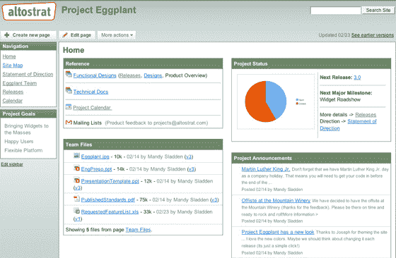

# 花了 16 个月，但谷歌重新推出了 Jotspot | TechCrunch

> 原文：<https://web.archive.org/web/https://techcrunch.com/2008/02/27/it-took-16-months-but-google-relaunches-jotspot/>

2006 年 10 月谷歌收购了托管维基服务 Jotspot。尽管支持现有用户，但该服务立即停止接收新用户。现在，将近 16 个月过去了，Jotspot 在 Google Apps 团队下重新启动，命名为 [Google Sites](https://web.archive.org/web/20230326021859/http://sites.google.com/) 。

Google Sites 看起来完全不像 Jotspot，除了两者都是托管的 wikis。Jotspot 在 2006 年 7 月发布的所有结构化数据模板[都被剥离了。用户现在可以在五个基本模板中进行选择——一个标准维基，一个可以嵌入谷歌小工具的仪表板，一个类似博客的公告模板，一个用于文件上传的文件柜，以及一个用于项目列表的页面。用户不再需要创建结构化的模板，现在只需嵌入谷歌文档、谷歌日历、YouTube 视频和 Picasa 相册中的电子表格、演示文稿和 word 文档。](https://web.archive.org/web/20230326021859/https://techcrunch.com/2006/07/24/jotspot-20-launches/)

【YouTube http://www.youtube.com/watch?v=X_KnC2EIS5w]

与 Google Docs 一样，Google Sites wikis 可以是私有的、与他人共享的或公开的。用户可以从各种模板中进行选择，但是还不能定制站点的外观。谷歌表示，他们还将为这项新服务发布一个 API。编辑是通过允许基本格式化的富文本编辑器完成的。

Google Sites 是一款免费产品，在支持和存储(10 GB)方面有限制。用户可以将他们的谷歌企业应用套件账户升级到标准版，也是免费的，并将他们自己的域名映射到该网站。premier edition 的价格为 50 美元/用户/年，包括服务级别协议、支持和更多管理功能。

所有 wiki 页面都有关联的 RSS 提要，以允许用户跟踪任何更改。

在不久的将来，现有的 Jotspot 用户将继续在旧平台上获得支持，他们还将获得将 Jotspot wikis 移植到 Google 站点的指导。

在今天的一次采访中，谷歌企业管理总监 Matthew Glotzbach 将谷歌应用程序下的合并产品称为“微软 Sharepoint 杀手”，因为它允许企业在没有昂贵的微软软件的情况下进行协作。它可能还不是 Sharepoint 杀手，但谷歌应用程序占谷歌总收入的 2-3%。不久的某个时候，它将开始伤害微软。

样本截图:

