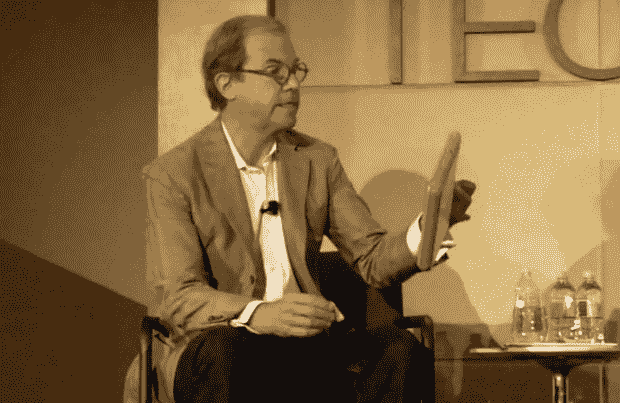
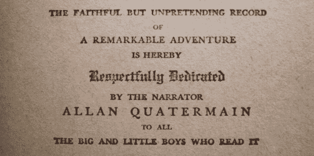

# 这是未来主义者对消费者的较量，因为有人预言书的死亡

> 原文：<https://web.archive.org/web/http://techcrunch.com/2010/08/07/its-futurists-versus-consumers-as-the-death-of-the-book-is-prophesied/>

预测这种或那种技术或制度的终结肯定是一种有趣的爱好——很多人似乎已经开始从事这项工作了。这可能是因为你不会输:这种预测不仅会促进讨论和问题的可见性，而且很少被证明是错误的。毕竟，预测未来五年发生的事情可以让足够多的变化在这个过程中发生，人们可以说“嗯，这是一个合理的假设*在那个时候*[尼葛洛庞帝最近在 Techonomy](https://web.archive.org/web/20230327133214/https://techcrunch.com/2010/08/06/physical-book-dead/) 发表的关于印刷书籍死亡的言论有着通常的回旋余地——这并不是说它们是错误的，只是它们是未来主义者变戏法的一个例子。

当然，印刷书籍的消亡(推而广之，杂志之类的)只是一个持续的过程——这是必然的。悬而未决的是时机。尼葛洛庞帝说不是十年，而是五年。要么他比我更相信消费者的可塑性，要么他说的是完全不同的东西。这纯粹是我们两方面的猜测，尽管无可否认他已经卖出了数百万台设备，并且正在努力改变世界，而我仍在试图掌握煮鸡蛋的诀窍。因此，存在某种专业知识差距，但随着你在评估中积累多年，这种差距变得越来越无关紧要。保罗和我在所谓的奇点运动中谈到了这一点，奇点运动为不可预知的事情做了计划——也许是高尚的，但在我看来是徒劳的。

【图片:[大卫火花](https://web.archive.org/web/20230327133214/http://www.youtube.com/davidspark#p/a/u/1/_9JoyyTSQQ8)

所以尼葛洛庞帝认为电子书会在五年内杀死实体书。也许“杀死”这个词并不恰当——印刷书籍并没有被根除。但是很明显，他认为五年后战斗将会结束。我认为电子书的销量要高于纸质书(不仅仅是精装本)，电子书销量上升和纸质书销量下降是“胜利的条件”当我这样说的时候，它开始听起来更合理(我可以非常有说服力)。

一项正在进行的电子书读者调查显示，人们对电子书的兴趣越来越大，但这是被迫的，人们担心前期成本。许多人已经以这样或那样的方式度过了那个难关，完全放弃了纸质书。但是我们仍然在谈论一个相当精选的群体。这项调查更多的是关于现有的和新的电子书用户的行为，而不是电子阅读器本身的实际进展。他们仍然是小众的，他们成长中最艰难的部分还在前面。

很难高估现有技术的惯性——尤其是那些已经存在了整整三千年的技术(取决于你问[谁](https://web.archive.org/web/20230327133214/http://www.crunchgear.com/2010/08/05/google-books-has-determined-that-there-are-128864880-books-in-the-world-for-now/#comments))。有人说一项技术存在的时间长短并不重要，但我认为这种观点没有抓住要点。*书面语*没有被新奇的事物淘汰；这只是*显示*书面语的一种新方式。正在发生的任何革命都是在信息自由领域，而不是取代纸质媒体。也就是说，电子阅读器和电子书不像谷歌图书那样是一大进步。前者正在改变你看待媒体的方式，后者实际上正在改变媒体。但这是顺便说一下，我在重复我自己。

从更实际的意义上来说，实体书的惯性在于人们会继续买书。不是因为电子书技术有任何不足(现在相关，但几年后就没那么重要了)，而是因为书籍比电子书有一些基本优势，这些优势不太可能改变。我不认为说纸质书的安全性、触感、美观性和持久性仍将是重要的卖点是感情用事——不仅仅是五年，而是十年、二十年、三十年。与音乐和电影不同，书籍是以数字形式完美再现的。我不会打任何涉及人们不再享受事物的赌。

而且，尽管这是一个不太令人信服的论点，但现在购买的一代人是在书本中长大的，尽管年轻人正在像任何人一样接受电子书和 iPad，但大量的支出是由仍然不知道 iPad 是什么的人口统计数据完成的。依靠它:“老式”不仅仅是一种甜甜圈，它是一个上亿人的市场，拥有比时髦的年轻博主和早期用户多得多的可支配收入。安逸和故意的无知可能是进步的敌人，但是你忽视它们是危险的。

也就是说，不承认电子书也比实体书有显著优势是荒谬的。便携性是首要的。这不仅仅是因为你可以一次携带许多东西——这对你我来说都很好，而是内格罗蓬特期待的变化是无限的可携带性和极小的成本。正如我昨天在谈论谷歌图书时所说的，世界上很多知识正在被数字化并免费提供，这一事实非常重要*，是一件纯粹的好事。内格罗蓬特的视角是国际化的，虽然在我看来，发展中国家对电子书的大量吸收在某种程度上抵消了发达国家健康的图书销售的想法是荒谬的，但这与他的世界观是一致的，我对此无可挑剔。*

 *最终，这取决于你在哪里设定目标。我猜你在玩什么游戏。以及裁判是谁。裁判站在哪里，书什么时候会被打败？从来没有，如果你问一个。如果你问别人，他们已经死了。

不过，这房间里只有我一个人，所以我要问我自己。我认为，随着电子阅读器变得越来越好、越来越便宜(140 美元仍然很多)，随着大玩家占据的烟雾弥漫的房间变得有点空旷，书籍的发行量将继续下降。不过，我预测会有一个转折点:当廉价的电子阅读器成为普通财产时，书籍将不再是次等的替代品，而开始成为奢侈品。如今，平装书的质量实在太差了:纸浆纸、模糊的字体、薄薄的封面——当简·六块腹肌选择一款光滑轻便的电子阅读器时，这就不是什么秘密了。低质量的图书市场正在被电子阅读器侵占，基于死树的出版商将不得不改变他们的策略，显然经济和方便将不再是他们产品的特点。

实际上，尼葛洛庞帝认为(他不是唯一的一个),书籍所包含的原始信息将很快变得比书籍本身更重要，更容易获取。这是不可避免的，因为印刷书籍只是容器，但它们仍然是有效和受欢迎的容器，我认为它们还有很长的寿命——至少五年以上。印刷时代即将结束，但我们这些兴奋地写下它的人是唯一着急的人。*