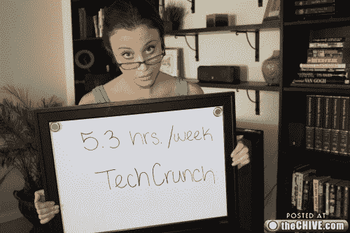

# 这是官方消息:最好的老板都会读 TechCrunch！TechCrunch

> 原文：<https://web.archive.org/web/https://techcrunch.com/2010/08/10/its-official-the-best-bosses-read-techcrunch/>

# 这是官方消息:最好的老板都会读 TechCrunch！

一位名叫詹妮弗的年轻女士——互联网现在正在搜索她的姓氏——向她整个 20 人的办公室发送了精选的[33 张照片](https://web.archive.org/web/20230208005432/http://thechive.com/2010/08/10/girl-quits-her-job-on-dry-erase-board-emails-entire-office-33-photos/),详细说明了她辞职的原因。主要是因为一个叫斯潘塞的男人称她为 HPOA(去查一下或者看看照片)，但是你会注意到她的演示中有一张重要的幻灯片。

没错:斯潘塞是 TechCrunch 的读者！

斯潘塞在 TechCrunch 上花了 5.3 个小时。那是一天中美好的一小时，每天都是。以此为“推荐剂量”，必要时增加。还有，不要成为斯潘塞。还有，雇佣这位小姐。她似乎很了解自己的工作，尤其是如果她有足够的思想去窥探她自己的恶意老板。

更新——关于 HOPA/HPOA 辩论的最后一句话来自[这里的](https://web.archive.org/web/20230208005432/http://www.reddit.com/r/funny/comments/czh9l/hpoa_quits_her_job_by_embarrassing_her_boss_in/)，它可以用任何一种方式拼写。顺便说一句，不管怎样，这也是一件可怕的事情。

[通过选择](https://web.archive.org/web/20230208005432/http://thechive.com/2010/08/10/girl-quits-her-job-on-dry-erase-board-emails-entire-office-33-photos/)