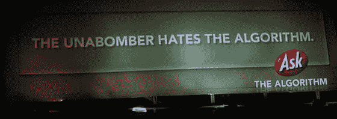

# 宋飞的时代结束了，但克里斯平·波特让微软继续经营 

> 原文：<https://web.archive.org/web/https://techcrunch.com/2008/09/17/its-over-for-seinfeld-but-crispin-porter-keeps-microsoft-business/>

# 宋飞的时代结束了，但克里斯平·波特让微软继续发展

我信任的微软人说，让宋飞出现在《T2》的前几部中是绝对的、积极的、明确的(真的)一直以来的计划，只是为他们 3 亿美元的 Vista 广告活动预热广告，然后转移到信息的核心部分。我相信他们，只要有适当的回旋余地(比如，如果广告非常受欢迎，他们可能会行使选择权，让他呆得更久，等等。).

但不管怎样，在三个有争议的广告([第一](https://web.archive.org/web/20221006003800/http://www.beta.techcrunch.com/2008/09/04/microsoft-ads-first-phase-to-engage-consumers-spark-conversation/)，[第二和第三](https://web.archive.org/web/20221006003800/http://www.beta.techcrunch.com/2008/09/12/bill-gatesjerry-seinfeld-commercial-2-i-remain-confused/))之后，宋飞出局了，至少现在是这样。微软不会以任何方式证实盛传的宋飞 1000 万美元的费用。他们说他可能会在竞选后期回来。

但是从明天开始，广告继续播放，没有宋飞。

这些广告的背后是广告公司[克里斯平·波特+博古斯基](https://web.archive.org/web/20221006003800/http://www.cpbgroup.com/)，也就是[快公司](https://web.archive.org/web/20221006003800/http://www.fastcompany.com/magazine/126/believe-it-or-not-hes-a-pc.html)所说的*“以把客户逼到边缘而闻名。”这家公司为大众汽车、汉堡王和其他公司做了惊人的工作(而鸡仍然很棒)。*

但是他们 2007 年为 Ask.com 所做的工作真的非常糟糕。该公司为一项活动预算了[1 亿美元](https://web.archive.org/web/20221006003800/http://www.beta.techcrunch.com/2007/10/31/when-will-askcoms-ad-campaign-start-paying-for-itself/)，其中包括[带剑的脱衣舞娘](https://web.archive.org/web/20221006003800/http://www.beta.techcrunch.com/2007/06/05/new-askcom-television-campaign-leaked-photos/)(这是[的视频](https://web.archive.org/web/20221006003800/http://www.beta.techcrunch.com/2007/06/05/askcom-commercial-now-on-youtube/))[以尿液为主题的展示广告](https://web.archive.org/web/20221006003800/http://www.beta.techcrunch.com/2007/05/04/ask-is-the-algorithm-working/)，以及[尤那邦摩](https://web.archive.org/web/20221006003800/http://www.beta.techcrunch.com/2007/05/29/the-algorithm-is-offensive/)。

广告不仅糟糕，而且没有为 Ask 带来任何流量。一位了解这种关系的人士说，该活动在 1999 年仅花费了 1500 万美元就终止了。

微软的广告不像为 Ask 制作的作品那样明显具有攻击性，但它们确实刻意突出了该公司与消费者脱节的事实。

> 比尔·盖茨:为什么我们又要这样做？
> 
> 杰瑞·宋飞:为什么是比尔？因为正如我们讨论过的，你和我有点心不在焉。你住在西雅图上空的月亮房子里，就像母舰一样。我的车太多了，我被困在自己的交通中。我们需要和真实的人联系。

微软表示，他们将坚持使用 Crispin，广告将完全按照计划进行。我迫不及待地想知道接下来会发生什么。