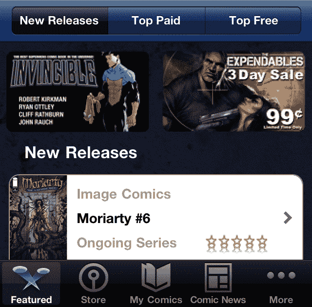

# iVerse Media 获得 400 万美元投资以发展其漫画+应用 

> 原文：<https://web.archive.org/web/https://techcrunch.com/2011/11/07/iverse-media-receives-4-million-investment-to-grow-its-comics-app/>

# iVerse Media 获得 400 万美元投资以发展其 Comics+应用程序

跨出版商数字漫画发行商[伊维斯媒体](https://web.archive.org/web/20230204214241/http://iversemedia.com/)今天宣布来自 PS & J 集团的 400 万美元私募股权投资。这笔钱将用于扩大其 iOS 漫画阅读器应用[漫画+](https://web.archive.org/web/20230204214241/http://comicspl.us/) 的营销和产品开发。Archie Comics、Dynamite Entertainment 和漫威等出版商维护独立的阅读器应用程序，而 Comics+聚合了几十家出版商的内容，以提供一站式的漫画购买和阅读体验。

PS&J 的投资表明，它相信在读者获取漫画的渠道方面，报摊正迅速让位于应用商店。应用程序具有很高的盈利潜力，因为用户可以立即购买他们最喜欢的系列的下一期。这有助于购买狂欢，读者可能在单次阅读中花费超过 20 美元，而不是离开书店时只有几本 1.99 美元的杂志或一本漫画小说。

PS&J 集团主席 Pierre LeRoy 表示，“通过数字漫画销售、软件许可和战略合作伙伴关系，伊维斯在一段时间内已经具备了财务偿付能力。”目前，iVerse 提供包括视频功能的 Comics+应用程序，以及专门提供家庭友好漫画的 Comics+Kids。这两款 iOS 应用都是免费的，但通过应用内购买向用户收取每期 1.99 美元的标准报摊价格。

Comics+已经包括了许多最受欢迎的出版商的作品，但缺少一些重量级的作品，如可以在竞争对手 comiXology 的应用程序中找到的 DC Comics。这笔资金可能有助于它获得分销协议，从而完善其内容产品。

营销也将是资金的一个重要用途，因为 comiXology 的漫画应用程序目前在应用商店中的查询“漫画”搜索排名较高。如果 iVerse 能够获得更多的下载量，并提高其平均评级，就可以提高其可发现性。允许 Comics+托管创新的多媒体阅读体验的产品开发也可以帮助它成为#1 数字漫画阅读器。iVerse 已经为 Archie，Star Trek 和其他游戏开发了独立的阅读器应用程序，产品开发可以吸引更多的出版商基于该公司的技术。

随着实体漫画书店的倒闭或多样化经营更多生活方式的产品，寻找纸质形式的漫画变得越来越困难。尽管如此，随着漫威推出以超级英雄为主角的大预算电影和由漫画改编的《行尸走肉》等电视节目，这种媒体仍然非常活跃。PS&J 集团的投资将使伊维斯的漫画+应用程序有更好的机会获得首次读者和转向数字读者。

