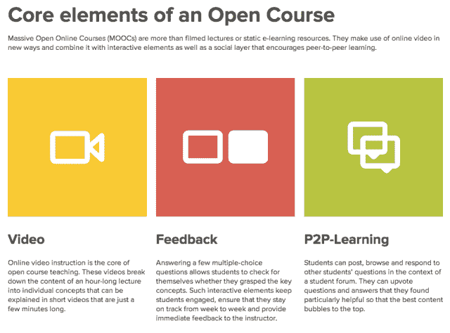

# 总部位于柏林的大学重新推出 MOOCs 平台，着眼于成为欧洲的 Coursera TechCrunch

> 原文：<https://web.archive.org/web/https://techcrunch.com/2013/03/11/iversity-moocs-pivot/>

快速膨胀的 MOOCs 世界有了新成员。总部位于柏林的初创公司[大学](https://web.archive.org/web/20221007155926/http://www.iversity.org/)成立于 2011 年，旨在提供学习管理的在线协作工具，该公司已将自己重新定位为大规模开放在线课程的平台。它的第一批 MOOCs 将于 9 月/10 月左右，即冬季学期开始时上线，目的是稳步扩大其平台上提供的课程数量，并从最初预计的六位数增加学生人数。

课程内容将由大学和个别教授提供——假设大学能够让欧洲的教育工作者相信 MOOCs 是未来，其平台是重新思考教育交付方式的地方。大学本身不会开设任何课程，所以需要其他人参与进来。首席执行官马库斯·里克说，因此，它的首要任务是让欧洲大陆了解 MOOCs 现象和正在美国发生的“革命”。

可以说，欧洲大陆也落后于英国。总部位于英国的 [Futurelearn](https://web.archive.org/web/20221007155926/http://futurelearn.com/) MOOC 财团于去年 12 月在[成立，现在](https://web.archive.org/web/20221007155926/https://beta.techcrunch.com/2012/12/13/12-u-k-universities-forge-moocs-alliance-futurelearn-consortium-will-offer-uni-branded-open-online-courses-starting-next-year/)[由 19 个机构](https://web.archive.org/web/20221007155926/https://beta.techcrunch.com/2013/03/04/u-k-moocs-alliance-futurelearn-adds-british-council-to-its-free-higher-education-roster/)支持，计划在 2013 年年中推出第一批课程。曾在雅虎和 Monster 担任高级职位的易贝欧洲公司前副总裁里克表示:“(欧洲大陆的 MOOCs)还处于早期阶段。”。“奇怪的是，MOOCs 仍然有点像圈内人的话题，教育界和互联网行业的大多数人都还没有听说过它。

### 如今，大学的一切都处于崩溃的边缘……就像 10 年前的出版业一样

“就对这一现象的认识而言，欧洲大陆与英国相比——更不用说美国了——可能落后六个月，所以我们希望实现的第一件事是将这一对话提上日程。今天的情况并非如此。在欧洲大陆，这实际上更像是一场内部讨论。如今很少有人涉足这个领域。”

为了鼓励机构和学者启动其平台业务，大学与德国教育智库 [Stifterverband](www.stifterverband.de) 合作，发起了一场名为 [MOOC Production Fellowship](https://web.archive.org/web/20221007155926/http://www.moocfellowship.org/) 的竞赛，要求提交 MOOC 概念。比赛将持续到四月底。将选出 10 名获胜者，每人将获得€25，000 英镑的资助，以便在大学冬季开学前制作他们的课程。

大学的支点是怎么来的？“大约六个月前，创始人和我，当时不是团队的一部分，被美国发生的所有事情迷住了，”里克告诉 TechCrunch，特别是检查了 [Coursera](https://web.archive.org/web/20221007155926/https://www.coursera.org/) 、 [Udacity](https://web.archive.org/web/20221007155926/https://www.udacity.com/) 和[edX](https://web.archive.org/web/20221007155926/https://www.edx.org/)mooc 平台的名称。“我们开始相信，MOOCs 现象不只是你经常性的炒作，而是一种非常实质性的趋势或正在出现的新业务。”

“我认为今天大学里的一切都处于崩溃的边缘……就像 10 年前的出版业一样，”他补充道。“这就是为什么我们聚在一起，并在去年年底与现有投资者和德国电信的风险投资部门 T-Venture 进行了新一轮融资，我们决定重新启动大学，使之成为欧洲领先的 MOOC 平台。”

尽管 iversity 将对来自世界各地的教授或机构提交的 MOOCs 开放，但在欧洲大陆开展业务显然让它首先关注欧洲。Riecke 认为，虽然 Coursera 和其他美国 MOOCs 平台对美国以外机构的课程开放——事实上，Coursera 的 62 所大学合作伙伴中已经有几所欧洲和国际机构。

“显然，美国公司有时间优势……但在这个特殊的行业中，有一个关键部分正开始出现——那就是你在当地或你所在地区与你的内容社区(即大学教授)的联系，”里克说。“对于来自帕洛阿尔托或山景城的 Coursera 来说，像我们一样离欧洲的大学这么近可能会有点困难，这当然是可行的。”

欧洲大陆的教育格局也与北美不同——通常有更多的机会接受高等教育，成本更低——这意味着大学将调整其商业模式，以更好地适应欧洲的教育现实。

据 Riecke 称，iversity 正在寻找三种可能的商业模式:

*   对学生的认证费用 Riecke 说，这些不会在今年实施，但会在 2014 年在大学实行
*   许可费——物理大学向大学支付许可费，以取代他们开设的一些课程(可能是入门课程，让大学的员工有时间进行更深入的教学)
*   招聘费用——根据学生在相关课程中的表现，通过向雇主提供“招聘情报”服务产生的费用

iversity 没有披露其迄今为止的总融资水平——但根据 Crunchbase 的消息，在最近一轮融资之前，I versity 已经筹集了 170 万美元——但 Riecke 表示，它有足够的资金在今年推出首批 MOOCs 的“概念验证”。之后，他表示将在年底前寻求新一轮融资。

“一旦我们有了前 10 门课程——如果你是一家平台企业，开始总是最困难的事情——那么我们希望从最初的 10 门课程扩展到可能的 30、50 门课程，之后就没有限制了，”Riecke 补充道。

iversity 的现有投资者包括 BFB·弗鲁哈森丰斯·勃兰登堡、bmp 媒体投资公司和天使投资人·马苏德·卡马里。

以下是 iversity 在其网站上对 MOOC 关键要素的描述:

