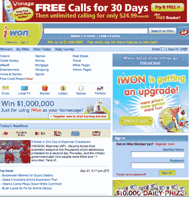
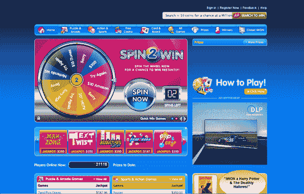

# iWon 焕然一新 

> 原文：<https://web.archive.org/web/https://techcrunch.com/2007/09/30/iwon-gets-a-makeover/>

由 IAC 拥有的网站 iWon 正在改造它的外观，从一个非常 1.0 的门户网站变成一个华丽的休闲游戏网站，拥有旋转的轮子、老虎机和许多鲜艳的颜色。这些游戏现在也将变得可以 widgetizable，这样它们就可以存在于人们的脸书或 MySpace 页面上。(你认为只要避开这个网站，就可以避免刺耳的营销诱惑)。

iWon 的商业模式是用现金奖励吸引人们，让他们玩数独、吃角子老虎机或纸牌等在线游戏，并向他们展示广告。也可以专门为广告赞助商制作游戏。

这是 iWon 1.0:

这是 iWon 2.0:

我不知道哪个更烂。尽管如此，我还是需要做些什么。根据 comScore 的数据，其每月独立访客从去年的 520 万下降到 8 月的 220 万。虽然平均花费在网站上的时间从每月 33 分钟飙升到 53 分钟，但这是你所期望的，因为休闲游客厌倦了这些产品，唯一剩下的是铁杆 iWannaBeWinners。在 beta 测试中，新网站已经被证明可以让人们玩的时间比以前长五倍。但是，是同样的人一遍又一遍，还是改头换面能够吸引足够多的新游客来扭转局面？