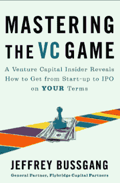

# 当杰克·多西遇见弗雷德·威尔森，以及其他 Twitter 故事(书籍节选)

> 原文：<https://web.archive.org/web/https://techcrunch.com/2010/04/27/jack-dorsey-fred-wilson-twitter-book-excerpt/>

***编者按**:以下节选自[掌握风险投资游戏](https://web.archive.org/web/20221208153830/http://www.amazon.com/Mastering-VC-Game-Venture-Start-up/dp/1591843251/ref=sr_1_1?ie=UTF8&s=books&qid=1272425119&sr=1-1)，这是 [Jeffrey Bussgang](https://web.archive.org/web/20221208153830/http://www.crunchbase.com/person/jeff-bussgang) 的新书，将于周四上市。它从创始人[杰克·多西](https://web.archive.org/web/20221208153830/http://www.crunchbase.com/person/jack-dorsey)的角度讲述了 Twitter 的背景故事，从他早期对快递的痴迷和他试图创建一个更好的调度系统，到他对 Twitter 的“啊哈”时刻(“如果我们简单地设置状态，在网上存档，用短信来做，这一切都是实时发生的，会怎么样？”)为什么公司选择联合广场风险投资公司的弗雷德·威尔逊作为它的第一个风险投资人(“我想要一个总是比我先想好几步的风险投资人”)。布斯冈采访了这两个人，并在节选的后半部分详细描述了风险投资家和企业家是如何合作的。第一部分讲述了多尔西如何发明推特的故事。*

布斯冈是 Flybridge Capital Partners 的普通合伙人，之前曾与人共同创立了大学储蓄服务公司 Upromise，该公司已被 Sallie Mae 收购。

* * *

杰克·多西(Twitterverse 的行话也叫杰克)创建了 Twitter，这是一个社交网络和微博客网站，用户 Twitter 用户——在这里发布非常简短(最多 140 个字符)的更新，即所谓的推文。Twitter 的概念来源于杰克毕生对绘制复杂环境中人和事物的实时运动的着迷。“从我很小的时候起，我就对城市的运作方式着迷，”杰克以他特有的直白方式告诉我。“当我想到将它们可视化，特别是围绕地图时，我总是非常兴奋。你会在地图上放什么来展示一个城市是如何运转的？”

在他长大的圣路易斯，杰克第一次注意到了他觉得神奇的东西的存在:信使。“我喜欢快递员。你可以在城市和世界范围内传递物理信息。有人拿起包裹，放进包里，去某个地方，从包里拿出来，交给别人。我觉得那太酷了。我想把它绘制出来，在大屏幕上看到它的流动。当我研究快递系统如何工作时，我发现有一种并行的信息传输是数字化的，它被称为‘调度’，这只是一种协调努力。”

杰克非常喜欢以数字方式绘制城市互动地图的想法，以及快递员作为这些互动的物理表现形式的概念，以至于他在 16 岁时就决定开始自己的自行车快递服务。“我把我和我的兄弟放在自行车上，这样我就可以编写调度软件。杰克自称是电脑怪胎，年纪轻轻就自学编写软件。]我们很快发现，圣路易斯根本不需要自行车快递员。但我真的很喜欢编写软件，并能绘制地图和可视化作品。”

杰克十几岁时创办的公司迅速倒闭，但这并没有阻止他。在密苏里科技大学(Missouri University of Science and Technology)工程项目的第二年，他遇到了一家总部位于纽约的公司，名为 Dispatch Management Services Corporation(DMSC ),该公司管理着快递员的调度中心，包括步行、自行车和摩托车。

“我不得不进入其中！”杰克兴致勃勃，因为我们的谈话让他回到了过去。“我联系了董事长格雷格·基德，是他创建了这家公司并将其上市。我说，‘我在写一些调度软件，我真的很想去纽约和你们一起工作。’“杰克拼命追求格雷格，几周之内，他搬到了纽约，调到了 NYU，开始为 DMSC 编写调度软件。

在 DMSC，杰克更深入地研究了他对调度和快递的迷恋。“那里有一种交流的本质，”他向我描述道。“一种抽象。所有这些实体都在漫游，它们都通过各种不同的设备实时报告自己在做什么。我们有民用波段无线电、个人数字助理和手机上的信使。我们有带全球定位系统的出租车和急救车。他们都在不断报告他们在哪里，他们在做什么工作，所有这些都流入这个系统，调度员可以在地图上实时查看。这就是这个城市的现状！我觉得这种抽象太酷了，所以我想让我的朋友也拥有同样的东西。”

杰克和格雷格决定他们可以改进 DMSC 的调度系统。1998 年，他们搬到西海岸，从天使投资人(一群向科技企业家提供种子资金的现任和前任硅谷高管)那里筹集了足够的资金，创建了 dNET，即调度网络。“我们想做一个以网络为中心的调度系统，本质上为快递员提供一个自动取款机，他们中的大多数人没有银行账户，所以他们可以很容易地通过网络提取佣金。”

当杰克正在努力使 dNET 起飞时，他发现了即时消息(IM)。“即时消息很有趣，因为你只要看一眼好友列表，就能知道你的朋友在听什么，在做什么，在做什么。问题是你被束缚在电脑键盘上。我很幸运有一部 RIM 850，它是黑莓的前身。就是这个矮胖的小电子邮件设备。有一天晚上，我睡不着，只是要写一个原型剧本。它将位于服务器上，接收收到的电子邮件，将它们发送到一个列表中，并将其记录在一个我可以在网上查看的数据库中。”这是 Twitter 的第一缕曙光。

但由于各种原因，dNET 没有在市场上获得牵引力，因此杰克在加入一家名为 Odeo 的播客初创公司之前，开始了一段时间的自由编程，主要是与前谷歌员工埃文·威廉姆斯(又名@ev)合作。但杰克对播客的短暂涉足并没有抑制他对简短状态信息的热情。“当时，我的一个同事给我介绍了 SMS(短消息服务)，这是我从未见过的。她一直在用它。当我看到这个的时候，我就想，‘哇，太棒了！’这种交流让我大吃一惊，她使用它的方式也让我大吃一惊。我想，如果我们简单地设置状态，在网络上存档，使用短信来做，这一切都是实时发生的，会怎么样？我们都走到一个角落，写下一堆用户场景，并开始邀请同事进来。他们爱上了它。我们知道我们有东西。"

因此，杰克和他的团队开发了我们现在所知的 Twitter 服务。他们当时称之为“Twttr ”,并于 2006 年 7 月推出。第一条推文是杰克在 2006 年 3 月 21 日下午 12:50 发出的内部推文:“正在设置我的 twttr。”几分钟后，他无害地发了条推特:“邀请同事。”这是推特革命的开始。

有趣的是，杰克奉行的策略是:不要隐藏你在做什么。如果你认为你在做一件有趣的事情，那就公开说出来，在屋顶上大声喊出来，并尽可能多地征求反馈和意见。这种策略对于像 Twitter 这样的基于互联网的消费者服务来说尤其重要。

发布后的最初评论褒贬不一。一位[评论者](https://web.archive.org/web/20221208153830/https://beta.techcrunch.com/2006/07/15/is-twttr-interesting/#comment-560218)对此反应消极，称其为“有史以来最愚蠢的事情！谁会希望自己所有的个人短信都放在一个公共网站上，让任何人阅读和跟踪？”尽管有这样的怀疑，这项服务开始获得势头和草根追随者，虽然仍然隐藏在 Odeo 里面。“我们知道它越来越大，只是在等待触发。那是 2007 年的西南偏南。”

西南偏南是一个节日和会议——充满了小组讨论、书籍阅读、对话和聚会——每年在德克萨斯州奥斯汀举行。杰克和他的同事们在全国各地拖着大屏幕等离子电视，将它们安装在会议的走廊上，以显示关于正在进行的会议的实时 Twitter 聊天，一个在注册台，一个在主会议室的出口。

“我们真的很擅长结交合适的朋友。我们有很多精力充沛、直言不讳的博客作者在西南偏南使用 Twitter。他们在会议上不停地谈论这件事。媒体碰巧也在看。它就爆炸了。”

杰克相信 Twitter 将会腾飞，但即使是他也对它所产生的热情感到惊讶。“这个非常简单的消息和订户模型适用于我感兴趣的所有内容。我认为它可能是巨大的。但是，作为一个消费者应用程序，我真的对我们早期用户的速度和耐心感到惊讶。”

虽然 Twitter 的势头越来越大，但拥有该公司的初创公司 Odeo 却没有。事实上，Odeo 已经没有钱了，也没有风险投资者的额外资金支持。Odeo 的首席执行官伊万·威廉姆斯决定从投资者手中购买资产，并带上了杰克、另一位联合创始人比兹·斯通(@Biz)和许多员工。杰克成为 Twitter 的创始 CEO，30 天后，团队开始考虑筹集资金，成立一家独立的公司。“我们真的不准备马上拿钱，但我们收到了某人的一张便条。我们去旧金山一家酒店的顶层和他们一起吃早餐，聊得很开心。我们还在组建公司什么的。当我们 30 分钟后回到办公室时，我们在收件箱里发现了一张 50 万美元支票的扫描图像。”

即时提供的资金促使杰克思考他真正想要的投资伙伴是什么。“公司和产品获得关注的方式是，我们找到了我们能想到的最好的人才，并与他们一起工作。我们也想从风投那里得到同样的东西。我们想要桌子对面最好的人。这不是他来自哪里，而是和他一起工作有趣吗？他要挑战我们吗？“他聪明吗，”这个人将在董事会中占有一席之地。"

事实证明，Twitter 与一位风投合作，这位风投和杰克一样发现了 Twitter 的概念。Union Square 的弗雷德威尔逊(Fred Wilson)表示，他喜欢把自己视为企业家的顾问，但他是一位模式识别能力很强的顾问。“当他们需要一些建议时，我想成为他们打电话的人。不管是“我的销售有问题”还是“我们需要筹集更多的资金”。你认为着手做那件事的正确方法是什么？或者，‘我有件大事。我对此很紧张，因为我不确定我们是否真的能达到预期。但是我想要收入。我该怎么办？这些都是大问题。作为一名风险投资家的美妙之处在于，我们已经多次看到所有这些问题。我从事这项业务已经很长时间了，我观察到了足够多的信息，知道发生了什么，并能做出恰当的解释。"

Twitter 的杰克·多西说，事实上，他确实把弗雷德当成了自己的战略顾问。“弗雷德将我们的电话设置为优先拨号，因此他可以随时联系我们，我们可以立即改变事情。他非常投入，无论何时我们需要什么，我们都会打电话给他。他很乐意为我们做任何事情。”杰克指出，作为一名狂热的用户，弗雷德不仅关注宏观战略，还关注 Twitter 的本质特征。“我们倾听他的想法和他对产品的需求，”杰克说。“这是建立关系的一个很好的方式，也让我们双方更加信任对方。当我们一起开发产品时，我们开始了解到，‘哦，弗雷德就是这样，杰克也是这样。’我们开始互相学习对方的缺点。这不可能以其他方式发生。"

在某些方面，风投是一个被美化了的招聘者。然而，如果认为招聘一家风投公司所能做的就等同于一名企业家从专业猎头公司所能得到的，那就错了。风险投资更关注改善初创企业所需的各种人才、成功的机会，以及在公司生命周期的正确时间点预期需要的合适类型的高管。正如 Twitter 的杰克·多西所说，“我讨厌一个风险投资人，我只是给他发邮件说，‘我需要一个业务拓展人员。你能介绍一下吗？我想要一个总是比我先想好几步的风投。那种会说‘嗯，我认为我们正在做这件事，因此我们可能会考虑以这种方式定义这个新职位，并因此与这个人交谈。"

对每个创业者来说，最好的风险投资人的定义是不同的。Twitter 上的杰克·多西在寻找一位对他的市场有热情、能帮助他开发产品、能挑战他的思维的风险投资人。当杰克试图为 Twitter 融资时，他与许多风险投资家进行了交谈，从西海岸的公司开始。“我们和山谷里的人谈了很多，”杰克说。“在推介结束时，桌子对面的人会说，‘好吧，我们会尽快让你知道，大概一个小时左右。我们只是想在内部交流，但我们真的很兴奋。我们对此反应不佳。我们希望被质疑，我们希望被挑战，我们希望看到他们在实际开发这个产品时的一些想法。"

不管出于什么原因，杰克在东海岸发现了比西海岸更多的具有挑战性的风投。“我认为这只是一个态度问题，”他说。“我发现东海岸更有侵略性。他们想说什么就说什么，希望能马上继续前进。在西海岸，人们更放松一点。如果他们认为我们走上了错误的道路，他们不一定会说出来，但他们可能会以一种间接的方式让人们知道。我只是一点也不欣赏这一点。”

杰克最后和纽约的弗雷德·威尔逊一起在联合广场投资公司工作。“我们拒绝了一批风投，”杰克说。“我们看到了一个名字，但名字后面没有足够的信息。风投必须马上向我证明我可以信任他们。很难做到。但当它是对的时候，它就是对的。我们很幸运和弗雷德在一起。他很有侵略性，从好的方面，从思考的角度。他一点也不敏感。但更重要的是，他是我们服务的日常用户，他显然喜欢我们的服务。他带着一堆功能要求和许多关于我们为什么要做这些事情的问题来到球场。这有助于澄清我们对产品的看法，也有助于澄清我们对公司的看法。这正是我们在董事会想要的。”

在他们的恋爱期间，弗雷德向杰克展示了他能提供的不仅仅是金钱；他可以为产品的愿景和方向做出贡献，帮助公司走向成功。如果你的风投没有向你展示出对你的产品和你个人成功的热情，以及通过他们的战略或产品洞察力在尽职调查过程中增加价值的能力，那么他和他的公司可能不是你合适的商业伙伴。正如多尔西对我说的，“当选择我们的风险投资伙伴时，我知道我雇佣了一个我不能解雇的老板。”

弗雷德·威尔逊对企业家和风险资本家之间的关系有一个有趣的看法。“我认为风险投资家首先需要感觉到他们的工作是让企业家成功。所以我认为风险投资是一种服务行业。企业家是你的客户。这是一种非常奇怪的关系，因为企业家并没有真正付给你钱，尽管他们真的在付给你钱。但是他们绝对不能解雇你。事实上，你可以解雇他们。因此，这是人们能想到的最奇怪的服务关系之一。”

更多的钱为错误提供了更多的跑道和空间，但代价是一些额外的稀释。多尔西回忆起他与网景公司创始人兼天使投资人马克·安德森的一次对话。“马克很早就建议我们尽可能多拿钱，因为经济衰退即将到来，一切都会受到影响。这是在 2008 年初，可能是 2007 年底。他说，'我知道你担心稀释，但只是试图得到尽可能多的钱，建立一个战争基金，这样你就可以度过风暴，因为风暴即将到来。'"

时机和你个人的承诺都是重要的因素。推特的杰克·多西每天都被问到这个问题——推特什么时候会退出？他向我解释了他在这个问题上的观点，这加强了我的论点，即最好的企业家不关注金钱，他们关注的是他们对企业的梦想。

“你总是要回到这个问题上，‘退出对产品来说是正确的吗？’”杰克解释道在我们的历史上有很多次，我们在技术方面没有达到标准，我们可以使用更多的基础设施。我们本可以利用谷歌、脸书或雅虎的资源。但是，直到你觉得你已经完成了愿景的某些方面，移交它是没有意义的。如果你有这个想法，并且你或多或少已经看到了它的结局，现在你只是绞尽脑汁试图找出如何进一步推动它，产品在别人手中可能会更好，因为你已经做了你能做的。对我来说基本上就是这样。你说完了吗？如果是，那么退出。如果你不是，那就继续努力。"