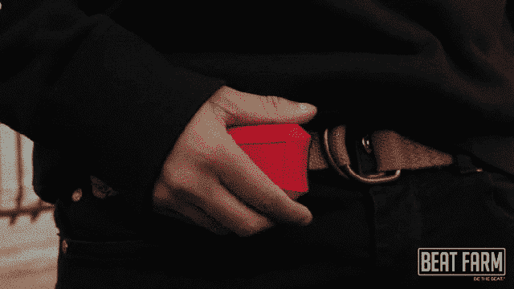

# 墨西哥胡椒拍子为你的锻炼增添一点趣味 

> 原文：<https://web.archive.org/web/http://techcrunch.com/2014/01/09/jalapeno-beat-maker/>

[kickstarter URL = http://www . kickstarter . com/projects/1330531709/jalapenotm-portable-beat-maker-for-action-sports width = 640]和大多数人一样，我在锻炼过程中依靠快节奏的音乐来保持动力，锻炼通常包括在公园里跑步或快速观看有氧健身视频。但是，即使在我的播放列表中添加新的曲目，有时也不足以让我不感到无聊。这就是墨西哥胡椒搅打器的用武之地。这是一个便携式设备，你可以将它附加到你的健身设备上或戴上，它可以根据你的运动实时混合音乐。你可以通过一个 Android 或 iOS 应用程序听到你的劳动成果。防水的 jalapeo Beat Maker 是为单板滑雪和其他动作运动而设计的，但它的设置可以为各种活动定制。

墨西哥胡椒 Beat Maker 是由 [Beat Farm](https://web.archive.org/web/20230130235726/http://beatfarmusa.com/) 开发的，这是一家创造音乐驱动产品的初创公司，其 [Kickstarter 页面](https://web.archive.org/web/20230130235726/http://www.kickstarter.com/projects/1330531709/jalapenotm-portable-beat-maker-for-action-sports)今天刚刚推出。该项目在过去几个小时内已经筹集了 3700 美元，因此它很有可能在 2 月 7 日之前达到 53000 美元的目标。这款设备的早期套餐起价为 199 美元，预计将于 2014 年 10 月交付。

Beat Farm 由 John Hunchar、Ben Harmer 和 Kenneth Liew 创建，他们在宾夕法尼亚大学综合产品设计研究生项目学习时相识。墨西哥胡椒节拍制造商结合了团队对运动和音乐的热爱。

哈默从 10 岁起就开始打鼓和滑雪。Liew 从小学习钢琴，然后在大学开始做 DJ。Hunchar 是一个狂热的冰球运动员和滑雪板运动员，尽管被他描述为“有问题的”音乐技能和品味所困扰，但他仍然喜欢音乐。

他们在一封电子邮件中告诉我，在开发墨西哥胡椒拍子的过程中，三人“出去进行了研究和人种学采访，看看那里有什么，人们真正想要和需要什么”。“如今，你会看到很多人戴着耳机在山上(滑雪)，随着 MP3 或智能手机摇摆。六七年前，情况真的不是这样。单板滑雪天生就有节奏感，所以我们突然想到，也许有一种方法可以用音乐来强调滑雪过程中的精彩时刻，最终创造更好的体验。”

Beat Farm 团队在一年半前提出了墨西哥辣椒 Beat Maker 的概念。从那以后，他们改进了它的设计、工程和用户体验。之所以选择墨西哥辣椒这个名字，是因为它描述了他们希望用户拥有的体验:在已经令人兴奋的体验上增加一层乐趣。辣椒的大小和形状也有助于指导原型的设计。

“我们想创造出一种有点像墨西哥胡椒，但又不是字面意思的东西——一种视觉上令人兴奋但功能性强的东西。Liew 解释说:“它需要耐用、防水、小巧(像墨西哥辣椒那么大)。

墨西哥胡椒节拍制作机有两种模式。多轨道模式允许您选择和混合多达四个轨道层(包括鼓、吉他、贝斯或人声)，这些轨道层由 Beat Farm 的艺术家的[“Farm-ily】创建。轨道是同步的，因此它们与你的动作保持一致和节奏。另一方面，单声道模式适用于智能手机上已经存在的音乐，目前处于早期测试阶段。](https://web.archive.org/web/20230130235726/http://www.beatfarmusa.com/pages/beat-farm-artists)

该团队描述了 jalapeno Beat Maker 的多种用途，除了为单板滑雪和滑雪课程增加额外的乐趣。比如骑自行车的，跳霹雳舞的都可以用，见上图 gif。音乐家可以用这个设备演奏，或者用它来修改他们的曲目。我已经很久没有去滑雪了，但我认为墨西哥胡椒节拍制作器可能会让跟随健身视频或慢跑变得更有趣，并让我保持动力。使用 jalapeo Beat Maker 制作的轨道可以导出到视频编辑软件中。它甚至可以用来娱乐极度活跃的孩子。

“有些人建议把它放在他们的孩子或他们的狗身上(并不是说这两者是一样的)，让他们到处跑，”Liew 说。"我们想在割草机上试试."

最终，该团队表示，他们希望墨西哥胡椒节拍制造商“改变人们创作和体验音乐的方式”，无论他们是否是经验丰富的音乐家或运动员。

“在一天结束的时候，并不是真的要把事情看得太重，而是要开心，”Liew 说。“如果我们能激励人们走出去，去行动，去创造，这正是我们喜欢的额外乐趣。”