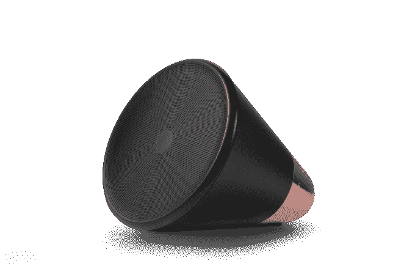

# Janus Friis 的下一个行动是一家名为 Aether 的硬件初创公司，以及一款名为 Cone TechCrunch 的“思维”音乐播放器

> 原文：<https://web.archive.org/web/https://techcrunch.com/2014/03/04/janus-friis-next-act-is-a-hardware-startup-called-aether-and-a-thinking-music-player-called-cone/>

Janus Friis 创立了一系列颠覆性的软件创业公司，如 Skype、Rdio、Joost 和(更早的)KaZaA，其中一些比 T2 更成功。

现在，这位丹麦企业家正在进入一个新的领域:一家名为[以太](https://web.archive.org/web/20221007104522/https://www.aether.com/)(之前以其秘密工作名称[莫尔斯项目](https://web.archive.org/web/20221007104522/http://www.morseproject.com/)而闻名)的硬件初创公司，今天推出了其第一款产品，一款 6.3 英寸高、扩音器式的无线音乐播放器，名为 Cone，你可以用手通过拨号、语音和应用程序进行操作。

Cone 售价为 399 美元，将于 2014 年夏季首先在北美上市，随后将在更大范围内推出。这些设备直接从 Aether 的网站上销售，该公司正在努力拓展其他销售渠道。

Cone 利用流媒体音乐平台的音乐，以及互联网电台和其他潜在的来源，目的是尽可能地包容。Aether 的联合创始人兼首席产品官 Duncan Lamb(曾在 Skype 与 Friis 共事，也曾在诺基亚工作多年)表示，“但我们正在与其他几家公司进行谈判”。

对于一个在软件领域屡创佳绩的企业家来说，为什么要转向硬件这个众所周知的困难和资本密集型领域呢？为什么是音乐，我们有很多大型消费电子公司和像 Sonos 这样的小型新贵已经在玩了？兰姆表示，此举是出于对当今市场的失望:

“我们研究了人工智能领域的所有创新，比如 IBM 的沃森(Watson)扮演 Jeapordy，但与此同时，当涉及到消费者时，我们仍然必须告诉我们的计算机我们希望它们做什么。他说:“如今，许多‘智能’电子产品仍然需要大量的努力才能工作。“这是一个数字孤儿院。W e 能够清楚地看到事情应该走向的方向。我们基本上是通过成立一家公司来制造有思想的东西，从而着手解决这类问题。”

这里的想法是呈现“存在于我们日常生活中的物理对象，但它们有能力思考和处理免费提供的数据，并以人类的方式做出决策和选择。”

兰姆说，在 Aether 工作的设计师和硬件专家团队来自苹果、SGI、谷歌、美国宇航局、推特、诺基亚、摩托罗拉、Ideo、Skype、罗技、英特尔、摩托罗拉、青蛙等公司，他们从音乐播放器开始，但打算将这一技术推广到其他领域。

Cone 不是普通的音乐设备:它集成了由 Nuance 支持的语音识别软件(这种集成尚未达成协议，但正在进行中)，你可以通过三种方式在它上面导航音乐:通过应用程序，通过旋转手掌大小的转盘，或大声说出一些东西。

Lamb 将它描述为一个“思考”的音乐播放器，这是它背后的基本概念:通过算法，Cone 根据你是否停留在一个选择上或传递它来学习你喜欢听什么，然后根据一天中的时间和你的 Cone 所在的位置来开始应用定制的选择。

Lamb 告诉我，长远来看，随着时间的推移，要给 Cone 增加更多的功能。“圆锥的规格非常好，”他告诉我(下面是这些规格的完整列表)。“作为一家初创公司，我们现在没有能力使用其中的一些，但我们希望打造它，使它不会立即过时。”这是否包括使用麦克风集成语音通话等功能？“我不排除这种可能性，”他回答道。

尺寸&重量

高:6.3 英寸
宽:6.3 英寸
长:6 英寸
重:2.9 磅

电源和电池
内置可充电锂离子电池
8 小时连续播放

连接
Wi-Fi 802.11 a/b/g/n
双频(2.4 和 5GHz)

需要设置
任何运行 iOS 7+或 Mac OSX 10.9+“小牛”的设备

详细信息
3 英寸低音扬声器加双高音扬声器设计，实现自然立体声环绕
SNR 信噪比 106 dB (A 加权，f = 1 kHz，THD 最大功率<1%)
ARM Cortex-A9 1 GHz 处理器
32 位浮点处理
高能效设计，使用高级 D 类放大器，效率高达 90%

全数字 I2S 2，1 通道 20w 音频放大器
低功耗、三轴、微加工加速度计，14 位分辨率
动态变化 LED 灯环，亮度可变

*文章已更新，更正了 Friis 的国籍，并指出一项细微差别交易仍在进行中。*