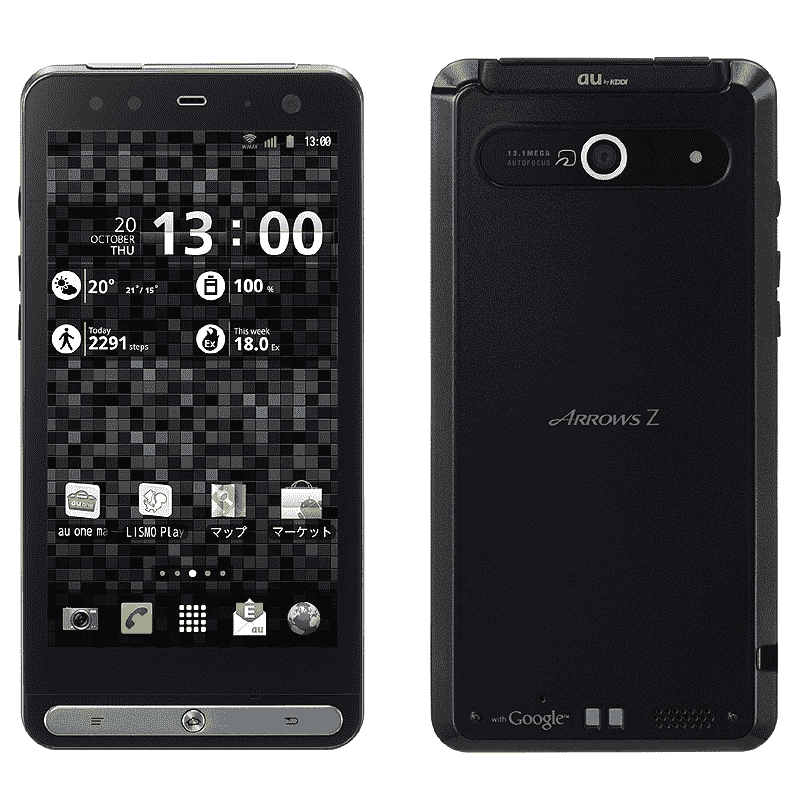
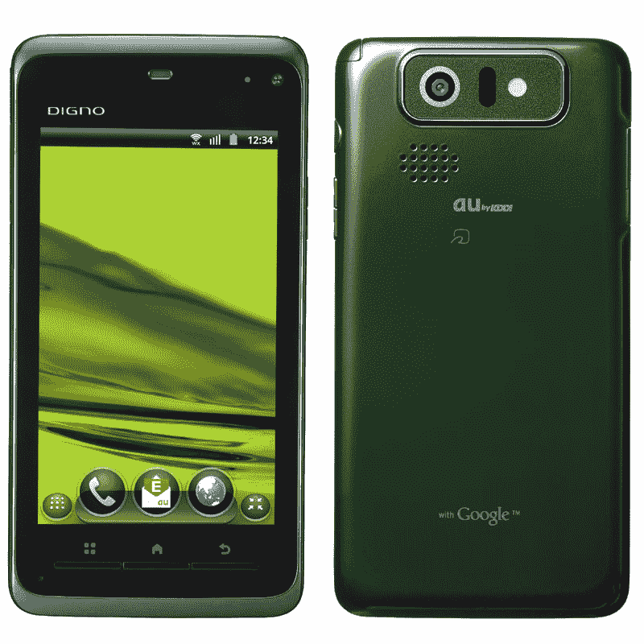
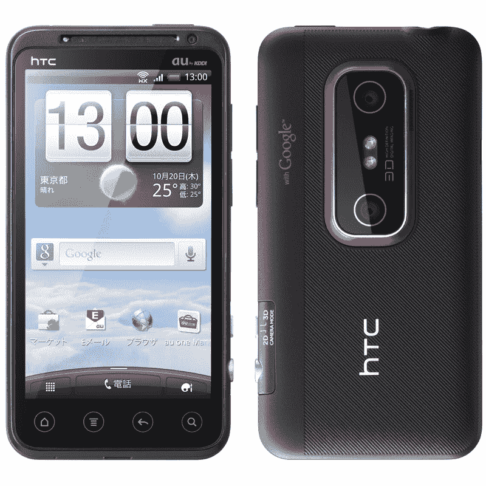
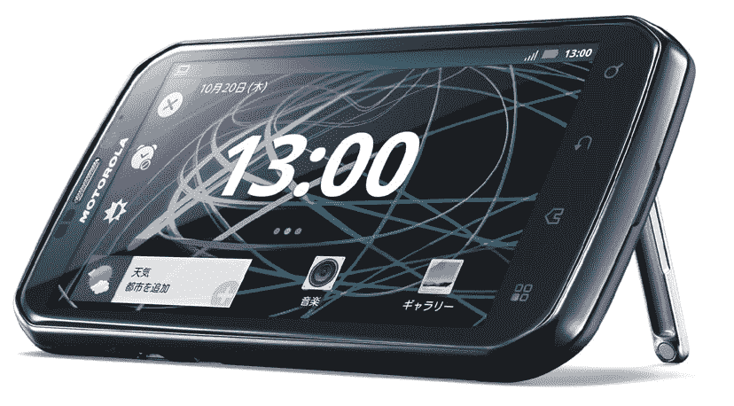
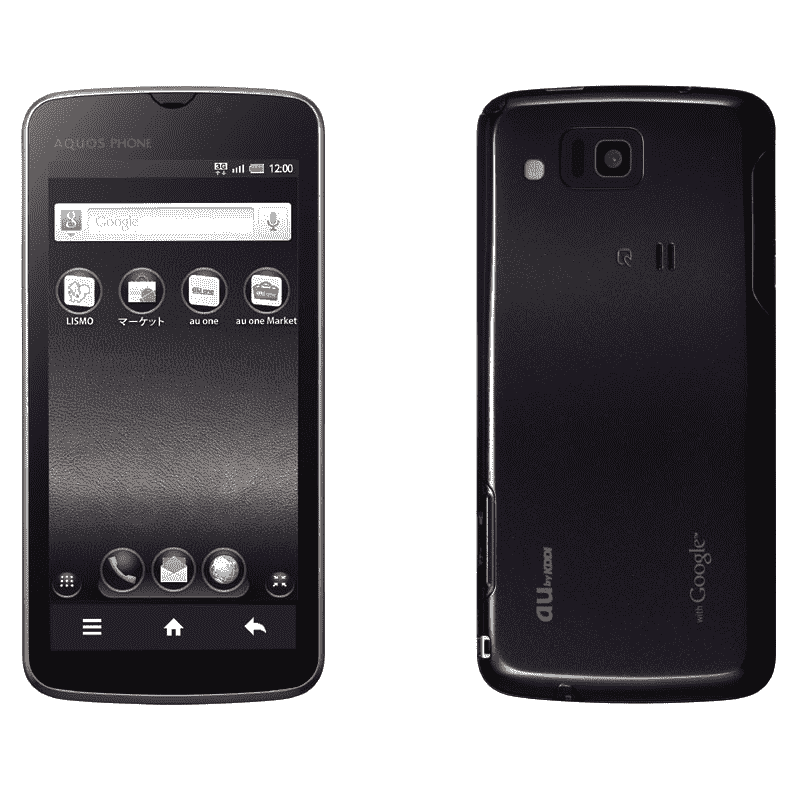
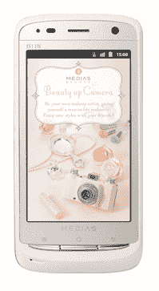
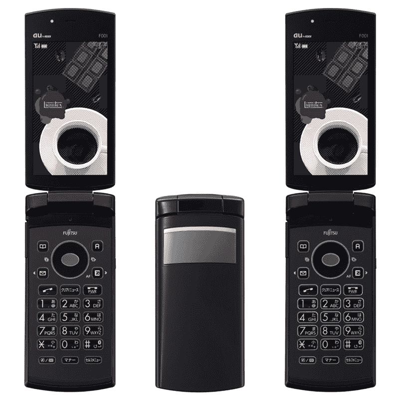
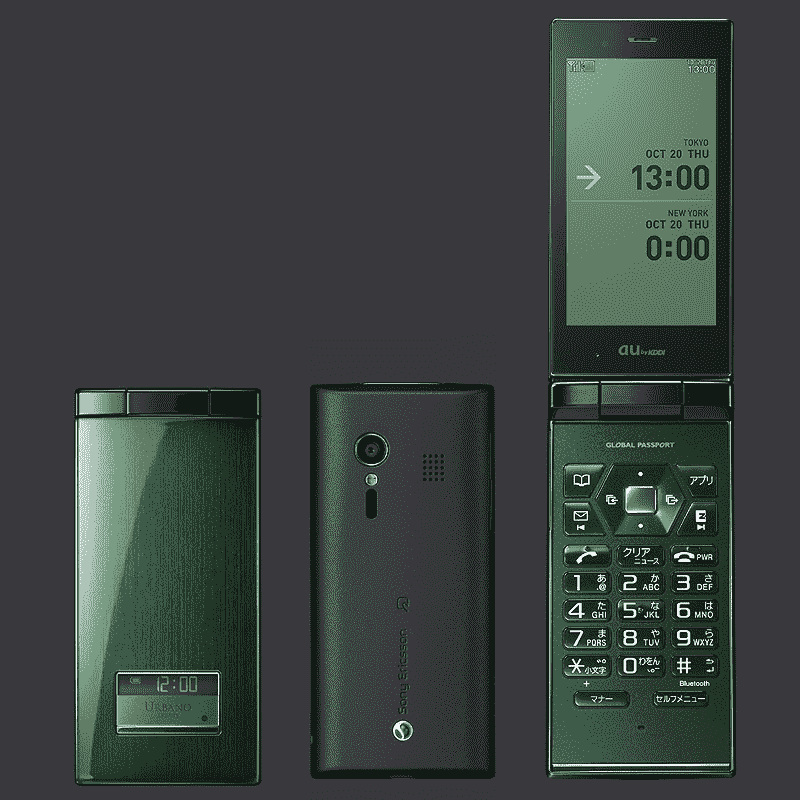

# 日本获得 8 款新手机:KDDI 的整个冬季阵容 

> 原文：<https://web.archive.org/web/http://techcrunch.com/2011/09/26/japan-gets-8-new-cell-phones-kddis-entire-winter-line-up/>

日本第二大运营商 KDDI 今天在 T2 发布了总共八款面向国内市场的新手机。更具体地说，这家电信公司(T4 很可能成为日本第二家提供 iPhone 5 的公司)展示了六款 Android 手机(箭头 Z 是最令人印象深刻的)和两款功能手机。

以下是 KDDI 今天展示的所有模型:

**[富士通东芝 Arrows Z isw 11 f](https://web.archive.org/web/20230205012855/https://techcrunch.com/2011/09/26/arrows-z-fujitsu-toshiba-outs-waterproof-android-phone-with-wimax-13mp-camera/)**
(Android 2 . 3 . 5，4.3 英寸 LCD，1280×720 分辨率，Wimax，Wi-Fi，防水机身，1300 万像素 CMOS 摄像头，红外，电子钱包功能，数字电视调谐器)

**京瓷 DIGNO is w11k**
(Android 2 . 3 . 5，480×800 分辨率的 4 英寸有机发光二极管屏幕，Wimax，Wi-Fi，厚度仅为 8.7 毫米的防水机身，骁龙双核 MSM8655 CPU (1.4GHz)，8MP CMOS 摄像头，红外，电子钱包功能，数字电视调谐器)

**[HTC EVO 3D is w12 ht](https://web.archive.org/web/20230205012855/https://techcrunch.com/2011/03/22/hands-on-with-the-sprint-htc-evo-3d/)**
(Android 2 . 3 . 4，960×540 分辨率的 4.3 英寸 3D 液晶，Wimax，Wi-Fi，骁龙双核 MSM8660 CPU (1.2GHz)，两个 5MP CMOS 摄像头，1.3MP 副摄像头)

**[摩托罗拉光子 isw 11m](https://web.archive.org/web/20230205012855/https://techcrunch.com/2011/07/13/dual-core-android-powered-motorola-photon-to-hit-sprint-on-july-31st-at-200/)**
(Android 2 . 3 . 4，4.3 英寸液晶屏，分辨率 960×540，Wimax，Wi-Fi，蓝牙 2.1+EDR，双核 Tegra 2 CPU (1GHz)，8MP CMOS 摄像头)

**夏普 AQUOS 手机 IS13SH**
(Android 2.3.5，4.2 英寸 960×540 分辨率液晶屏，2.1 英寸 56×304 分辨率液晶屏，Wi-Fi，蓝牙 3.0，支持 DLNA，骁龙双核 MSM8655 CPU (1.4GHz) CPU，8MP CMOS 摄像头，防水机身厚度仅为 8.9mm)

**NEC MEDIAS BR IS11N**
(安卓 2.3.5，3.6 英寸液晶 480×800 分辨率，Wi-Fi，蓝牙 4.0，骁龙双核 QSD8655 (1.4GHz) CPU，8MP CMOS 摄像头，防水机身，数字电视调谐器，红外，电子钱包功能)

**富士通-东芝 F001**
(3.3 英寸液晶 854×480 分辨率，0.8 英寸有机发光二极管副屏，13MP Exmor R 用于移动 CMOS 摄像头，蓝牙，数字电视调谐器，红外，电子钱包功能，防水机身)

**索尼爱立信 URBANO AFFARE**
(3.3 英寸 854×480 液晶显示屏，1.1 英寸 e-ink 副屏，8MP CMOS 摄像头，骁龙双核 QSD8655 CPU，蓝牙，数字电视调谐器，红外，电子钱包功能)

