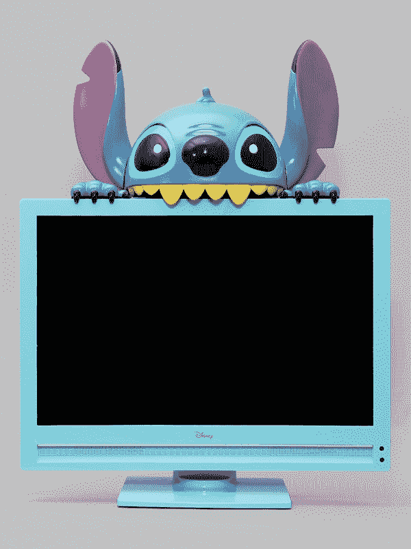
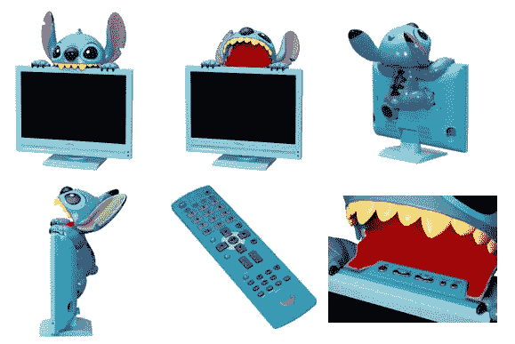

# 日本获得超级可爱的缝合电视

> 原文：<https://web.archive.org/web/https://techcrunch.com/2009/03/06/japan-gets-super-cute-stitch-tv/>

# 日本得到超级可爱的缝电视

一家名为 Runat 的日本公司今天展示了一台 [20 英寸的液晶电视，电视上有一个试图爬到它上面的小人](https://web.archive.org/web/20230320174326/http://www.runat.co.jp/runat/release54.htm) [JP]。这款电视将于本月底开始销售(仅限日本)。

这款电视的规格如下:1680 x 1050 分辨率，数字和模拟电视调谐器，一个 HDMI 端口和 2x5W 立体声扬声器。按下史迪奇头上的一个按钮，他就会张开嘴，露出几个按钮(菜单访问、音量控制等)。)代替了他的下颌。

除此之外，它只是一台普通的液晶电视，设计可爱，价格相当昂贵:1020 美元。