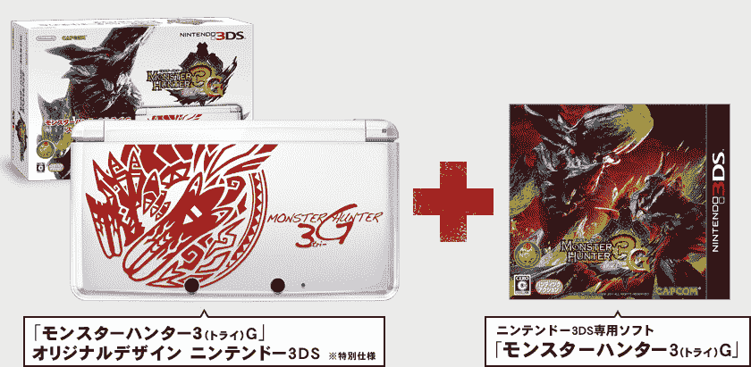
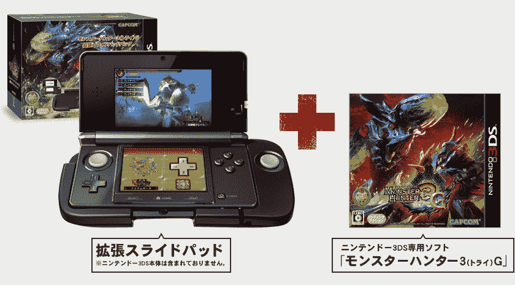

# 日本不仅将推出 3DS《冰雪奇缘》,还将推出 3DS 怪物猎人 G 套装

> 原文：<https://web.archive.org/web/http://techcrunch.com/2011/10/06/japan-to-get-3ds-in-ice-white-and-3ds-monster-hunter-g-bundle/>

# 日本将不仅推出 3DS 的“冰雪奇缘”,还将推出 3DS 怪物猎人 G 套装

任天堂和卡普空日本公司今天发布了两个与 3DS T1 相关的公告:首先，日本消费者将可以在 11 月 3 日买到一种新颜色的设备，即 T2，即冰白色 T3(正常价格为 15000 日元/195 美元)。

第二，Capcom Japan [公布了](https://web.archive.org/web/20230204164506/http://www.capcom.co.jp/monsterhunter/3G/shohin.html)【JP】所谓的“怪物猎人 3G 特别装”，其中包括一个白色和特别设计的 3DS 和怪物猎人 3G。该套装将于 12 月 10 日登陆日本，售价为 274 美元。

 

单单这个游戏，加上那个[大的滑动垫](https://web.archive.org/web/20230204164506/https://techcrunch.com/2011/09/13/the-ghastly-nintendo-3ds-slidepad-is-real-ships-to-japan-this-december/)，就要花掉我们 91 美元:

