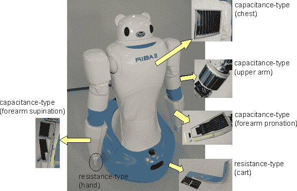

# 日本看护机器人协助扶起老人 

> 原文：<https://web.archive.org/web/http://techcrunch.com/2011/08/02/japanese-caretaker-robot-to-assist-in-lifting-the-elderly/>

# 日本看护机器人协助扶起老人

在日本，人们非常担心如何适应老龄化的人口。他们的老弱人数以百万计，这个数字的增长与这个国家的其他地方不成比例。照顾它们自然是每个人的想法——包括那些机器人专家。研究机构 RIKEN 正在更新其医疗援助机器人，以帮助护理人员完成将人从床上抬到轮椅上并送回来的任务。

[新版 RIBA](https://web.archive.org/web/20230203040604/http://www.riken.go.jp/engn/r-world/info/release/press/2011/110802_2/index.html) (用于交互式身体辅助的机器人)实际上可以蹲下并抱起病人离开地板，这是护理人员必须经常做的费力的动作。它的手臂上有传感器，根据电容原理工作，但完全由橡胶制成(当然，导电部分除外)，这使它能够确定病人的体重和正确的力量，以便提起、滚动等。

它不是自主的，[正如你从视频](https://web.archive.org/web/20230203040604/http://www.youtube.com/watch?v=wyNa7b4eHRo)中看到的，考虑到不久前的[流氓 lovebot](https://web.archive.org/web/20230203040604/https://techcrunch.com/2009/03/05/japanese-lovebot-traps-intern-in-order-to-hug-her-repeatedly/) ，这可能是一件好事。

我预计在未来几年内会看到更多这样的东西被开发出来——美国也有自己的研究在进行中，与[计算机视觉](https://web.archive.org/web/20230203040604/https://techcrunch.com/2011/02/25/cool-video-robot-teams-collaborating-on-navigation-and-targeting/)和[高级仿生系统](https://web.archive.org/web/20230203040604/https://techcrunch.com/2011/07/19/new-robot-touch-sensor-paves-the-way-to-more-lifelike-humanoids-video/)的合作可能会产生机器人护士，从人手里拿走大量繁重的工作。

【via [快公司](https://web.archive.org/web/20230203040604/http://www.fastcompany.com/1771029/the-riba-robotic-nurse-can-pick-you-up)