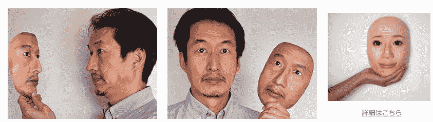
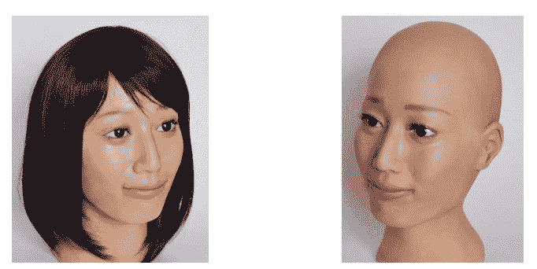
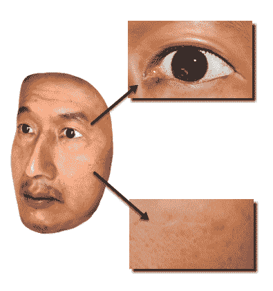
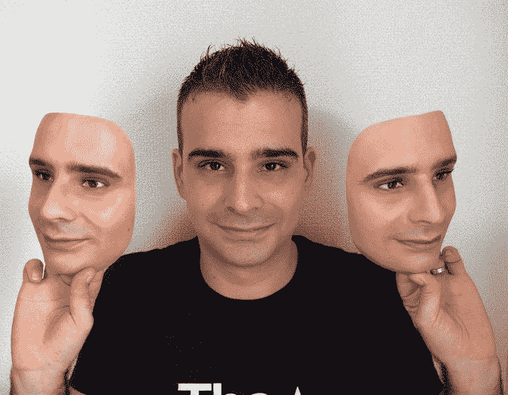
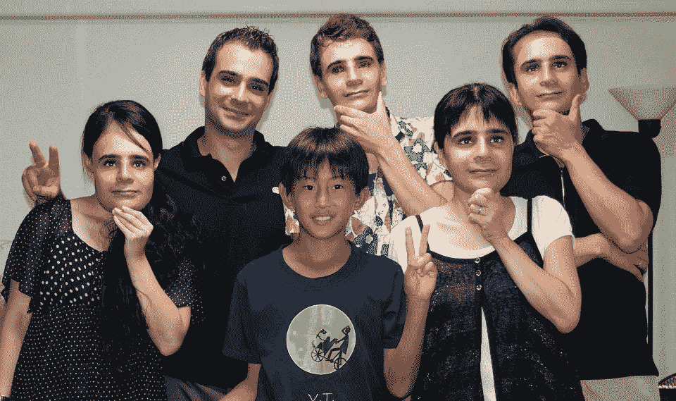

# 3DPF:日本公司创造出超逼真的 3D 人脸复制品 TechCrunch

> 原文：<https://web.archive.org/web/https://techcrunch.com/2011/10/10/japanese-company-real-f/>

# 3DPF:日本公司创造出超逼真的 3D 人脸复制品

无论出于什么原因，如果你曾经梦想过获得一个超级逼真的人脸复制品，这就是你的机会:一家名为 [REAL-f](https://web.archive.org/web/20221208005148/http://real-f.jp/) [JP]的日本公司正在创造所谓的 3DPFs(“三维照片形式”)，即“3D”人脸的副本。这家初创公司提供两种版本，一种是面具型复制品，另一种是所谓的人体模特型，即头部复制品。

它的工作方式是，REAL-f 首先从各个位置拍摄一个人的脸部照片，并将图像印在模具上拉伸的氯乙烯树脂上。据该公司称，其独特的生产技术可以确保甚至像虹膜和血管这样的细节都被精确复制(见图片自行判断)。

购买者可以以 3920 美元的价格获得一个 3D“面具”(额外的复制品只需 780 美元)。每个人头复制品的价格为 5，875 美元(复制品的价格为 1，960 美元)。

 

更多图片可以在 REAL-f 的[脸书页面](https://web.archive.org/web/20221208005148/http://www.facebook.com/REAL.f.jp)找到。