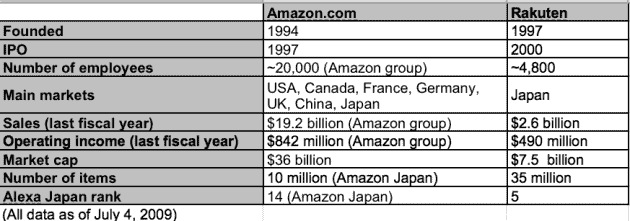
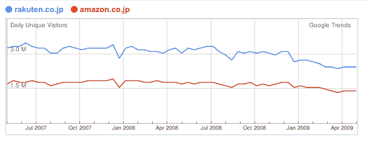
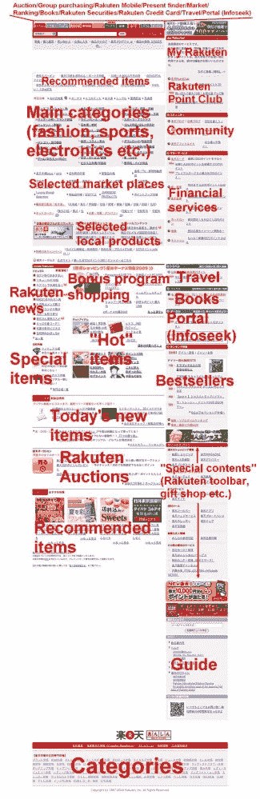

# 日本乐天:你从未听说过的最大电子商务网站会成为亚马逊全球的威胁吗？

> 原文：<https://web.archive.org/web/https://techcrunch.com/2009/07/05/japans-rakuten-can-the-biggest-e-commerce-site-you-never-heard-of-become-a-threat-for-amazon-globally-2/>

“电子商务”一词仍然缺乏一个普遍有效的定义，但即使你只是将 B2B 和 B2C 交易捆绑在一起，它也是一个全球数万亿美元的业务。去年，[尼尔森发现](https://web.archive.org/web/20221209222537/http://th.nielsen.com/site/documents/GlobalOnlineShoppingReportFeb08.pdf) [PDF] 86%的全球网民已经进行了网上购物(北美:92%)。仅在美国，B2C [销售额预计](https://web.archive.org/web/20221209222537/http://www.emarketer.com/Article.aspx?R=1007142&Ntt=ecommerce&No=-1&xsrc=article_head_sitesearchx&N=0&Ntk=basic)将从今年的 1300 亿美元增长到 2013 年的 2000 亿美元以上(不包括旅游)。

在北美，[亚马逊](https://web.archive.org/web/20221209222537/http://www.amazon.com/)是 B2C 领域 800 磅重的大猩猩—[远远超过](https://web.archive.org/web/20221209222537/http://www.businessinsider.com/henry-blodget-chart-of-the-day-amazon-vs-e-commerce-vs-retail-sales-2009-5)。1995 年在美国推出后，该公司迅速在[加拿大](https://web.archive.org/web/20221209222537/http://www.amazon.ca/)、[英国](https://web.archive.org/web/20221209222537/http://www.amazon.co.uk/)、[德国](https://web.archive.org/web/20221209222537/http://www.amazon.de/)、[法国](https://web.archive.org/web/20221209222537/http://www.amazon.fr/)、[中国](https://web.archive.org/web/20221209222537/http://www.amazon.cn/)和[日本](https://web.archive.org/web/20221209222537/http://www.amazon.co.jp/)建立了独立的网站。但是，尽管亚马逊在加拿大和欧洲取得了胜利，但在亚洲情况并不尽如人意。在中国(亚马逊于 2004 年开始提供本地化网站)，它实际上已经被本地玩家[摧毁了](https://web.archive.org/web/20221209222537/http://trends.google.com/websites?q=amazon.cn%2C+taobao.com&geo=CN&date=all&sort=0)[淘宝](https://web.archive.org/web/20221209222537/http://www.taobao.com/)【CN】。就流量而言，亚马逊在日本本土电子商务网站面前也相形见绌:[乐天](https://web.archive.org/web/20221209222537/http://en.rakuten.co.jp/)。

亚马逊在日本的活跃有一个很好的原因:日本政府在其最近的报告中称，2007 年该国的在线 B2C 行业同比增长了 21.7%，超过 550 亿美元。(注:由于测量方法完全不同，不同来源的统计数据可能会有很大差异。例如，日本的数据确实包括了旅游。)

现在，乐天似乎想把它的全球计划(在过去曾无数次在[提出)提升到一个新的水平，首席执行官三木谷浩史(Hiroshi Mikitani)就在本周末表示，他希望看到他的公司到今年年底在日本以外的日销售额达到 100 万美元。](https://web.archive.org/web/20221209222537/http://fukumimi.wordpress.com/2007/12/18/rakuten-launches-english-language-site-sort-of)

这个简短的案例研究试图揭示乐天的背景和关键成功因素，为什么他们在日本击败亚马逊，以及他们为走向全球做出了哪些努力。

**1。Rakuten vs . Amazon Japan**
Rakuten Ichiba(Rakuten market place)拥有 4700 万会员(三分之一的日本人都注册了)，在这个国家家喻户晓。与亚马逊最大的不同是，乐天是作为 B2B2C 公司创立的，没有仓储功能。这是一个平台，让个体商家在网上向个人客户销售产品。

他们在这方面非常成功，尽管亚马逊早在 2000 年就推出了他们的日本网站。请看下表，这是谷歌趋势流量对比图:

**2。乐天的成功因素:激进的定价和广泛的多样化**
乐天的想法和主要成功因素是帮助那些想要自己建立定制网上商店的日本实体企业。早在 20 世纪 90 年代末，首席执行官三木谷浩史就开始系统地将现有主机服务的价格降低 75-85%，并将其与积极的销售和咨询模式相结合。作为取消中间商的代价，商家必须预付货款，这使得乐天有可能保持正现金流。直到今天，该网站还为商家提供各种服务，让他们的生活变得更轻松(真实世界研讨会、商家专属月刊、电话支持等)。).作为回报，除了佣金(每个零售商销售收入的 2.6%)之外，Rakuten pockets 还从目前在该网站注册的 28，000 多家商家那里收取固定的“虚拟房地产”费用。

与此同时，该公司在过去几年里脱离了其最初的 B2B2C 根基，迅速成为一个巨大的网络集团。该公司的转型比亚马逊在美国做得更彻底:乐天收购了流行的在线门户网站 Infoseek([Alexa Japan rank:20](https://web.archive.org/web/20221209222537/http://www.alexa.com/topsites/countries/JP))以增加主网站的流量，建立了拍卖服务(现在是日本第三大)，提供在线证券经纪服务，收购了在线旅游服务(乐天旅游现在是日本最大的酒店预订网站)，并提供博客平台(在博客疯狂的日本排名第三)。此外，还有乐天信用卡(近 200 万日本人拥有一张)、个人消费信贷服务、电子银行(日本最大的)、售票服务、现实世界的乐天棒球队、受欢迎的高尔夫球场预订子网站等。等等。你明白了。

**3。Rakuten market place:3500 万件商品，价格从 1 美元到 10 万美元**
不等，但尽管近年来迅速多元化，Rakuten 仍然主要作为日本人的在线购物网站而闻名。与亚马逊相反，他们可以在乐天上买到任何东西，从二手的 7 万美元四吨卡车、古驰手袋、数字内容(亚马逊日本不提供下载)，到当地农民直接提供的苹果和橙子。

许多商品的价格水平相对较低，因为许多商店提供相同的产品，并且收集的设置允许用户快速比较价格。所有书籍、DVD、CD 和类似媒体的运输通常都是免费的。乐天还推出了所谓的[“超级积分”](https://web.archive.org/web/20221209222537/http://event.rakuten.co.jp/borderless/infoservice/en/point/)系统，这是一个针对会员的奖励计划(在网站上购买不需要注册)。亚马逊的反要约“亚马逊点”成立于 2007 年。

下面是乐天一叶海量首页的翻译版(点击放大):

**4。亚马逊日本的强势地位**
看到这个杂乱的首页(这在日本一点也不稀奇)，有趣的是注意到亚马逊忍住了改变他们全球统一的设计方法以适应日本人口味的冲动(亚马逊的美国网站基本上是作为他们全球所有网站的设计蓝图)。

但是亚马逊并没有像往常一样在日本开展业务，而是对其子公司进行了额外投资。下个月，该公司将在大阪城外建立一个新的配送中心(这将是亚马逊在日本最大的配送中心)。在过去的几周里，网站上增加了三个新的类别，大约有 130，000 种商品。日本零售商从 2006 年开始就有可能在亚马逊上开网店。

总的来说，亚马逊在日本的定位非常好，证明了外国网络公司可以成功进入这个国家。它们还表明，流量上的劣势并不总是转化为销售额上的劣势(按比例)。亚马逊的母公司没有在国家层面上细分销售数字，但一些消息来源估计日本子公司赚取了亚马逊总销售额和收入的大约 10%。假设这是真的，这将使该国的销售额达到约 19 亿美元，营业收入达到可观的 8400 万美元(尽管就在昨天，据报道日本税务当局要求该公司退还未申报收入的 1.19 亿美元税款)。

**5。乐天的国际化努力和英语服务**
乐天多年来一直在谈论走向国际化，他们已经在一些国家试水。在美国，四年前，乐天以 4.25 亿美元收购了总部位于纽约的电子商务公司 [LinkShare](https://web.archive.org/web/20221209222537/http://www.linkshare.com/) (乐天美国总部位于波士顿)。乐天台湾和乐天欧洲(在卢森堡)于去年成立。乐天旅游已经扩展到韩国、关岛、泰国和中国。

国际客户已经可以通过[乐天旅游的英文界面](https://web.archive.org/web/20221209222537/http://travel.rakuten.co.jp/en/)(在乐天日本上，效果非常好)在许多亚洲国家预订酒店。日本顾客可以通过一项名为“乐天国际运输服务”的服务从选定的国家订购大约四分之一的商品。非日本用户可以访问谷歌翻译的[商品页面](https://web.archive.org/web/20221209222537/http://event.rakuten.co.jp/borderless/index_en.html)(目前支持 24 种语言)，下单，通过信用卡支付，然后等待从日本直接发货(外国人[甚至可以收集超级积分](https://web.archive.org/web/20221209222537/http://event.rakuten.co.jp/borderless/infoservice/en/point/))。

当然，这只是一个权宜之计，但比许多其他日本在线零售商提供的要好得多。

**6。乐天表示，日本以外的销售额目前还不到总销售额的 10%，海外销售额目前平均每月增长约 20%。三木谷浩史经常提到亚洲(尤其是中国)是他的公司的下一个大市场。**

但当前的经济危机引发了网络巨头们的一种趋势:选择性国际化。 [MySpace](https://web.archive.org/web/20221209222537/http://www.myspace.com/) 大批非美国员工[最近](https://web.archive.org/web/20221209222537/http://www.beta.techcrunch.com/2009/06/23/myspace-layoffs-coming-to-countries-where-it-is-getting-trounced-by-facebook/)、[脸书](https://web.archive.org/web/20221209222537/http://www.facebook.com/)据传[对中国](https://web.archive.org/web/20221209222537/http://www.mobinode.com/2009/07/05/best-strategy-for-facebook-china-is-forget-about-china/)和德国商业社交网络[邢](https://web.archive.org/web/20221209222537/http://www.xing.com/)上周决定[搁置](https://web.archive.org/web/20221209222537/http://www.beta.techcrunch.com/2009/06/29/xing-to-give-up-china-and-make-way-for-linkedin-in-the-us/)在美国和中国的扩张计划。

这就是为什么我猜测，乐天将避免在核心市场与亚马逊一决雌雄，而是专注于未开发的国家或利基市场——尽管过去曾做出过这些咄咄逼人的声明。(例如，去年 1 月，该公司表示将在 2013 年前进军 27 个不同的国家。三木谷浩史经常声称，他的最终目标是建立世界上最大的互联网公司。)

在日本，事情进展得相当顺利，但在全球范围内，乐天将经历一段艰难的时期。大型竞争对手肯定不会袖手旁观，将拉美、非洲、印度或东南亚等市场拱手让给它们。在美国和欧洲核心市场，亚马逊占据主导地位。在中国，淘宝已经拥有 1.2 亿用户。

就目前而言，外部参与者不太可能赢得这些市场。即使对于乐天这样的企业集团及其魅力领袖来说也是如此(此外，他们还必须在国内应对一个名为亚马逊的相当强大的服务)。