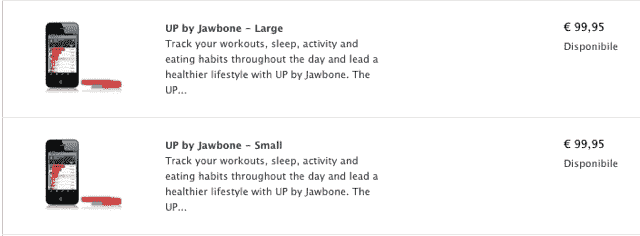

# Jawbone 适合健身的 Up 腕带出现在网上商店 

> 原文：<https://web.archive.org/web/http://techcrunch.com/2011/10/31/jawbones-fitness-friendly-up-wristband-appears-in-online-stores/>

# Jawbone 的健身友好型 Up 腕带出现在在线商店

Jawbone 首席执行官侯赛因·拉赫曼在去年的 TED 大会上推出 Jawbone 时，引起了一些人的关注，主要是因为它看起来与通常的 Jawbone 系列完全不同。

当与我们自己的莎拉·莱西谈话时，拉赫曼承诺 Up 将“很快”推出，但我们可能非常接近发布。注重健康的 Up 腕带今天在苹果在线商店和 Jawbone 自己的网站上短暂出现，这意味着正式发布不会太远。

对于那些不熟悉 Up 的人来说，这里有一个快速复习:它本质上是一个内置加速度计的腕带(相当吸引人)。它旨在收集从用户的活跃程度到用户睡眠状况的一切数据，希望量化这些信息将使用户更有可能跟踪它。这不是世界上最新的概念(T2 FitBit T3 比 Up 早了不少)，但它可能会受益于时尚的执行。

我们的一位忠实线人给我们发来了这张苹果意大利在线商店的截屏图(见上图)，它非常清晰地向我们展示了 Jawbone Up 将有三种不同的尺寸，零售价格可能在€99 左右。

我自己做了一点调查，发现了苹果英国商店的缓存版本，声称 Jawbone Up 有现货，随时可以发货，前提是你愿意支付 79 英镑。这似乎也证实了 Up 将有三种不同的颜色，所以挑剔的色彩应该不会找到他们喜欢的色调。

最糟糕的是，Up 在 Jawbone 的在线商店上也有自己的[产品列表，尽管我不知道它会持续多久。Jawbone 这边的某些人似乎明白了这一点，因为产品页面首先列出了 99 美元的标价，但刷新后显示了一个奇怪的占位符金额。](https://web.archive.org/web/20230205004356/http://store.jawbone.com/store/aliphcom/en_US/pd/productID.239807400)

所以，看起来健身恶魔们很快就能捡起颚骨了。作为一个通过用小玩意诱惑自己而迷上跑步的人(已经几个星期没有睡个好觉了)，我个人迫不及待地想要一个。

非常感谢我们的线人保罗！