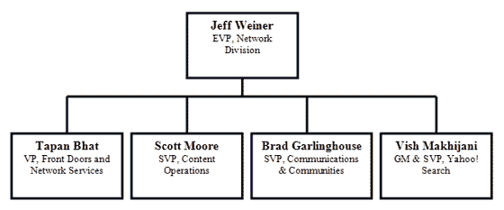

# 杰夫·韦纳即将离开雅虎，关于继任者的猜测开始 

> 原文：<https://web.archive.org/web/https://techcrunch.com/2008/06/11/jeff-weiners-departure-from-yahoo-imminent-speculation-on-successor-begins/>

我们公司内部的消息来源称，自周末以来一直是疯狂猜测的主题的杰夫·韦纳已经提交了辞呈。雅虎和韦纳仍在就他的离职协议进行谈判，并将“很快”宣布他的离职。但最大的问题是——谁将取代他？

韦纳第一次加入雅虎是在前首席执行官特里·塞梅尔于 2000 年上任时。许多员工认为他是继杨致远之后，公司的精神领袖，也是真正把事情维系在一起的人。他的离开给公司的高级管理层留下了一个空缺。

展望未来，韦纳可能会成为常驻企业家，与 [Accel Partners](https://web.archive.org/web/20230206215840/http://www.crunchbase.com/financial-organization/accel-partners) 和 [Greylock Partners](https://web.archive.org/web/20230206215840/http://www.crunchbase.com/financial-organization/greylock) 一起工作。韦纳通过安德鲁·布拉奇亚与阿塞尔关系密切，后者曾负责雅虎搜索，并向杰夫汇报。他与格雷洛克的关系源于詹姆斯·斯拉韦特，他曾负责雅虎汽车，也直接向韦纳汇报。

上个月，我和韦纳共进晚餐，我们讨论了他对社会责任投资的热情(他是[捐助者的选择](https://web.archive.org/web/20230206215840/http://www.crunchbase.com/company/donorschoose-org)和[不再有疟疾](https://web.archive.org/web/20230206215840/http://www.malarianomore.org/)，彼得·切宁的宠物慈善机构的董事会成员并积极参与其中)、社交媒体和雅虎正在进行的[开放战略](https://web.archive.org/web/20230206215840/https://techcrunch.com/2008/04/24/the-new-yahoo-sticky-viral-and-most-of-all-friendly/)

韦纳的直接下属[布拉德·加林豪斯](https://web.archive.org/web/20230206215840/http://www.crunchbase.com/person/brad-garlinghouse)、[塔潘·巴特](https://web.archive.org/web/20230206215840/http://www.crunchbase.com/person/tapan-bhat)、[斯科特·摩尔](https://web.archive.org/web/20230206215840/http://www.crunchbase.com/person/scott-moore)和[唯帅·马基亚尼](https://web.archive.org/web/20230206215840/http://www.crunchbase.com/person/vish-makhijani)管理雅虎的美国资产。据我们的消息来源称，雅虎可能会将这四个人中的一个挪到他的位置上——在雅虎的未来不确定的情况下，在这个时候引入一个局外人是不太可能的。我们听说，雅虎也有可能进行新一轮的高管重组。

以下是这份工作的可能竞争者:

布拉德·加林豪斯

 加林豪斯，SVP 通信与社区，是臭名昭著的[花生酱宣言](https://web.archive.org/web/20230206215840/https://techcrunch.com/2006/11/18/yahoos-brad-garlinghouse-makes-his-power-move/)的作者。他经营雅虎的社区和通信服务。他的属性包括 Mail、Messenger、Groups、Flickr 和 Zimbra。在加入雅虎之前！，布拉德担任 Dialpad Communications 的首席执行官。在职业生涯的早期，Brad 在@Ventures 领导了通信和互联网业务的风险投资。他还在@Home Network 和 SBC Communications 担任过领导职务。

**斯科特·摩尔**

斯科特·摩尔是雅虎内容运营的 SVP。他在雅虎的圣莫尼卡办公室工作，控制着所有的媒体资产和垂直内容——新闻、金融、体育、电影、电视、音乐、梦幻体育、游戏、OMG 和视频等。像 Kids 和 Shine 这样的利基垂直市场也属于摩尔的范畴。他曾是微软 MSN 的一名受人尊敬的长期主管，负责他们的新闻、金融和体育网站。他于 2005 年加入雅虎。

唯帅·马基贾尼

 唯帅·马基贾尼是雅虎搜索高级副总裁兼总经理。他控制着雅虎搜索、Delicious 和其他财产。此前他是雅虎的副总裁兼总经理。美国消费者国际搜索业务。在加入雅虎之前！，唯帅曾担任 Inktomi 的副总裁兼总经理，并在 Inkomi 被收购时加入雅虎。在加入 Inktomi 之前，Makhijani 先生曾在普华永道(PricewaterhouseCoopers)工作，负责该公司的纽约地铁和硅谷业务，帮助财富 500 强客户和领先的技术、媒体和初创公司进行财务报告、合并、收购和公开发行股票。

**塔潘·巴特**

 Bhat，前门和网络服务副总裁，控制着雅虎主页、我的雅虎和其他类似 [Buzz](https://web.archive.org/web/20230206215840/http://www.crunchbase.com/product/yahoo-buzz) 的财产。每月有 5 亿人通过他控制的房产进入雅虎。他负责开发雅虎所有网络“前门”的前门战略。此外，他还直接管理和负责网络的前门(www.yahoo.com)和我的雅虎。

