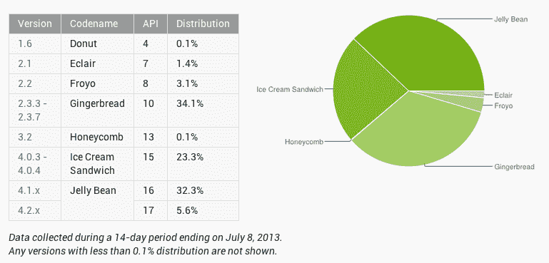

# 果冻豆提示以 37.9%的份额在 Android 用户中超过大多数采用 

> 原文：<https://web.archive.org/web/https://techcrunch.com/2013/07/08/jelly-bean-tips-past-majority-adoption-among-android-users-with-37-9-share/>

# 果冻豆提示在 Android 用户中以 37.9%的份额超过了大多数用户

谷歌今天更新了安卓版本的使用统计数据，果冻豆第一次领先成为最常用的操作系统。这可能得益于许多原始设备制造商最近推出了他们手机的果冻豆更新，包括 AT & T Galaxy S2。然而，姜饼仍然紧随其后，这表明许多旧设备仍在使用。

谷歌每月提供操作系统版本共享的更新，这一更新考虑了截至今天(7 月 8 日)的两周内收集的数据(基于 Google Play 商店的使用情况)。Jelly Bean 一直在接近多数份额，但这是它第一次超过它，这要归功于 4.1.X 版本的 32.3%的份额和 4.2.X 版本的 5.4%的份额。夹在姜饼和 Jelly Bean 之间的冰淇淋三明治没有那么受欢迎，其份额为 23.3%。

 果冻豆是安卓手机操作系统的最新版本，所以这对开发者和谷歌来说都是好消息。OS 更新几乎总是为开发者带来新功能，但开发者需要 OS 实际上被大量用户使用，才能采用那些新功能，而采用那些新功能正是谷歌和其他移动平台运营商将吸引和留住新用户的。

碎片化经常被认为是 Android 的一个大问题，谷歌已经采取措施解决这一问题，包括扩展其 Nexus 程序以包含更多设备。三星和 HTC 现在都通过谷歌自己的 Play store 提供他们的旗舰手机(Galaxy S4 和 HTC One ),具有“谷歌版”的名称，允许他们及时更新谷歌自己的 Nexus 系列设备，也就是说一旦它们上市。

这一点，再加上通过运营商将更新更快地发布到合格硬件的持续努力，正在帮助谷歌在让人们更快地使用新版操作系统方面取得进展。我仍然希望每部 Android 手机都可以选择快速轻松地更换为“谷歌版”，无需专业技术知识，但如果谷歌真的想加快采用新操作系统版本的速度，这一天可能不会太远。