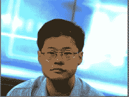
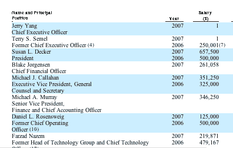
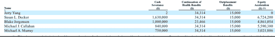
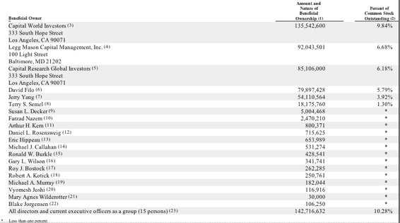

# 杨致远的工资只有 1 美元，但伊坎还是想要他的脑袋 

> 原文：<https://web.archive.org/web/https://techcrunch.com/2008/06/04/jerry-yangs-salary-is-only-1-but-icahn-still-wants-his-head/>

对雅虎来说，6 月将是一个有趣的月份。该公司昨天提交了[委托书](https://web.archive.org/web/20230204062304/http://www.sec.gov/Archives/edgar/data/1011006/000089161808000295/f37157r1prer14a.htm)，将年度股东大会的日期定在 8 月 1 日。维权股东卡尔·伊坎已经提出了自己的[董事会成员候补名单](https://web.archive.org/web/20230204062304/https://techcrunch.com/2008/05/15/dear-yahoo-youre-fired/)，现在也[呼吁 CEO 杨致远的人头](https://web.archive.org/web/20230204062304/http://www.nytimes.com/2008/06/04/technology/04yahoo.html?_r=2&partner=rssnyt&emc=rss&oref=slogin&oref=slogin)。

伊坎指出，最近一份未公开的股东诉讼诉状详细描述了雅虎与微软达成交易的过程。(投诉可在此下载[)。他告诉了 *NYT* :](https://web.archive.org/web/20230204062304/http://www.blbglaw.com/cases/yahoo_takeover.html)

> 我认为没有人理解雅虎为了避免达成交易所做的事情的重要性，在我看来，你可能不得不解雇杰里和董事会的一部分来恢复微软。

尤其让他恼火的是雅虎在微软出价后实施的员工保留计划，如果微软每股 31 美元的出价被接受，该计划最终可能会让微软花费高达 21 亿美元(如果每股 35 美元，该保留计划将花费高达 24 亿美元)。微软愿意为保留计划支付 15 亿美元。(这份未公开的诉状中的另一则趣闻是，微软曾在 2007 年 1 月提出以每股 40 美元的价格收购雅虎，但被时任首席执行官特里·塞梅尔(Terry Semel)拒绝。年度股东大会应该会很有趣。

伊坎可能想摆脱杨，但他不会去找一个更便宜的 CEO。根据雅虎的委托书文件，杨致远 2007 年的工资只有 1 美元，并且没有其他报酬(尽管他拥有公司 3.9%的股份)。仅总裁苏·德克尔的工资就高达 65.8 万美元。

不过，除掉杨也不会花太多钱。在所有权变更的情况下，他的离职协议要求他只能得到 2 美元。苏·德克尔将获得 160 万美元，外加价值 670 万美元的未归属股权和期权的自动加速。如果你把前五名高管的遣散费加起来，包括加速期权的价值，那将达到近 2500 万美元。

伊坎的剑拔弩张会给他带来什么好处吗？微软已经正式退出了这项交易。如果股东取代了雅虎董事会，它几乎肯定会回到谈判桌前，但如果发生这种情况，它可能不再觉得有必要提出每股 31 美元的报价。会发生吗？伊坎拥有雅虎约 4%的 t 4 股份，并且正在购买更多股份(可能还有 4%)。他得到了公司袭击者朋友的支持，比如 t·布恩·皮肯斯(拥有至少 1000 万股股票，不到 1%)和对冲基金投资者约翰·保尔森(拥有 5000 万股股票，另外 4%)。所以到目前为止，这只占有投票权股份的 9%到 13%。

伊坎需要让雅虎的两大股东加入进来:资本研究与管理公司的戈登·克劳福德和莱格·梅森公司的比尔·米勒。根据委托书，截至 5 月 7 日，克劳福德控制了雅虎 16%的股份，米勒控制了另外 6.7%。所有这些加起来，就是 32%到 36%的份额——仍然不够，但已经很接近了。雅虎内部人士，包括创始人杨和大卫费罗，只控制了 10%的股份。(点击下表查看大图):

