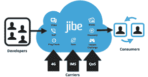

# Jibe Mobile 筹集 830 万美元发展其基于云的应用程序开发平台——希望教会运营商如何在全 IP 世界中取胜 TechCrunch

> 原文：<https://web.archive.org/web/https://techcrunch.com/2012/12/11/jibe-mobile-raises-8-3m/>

Jibe Mobile 已经完成了一轮 830 万美元的融资，投资者包括电信公司的风险投资部门[沃达丰风险投资](https://web.archive.org/web/20221206184500/http://www.vodafone.com/content/xone/index/ventures.html)，日本移动内容提供商 [MTI](https://web.archive.org/web/20221206184500/http://www.mti.co.jp/eng/) ，以及其他未透露姓名的投资者。

你可能还记得 2008 年的 Jibe 当时它提供了一个在社交网站上分享内容的移动应用程序。自那以后，该公司已经改变了形态——从应用程序制造商转变为平台创造者。它还一直在与运营商合作，构建基于 IP 的网络互联(又名 [Joyn](https://web.archive.org/web/20221206184500/http://joynus.com/) 计划)。目前，Jibe 将自己描述为基于云的全球通信提供商。或者至少，这是它的雄心——而这个宏伟的计划就是新资金的来源。

今天的融资公告是 Jibe 迄今为止唯一的外部融资(不包括对其早期业务的 80 万美元天使投资)。这位首席执行官告诉我，近年来公司一直在创造收入，因此不需要寻求其他资金。但其新业务的范围非常宏大——在这里坚定地强调“全球”和“云”这两个词——因此，启动和运行它并确保它可以随着需求的增长而扩展所需的财政资源比其早期的应用程序工作高出一个数量级。

### 一个应用程序相互调用的平台

简而言之，Jibe 正在为应用程序开发人员构建一个云平台，以便更容易(也更便宜)地将丰富的实时通信/连接功能整合到他们的应用程序中，例如 VoIP 通话、视频聊天和顶级的多人社交游戏功能。Jibe 表示，使用其 SDK 和 API，开发人员可以在几分钟内为他们的应用程序添加 Skype 风格的视频通话功能，例如，通过插入几行代码。

“以视频为例，用四行 Android 代码，他们就可以让视频在他们的应用程序中工作，”首席执行官 Amir Sarhangi 说。“他们不需要了解 SIP、IMS 以及任何用于视频聊天的技术，例如编解码器，他们不需要了解这些。

“就基础设施而言，他们正在利用我们的基础设施——我们在世界各地都有数据中心，而且我们在许多不同的地方部署了代理服务器，让用户体验非常好。”

除了拥有许多数据中心来传输所有的比特和字节——Jibe 在山景城、伦敦、杜塞尔多夫和东京都有办公室——它还与运营商合作，为他们各自的网络优化其平台。“总而言之，只要我们与移动运营商有关系，我们就能提供更好的体验，例如，如果你碰巧是沃达丰的用户，你就会获得更好的体验，因为我们与他们的网络有联系。

“但没有什么是依赖于运营商的，所以从开发商和消费者的角度来看，它在任何地方都适用，”他补充道。“随着我们开启更多的运营商关系，我们的网络变得更好，我们能够提供的质量也变得更好。”

“我们看到的是一个所有应用程序都相互连接的未来愿景——我们指的是本质上包含视频聊天、VoIP 等功能的应用程序，以及相互进行多人游戏的能力——所以你有两个可以通过移动网络玩游戏的应用程序。由于移动网络的性质以及能够在各种移动平台上交付的复杂性，应用程序开发人员传统上很难做到这一点。”

### 从一个应用到另一个应用

如果你还在为“基于云的全球通信提供商”的绰号挠头，这里有一个视频展示了 Jibe 平台的一个使用案例——展示了一个空气曲棍球游戏应用程序如何能够融入一个社交游戏多人模式，这允许用户识别他们的哪个联系人有这个应用程序，并且在特定时刻也有连接性可以玩，然后发送一个“游戏挑战”来邀请他们的好友玩。(“这几乎就像两个应用程序在互相调用”是 Sarhangi 的描述。)

【YouTube http://www.youtube.com/watch?v=3mxV_3-2Vj8？rel=0]

Jibe 的云平台进行实时数据传输，将两个应用程序联系起来，这样两个玩家就可以从各自的手机和位置进行对战——延迟水平足够低，以确保体面的游戏性。最好的性能是在 4G 网络上(在这种情况下有 40 到 60 毫秒的延迟)，但 Sarhangi 说 Jibe 的平台也可以在 HSPA 和 3G 网络上工作——尽管一些对时间非常敏感的游戏可能会在这些较慢的网络速度下受到一点性能冲击。

该平台的另一个特点是支持多任务实时应用的能力——例如，可以弹出一个视频通话窗口，以便用户在聊天时可以访问其他电话功能。该平台也不仅仅面向游戏开发者——Sarhangi 提出了一个电子学习用例，其中一名开发者将数字白板整合到组合中，以将移动电子学习应用程序中的视频共享到教室屏幕上。他说，许多类型的应用开发者都可以从搭上 Jibe 的云的顺风车中受益。

### 支点前的倾斜:快乐的力量

这一最新的 Jibe pivot 源于它为沃达丰(Vodafone)帮助建立 Joyn(T1)的工作，Joyn 是一项旨在确保不同网络和地理区域之间 IP 服务(如即时消息和图片消息)互操作性的运营商计划。Joyn 通过使用一种新的、单一的通信标准来做到这一点——但还没有几家运营商签署，因此它仍是一项正在进行的工作。

Jibe 业务的一部分是作为 Joyn 的权宜之计——在大规模运营商采用之前实现该技术的互操作性承诺(其业务的这一部分被称为 [JoynNet](https://web.archive.org/web/20221206184500/http://www.jibemobile.com/carrier/joynnet/) )。但是在 Joyn 工作期间，Sarhangi 说 Jibe 也意识到在开发者和运营商之间有建立新业务的空间——帮助这两个群体互相帮助。

“我们一开始就与 Joyn 有很多合作，作为一家公司，我们的主要热情之一是，在帮助创建 Joyn 的过程中，我们意识到开发人员做这些事情非常困难，”Sarhangi 说。“所以我们如何让它变得非常简单，另一方面，作为一个小开发商，与运营商合作很难，因为他们是一个大公司，所以你如何让它变得简单，以便你将双方带到一起，打破障碍。”

###  未来功能和费用

将来，随着 Jibe 云平台的发展，Sarhangi 设想能够支持四路视频通话，或者通过叠加来修改语音或视频通话。“你现在看到的是基础，”他说，并补充说，该公司打算由其开发者社区领导，以纳入他们要求的功能。“当开发者自己成功了，我们也就成功了，所以对我们来说，这不是一场争夺世界上那么多功能的比赛，而是一场让他们成功的比赛。”

Jibe 的平台包括对 Joyn 的支持，因此它是运营商网络演进的“未来展望”，目前支持 Android 应用程序，但该公司正在努力支持 iOS(Sarhangi 表示，它“可能”会在 Q1 早期宣布 iOS 的可用性)。它还计划推出一个 WebRTC 版本。

该平台最近结束了私人测试，已经有超过 500 名开发者注册。虽然目前开发者可以免费使用，但 Jibe 的商业模式涉及未来向开发者收费——尽管它表示只会在“他们成功时”收费——即一旦他们的应用程序通过 Jibe 平台进行的并发视频通话或语音通话超过一定数量。【T2

今天宣布的融资将用于“产品方面”的工作，如完成 iOS 支持。它还将用于扩展平台，以应对不断增长的需求。“很明显，我们正在运行一个全球云，所以我们需要一个团队来确保我们能够支持真正的[全球]体验，”Sarhangi 说。“我们需要能够在任何地方提供[低延迟性能]。而且，由于我们有更多的需求，与开发商和运营商合作需要大量的资源，这两个群体有些分散，需要大量的关注。”

### 运营商的削减:一个防玩家的关税？

那么，运营商与 Jibe 合作有什么好处呢？Sarhangi 说，这是一个“在全 IP 世界中围绕核心服务进行再创新”的机会，也是一个语音和文本收入持平/下降的世界。Jibe 的平台最终应该会推动运营商的数据收入，但更重要的是，它为运营商提供了一个机会，让他们能够研究适合超高端全 IP 服务时代的新商业模式。

“传统上，运营商不太擅长为了做某事而做某事，让每个人都为之兴奋，然后想办法增加收入。他们总是被金钱所驱使。我在沃达丰工作了将近七年，负责沃达丰日本公司的产品和服务，我们从来没有做过任何事情，除非它是完全*完全*考虑周全并且在财务上可行的，”Sarhangi 说。

“我认为现在他们正在采取一种不同的方法——他们试图从互联网书籍中学习如何提供服务，这种情况不仅仅是为了增加数据收入，而是关于未来是否有一天我们可以出售一项计划，让游戏开发者付费获得超高速体验？

“因此，这是关于对他们的包装进行细分，并使他们的网络在如何为开发商和最终消费者包装方面更加智能。如果你能向我保证，我会和我的朋友一起玩这些多人游戏，获得非常棒的体验，我会多付 5 美元。”