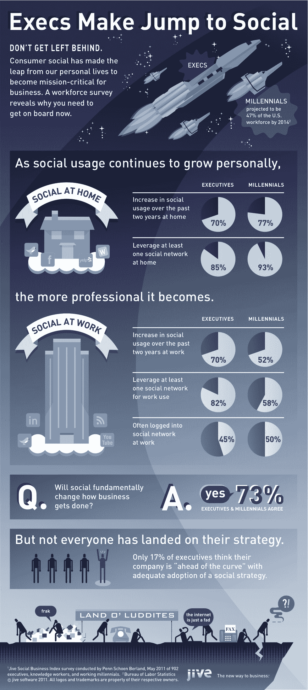

# jive:53%的高管认为他们必须采用社交业务，否则可能会落后

> 原文：<https://web.archive.org/web/https://techcrunch.com/2011/06/29/jive-53-percent-of-execs-believe-they-must-adopt-social-business-or-risk-falling-behind/>

# jive:53%的高管认为他们必须采用社交业务，否则就会落后

社会企业巨头 [Jive](https://web.archive.org/web/20230209125220/http://www.crunchbase.com/company/jive-software) 今天[在](https://web.archive.org/web/20230209125220/http://www.prnewswire.com/news-releases/new-jive-study-unveils-social-business-is-top-executive-strategic-imperative-124700518.html)发布了一项名为 Jive 社会企业指数的研究，该研究调查了 902 名美国大中型企业的高管对企业社会的看法。

该研究显示，社会业务越来越被视为企业中的战略执行要务，78%的受访高管承认，拥有社会战略对其企业未来的成功至关重要。

具体调查结果包括:

*   66%的高管认为，商业社交应用代表着工作方式的根本转变。
*   53%的高管认为他们必须采用社交业务，否则就有落后的风险。
*   57%的人预计实施社会商业战略会带来“收入或销售额的增加”。
*   70%的高管和 51%的千禧一代在他们的移动设备或个人电脑上下载了至少一个基于网络的工作应用程序。
*   58%的高管和 58%的千禧一代在工作场所下载或使用应用程序之前，没有征求或获得系统管理员或 IT 专业人员的许可。
*   89%的高管、88%的千禧一代和 76%的普通知识工作者认为，如果他们能够大幅减少撰写和阅读电子邮件的时间，他们和他们的团队将会更有效率。

考虑到越来越多的公司希望在他们的内部交流中加入社交功能，这些发现并不惊人，但很有趣。

