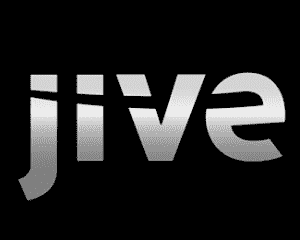

# 随着 IPO 的临近，Jive 增加了四名新的董事会成员 TechCrunch

> 原文：<https://web.archive.org/web/https://techcrunch.com/2011/03/30/jive-adds-four-new-board-members-as-the-ipo-gets-closer/>

# 随着 IPO 的临近，Jive 增加了四名新的董事会成员

[Jive](https://web.archive.org/web/20221222040133/http://www.jivesoftware.com/)CEO[Tony Zingale](https://web.archive.org/web/20221222040133/http://www.crunchbase.com/person/tony-zingale)终于宣布了他自 2010 年接管公司以来一直致力于的一个大项目的结果。这不是一次收购或产品发布:这是 Jive 董事会的一次大规模升级。

加入董事会的有迈克菲即将离任的董事长 Charles Robel、迈克菲首席执行官(现就职于英特尔) [Dave DeWalt](https://web.archive.org/web/20221222040133/http://www.crunchbase.com/person/david-dewalt) 、脸书技术运营副总裁 Jonathan Heiliger 和谷歌产品管理副总裁[桑德尔·皮帅](https://web.archive.org/web/20221222040133/http://www.crunchbase.com/person/sundar-pichai)。

除了头衔，还有一系列令人印象深刻的技能。罗贝尔曾在几家上市公司的审计委员会任职。DeWalt 是 McAfee 和 Documentum 的首席执行官，这两家公司都以很高的溢价出售。Heiliger 负责在云环境中向 6.5 亿用户交付脸书。皮查伊负责谷歌的 Chrome OS 和 Chrome 浏览器以及其他产品。它们中的每一个都跨越了企业和消费者体验之间的界限。

Jive 一举提升了公司财务、战略运营、规模、技术和产品愿景的深度。这四人加入了辛加尔的行列——辛加尔已经两次担任上市公司首席执行官，并在六家上市公司的董事会任职——凯鹏华盈的泰德·施莱因和红杉资本的吉姆·戈茨以及 T4 的其他人也加入了董事会。

是的，这是一个旨在让公司变得更好的董事会。但这也是一个传达两个信息的董事会:我们对建立下一个大型企业软件公司是认真的，当我们说我们将在 2011 年上市时，我们是认真的。

虽然津加尔很了解罗贝尔和德瓦尔特，但招募他们四个人还是费了一番功夫。“我本可以很容易地选择选择那些满身灰尘、无所事事的老高管，但这里的情况不是这样的，”他说，像一位优秀的私营公司首席执行官计划提交申请一样，对我的 IPO 猜测置之不理。“我认为，在我们追求更多 M&A 和做出战略决策时，公司需要这种专业知识的不公平优势来推动技术决策、治理决策和财务决策。”

没错，他说 M&A. Jive [去年年初收购了 Filtrbox](https://web.archive.org/web/20221222040133/http://www.jivesoftware.com/about/companies/filtrbox) ，显然更多的交易正在酝酿之中。“注意这个空间，”津加尔说。"有几样东西正在酝酿中。"