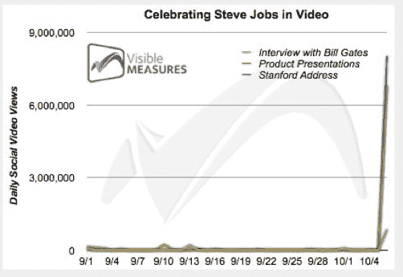

# 史蒂夫·乔布斯的斯坦福毕业典礼演讲昨天被观看了 800 万次 TechCrunch

> 原文：<https://web.archive.org/web/https://techcrunch.com/2011/10/07/jobs-stanford-address-watched-8-million-times-yesterday/>

# 史蒂夫·乔布斯的斯坦福毕业典礼演讲昨天被观看了 800 万次

哇哦。在苹果公司联合创始人史蒂夫·乔布斯去世的噩耗传来之后，[的视频播放量令人瞠目结舌](https://web.archive.org/web/20230205003137/http://corp.visiblemeasures.com/news-and-events/blog/bid/69066/Celebrating-Steve-Jobs-in-Video)。作为乔布斯最著名也是最近的演讲之一，2005 年斯坦福大学的[毕业典礼演讲在 9 月份平均每天有 2000 次点击。昨天，根据 Visible Measures 的统计，这个演讲有超过 800 万的浏览量。](https://web.archive.org/web/20230205003137/https://techcrunch.com/2011/10/05/stay-hungry-stay-foolish/)

9 月份，他在苹果活动上的许多产品展示平均每天有 24000 次点击量(这是 1997 年的[早期版本](https://web.archive.org/web/20230205003137/https://techcrunch.com/2011/10/06/jobs-focus-is-about-saying-no/))。昨天，这些视频的浏览量超过了 680 万次。9 月份，他和比尔·盖茨在 All Things Digital 的访谈平均每天有 11000 次点击。昨天，这些视频的浏览量超过了 85 万。一天之内就有超过 1500 万的浏览量。

Visible Measure 表示，它已经积累了网络上每个视频的大量剪辑数据。

毫无疑问，所有这些视频现在都是我们对史蒂夫·乔布斯集体记忆的一部分。

[YouTube http://www.youtube.com/watch?v=UF8uR6Z6KLc&w=420&h=315]