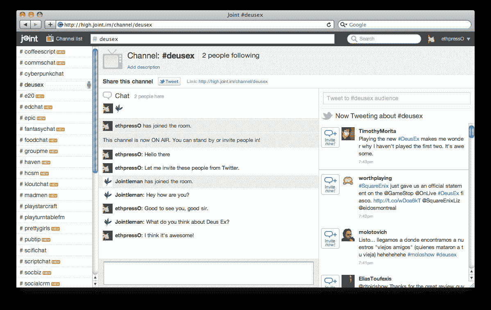
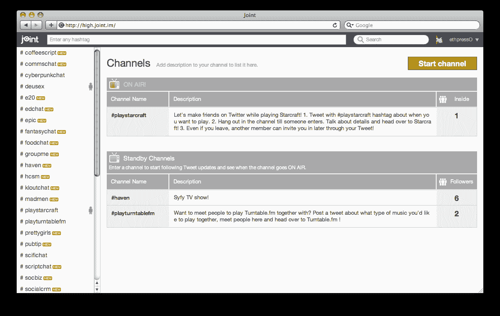

# 联合将群组聊天引入 Twitter 

> 原文：<https://web.archive.org/web/http://techcrunch.com/2011/08/26/joint-brings-group-chat-to-twitter/>

大约一个月前，汤姆·安德森[在他最喜欢的社交网络 Google+](https://web.archive.org/web/20230205022900/https://plus.google.com/u/1/112063946124358686266/posts/8HJMcBnKbGV) 上写了一篇文章，为 Twitter 提供了一些建议。虽然我们中的许多人都喜欢不时地使用 Twitter，但安德森指出，如果 Twitter 想提高其用户体验的整体质量，它可能会考虑一些简单的功能。主要的推动力是，Twitter 的社交体验可能会得到改善，如果该公司增加一个“讨论”或聊天功能，在 Tom 的概念中，这将为观众提供一个输入框，通过它可以留下评论并轻松讨论推文，而不会用正在进行的对话的一部分淹没追随者的信息流。

嗯，汤姆可能只是对今天启动的一家名为[联合](https://web.archive.org/web/20230205022900/http://joint.im/)的新公司感兴趣。好吧，这不是 Myspace 创始人想法的精确复制，但它解决了 Twitter 用户长期讨论的同一个痛点:该平台急需一种更好的方式来促进实时、私人和更长形式的对话。当然，对于 Twitter 是否应该提供这一功能，或者它是否应该保持简单，用户之间存在一些分歧。

联合创始人 Ethan Gahng 表示(我倾向于同意), Twitter 最好保持简单的用户界面，而不是让第三方创业公司和开发者从外部添加更多的社交和聊天功能。(Twitter 过去几年的行动似乎很大程度上符合这一理念。)

为了实现这一目标，Joint 本质上把任何 Twitter 标签变成了一个类似 IRC(互联网中继频道)的聊天室，它与 Twitter 的实时标签流集成在一起。下面来看看吧。这个组合允许用户参与许多不同的社交互动，包括前端和中心的实时群聊功能，它在右侧栏中填充了一个实时标签提要。

然后，用户可以直接将标签拉进群聊，或者直接从聊天室邀请写推文的人加入群聊，或者只是闲逛并享受同步聊天，观看推文流的填充。与 Hootsuite、Tweetdeck 和其他让你追踪标签的第三方应用程序相比，能够从“外部”观看某人发推文，并立即将他们带进来聊天，是 Joint 提供的一个微妙的边界和区别，这真的有很大的不同。

如果你试图在 Twitter 上与某人进行超过几个“@回复”的对话，你要么被迫 DM，要么在其他地方进行对话。Joint 允许用户轻松加入群组聊天，以及讨论著名或流行的标签。例如，最近“#irene”已经成为一个被广泛使用的标签，因为飓风 irene 即将袭击东海岸。对于希望在任何地点轻松聚集和讨论正在发生的情况(如飓风、抗议或事件)的人来说，Joint 可能成为一种非常有用的资源。

Joint 平台的另一个很酷的方面是，它旨在为 Twitter 用户提供一个非正式的对话媒体，这意味着如果我正在与某人交谈，而第三个人加入了聊天室，他们将无法看到正在进行的对话。Gahng 说，这是为了让联合群聊更好地反映现实世界中的互动。

至于 Joint 的预期用例，Gahng 表示，在 Twitter 上与其他人联系很容易，但很难真正了解他们，所以使用 Joint，你可以在 Twitter 上遇到你想与之一起玩星际争霸的人——你的许多粉丝可能不想加入进来。这就是为什么开放标准战士[克里斯·梅西纳](https://web.archive.org/web/20230205022900/http://twitter.com/chrismessina)首先提出了这个标签，但是，当然，没有多少人在日常的 Twitter 使用中经常关注这个标签。Joint 希望通过让搜索不同的标签、讨论和实时同步关注变得更容易来改变这一点。例如，[点击这里](https://web.archive.org/web/20230205022900/http://joint.im/channel/playstarcraft)查看星际频道。

更不用说，因为用标签发推文意味着你的推文会被存档并永远存在于搜索引擎上，等等。，许多人对在 Twitter 上进行公开对话(尤其是关于更私人的问题)感到不舒服。我们都曾不得不删除一两条推文，但往往为时已晚。通过向 Twitter 用户提供社交灵活性的额外好处，Joint 希望在其他第三方 Twitter 应用上占得先机。

最后，除了能够简单地关注一个标签组之外，Joint 还可以在聊天室有新用户时通知用户，提供搜索描述，并让用户能够浏览主目录，甚至启动他们自己的标签频道。

Joint 解决了 Twitter 用户经常遇到的一个主要痛点，从我在聊天室和在网站上闲逛的经历来看，UI 很简单，聊天也很快且易于使用。三人联合团队自 1 月份以来一直在研究这个问题，创业公司在这一点上是自举的，但如果这个平台可以扩展并继续实时运行，没有故障，这似乎是肯定会有腿的东西。

Joint 及其团队不以任何方式隶属于 Twitter，但如果这个社交网络在未来某个时候敲他们的门，我不会感到惊讶。

欲了解更多信息，[请点击此处](https://web.archive.org/web/20230205022900/http://joint.im/)查看家中的关节。