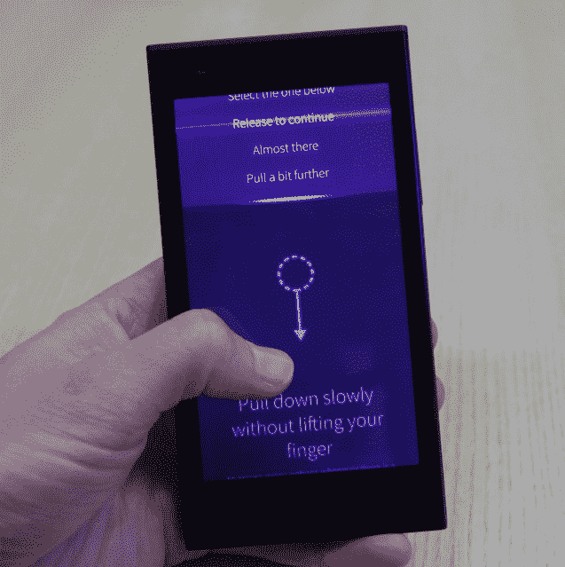
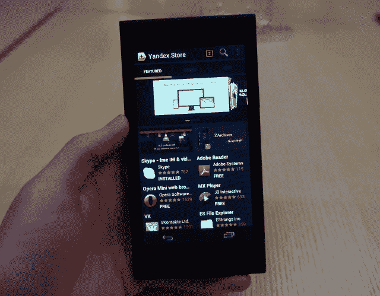

# 手握 Jolla 的首款手机 MeeGo 的继任者 Sailfish OS TechCrunch 的“先锋设备”

> 原文：<https://web.archive.org/web/https://techcrunch.com/2013/11/30/jolla-first-phone/>

芬兰智能手机初创公司 [Jolla](https://web.archive.org/web/20221005181452/http://www.crunchbase.com/company/jolla-oy) 的第一款手机就叫做 Jolla。这款手机已经研发了大约两年——这一时间框架证明了构建手机硬件*和*新移动平台的复杂性，更不用说召集开发者和实现[安卓兼容性](https://web.archive.org/web/20221005181452/https://beta.techcrunch.com/2013/09/16/jolla-android-compatibility/)了。因此，对于一家勇敢的初创公司来说，两年的时间真的不算糟糕，这家公司的成员曾经为昔日的移动世界之王诺基亚工作，然后离开去做这家手机制造商决定不做的事情:成功地将 MeeGo 作为谷歌的全能 Android 的替代品。

MeeGo 在诺基亚 N9 上的应用现在在 Jolla 的同名手机上变成了 Sailfish。Jolla 手机终于在周三在赫尔辛基发布，首批 450 台设备主要由那些已经通过预售活动登记了兴趣的人带回家。Jolla 现在向全欧洲的其他预购者运送手机。预售量排名前三的国家依次是芬兰(如你所料)、德国和英国

在伦敦的一次新闻发布会上，TechCrunch 与 Jolla 的第一款手机进行了几个小时的接触，两位联合创始人马克·狄龙(Marc Dillon)和萨米·皮涅姆基(Sami pienimki)也在场回答问题。

[gallery ids="921150，921144，921149，921147，921142，921141，921151，921146，921143，921148，921140，921145"]

Jolla 手机硬件将标准的智能手机平板改造成一个诱人的塑料三明治，就好像两块不同颜色的甘草被啪的一声放在一起。后半部分被称为另一半。在上面的演示设备上，后半部分是纯白色的，但芬兰运营商 DNA 的第一批手机是亮粉色的，未来 Jolla 开始通过自己的网站直接销售时，后半部分是可定制的颜色。

像 Jolla 的软件一样，另一半旨在成为一个可扩展的平台——通过内置在手机背面的连接器来供电，通过总线连接来传输数据，从而允许其他一半可以集成物理 Qwerty 键盘，或者气象站传感器，甚至电子墨水屏幕，以及当前 shells 支持的 NFC 支持的软件主题交换。

Jolla 联合创始人马克·狄龙(Marc Dillon)表示:“放置类似键盘的东西是意料之中的事情。“我们正在开发开发者工具包，以便任何人都可以这样做……我们正在开发附件，我们希望第三方也能开发附件。”

标准的 Jolla 手机(即另一半不太花哨的手机)握在手中的尺寸和重量都很好——既不会太大而不显眼，也不会太重或太轻而不舒服。理论上，它的规格相对中等——4.5 英寸显示屏，双核芯片，4G，800 万像素摄像头，外加 16GB 可通过 microSD 卡扩展的内部存储器。但是区分手机硬件规格并不是 Jolla 的全部。

它的不同之处在于 MeeGo 衍生的 Sailfish 软件平台，以及一种开放的理念，即希望开发者和其他公司能够在这个平台上构建各种软件和硬件扩展。Jolla 手机展示了创业公司 Jolla 能做什么——TL；看看我们为自己建造了什么，为什么不让我们为你建造些什么呢？

Dillon 告诉 TechCrunch:“没有先锋设备，你不可能真正拥有一个操作系统，尽管在过去两年里，我们已经与移动领域的几乎所有人进行了交谈，几乎每一种制造商，我认为他们都在等着看我们到底有什么能力。”

“因为如果你只是看上去，人聪明，那么我们*和这些家伙相比真的*渺小。他们的咖啡预算可能和我们创造这个设备的花费一样多！…所以现在他们有了一种方法来判断我们的能力，方法是拿起一个真实的设备，观察它，看看它能做什么。”

尽管有这种 b2b 销售宣传，Jolla 也致力于自己的消费者游戏——相信人们对新的和不同的东西有兴趣，以动摇相同的智能手机领域。

狄龙表示，今年早些时候预购其手机的人中约有 80%已经转化为销售，有些情况下没有支付任何定金。Jolla 没有证实预购了多少设备，只是说这是一个[“典型”规模的生产批次——最多 5 万台](https://web.archive.org/web/20221005181452/https://beta.techcrunch.com/2013/08/21/jolla-closes-first-pre-sales/)。但据狄龙称，这款手机在上市当天就为€带来了 100 万英镑的销售额。

做一个粗略的计算，用这个数字除以手机的标准€399 价格标签，相当于一天卖出 2500 部 Jolla 手机。尽管如此，预售活动还是把水搅浑了一点。不管怎样，对一个手机新手来说，在一天内为€创造 100 万美元的收入并不坏。

事实上，当你是一家拥有 80 多名全职员工的初创公司，而不是苹果或三星这样的电子巨头时，将智能手机推向市场本身就是一项巨大的成就。但这对 Jolla 来说也仅仅是个开始。现在，更艰巨的社区建设工作正式开始了——如果要把一部手机变成一场全新的开放移动运动的话。

激情项目吸引粉丝。Jolla 显然是 Dillon 的一个激情项目，他告诉我，他亲自与周三在赫尔辛基纳林卡广场排队等候 Jolla 发布的每个人握手。对于所有决定离开继续开发一个被诺基亚抛弃的平台的前诺基亚人来说。

Jolla 的早期买家显然也对(另一个)本土移动平台的潜力充满热情。问题是 Jolla 能否建立一个超越这些怀旧渊源的社区。Dillon 认为它已经在这么做了——而且发布会的特点是兴趣广泛。

从高中生到退休老人，人人都有。有男人和女人，不同的国籍——当然有很多芬兰人，因为是芬兰人，但也有来自其他国家的人，”他说 。

“这是我们真正好奇的事情之一。通常你会有一群新技术平台的早期采用者——我们似乎打破了这种局面。我们有非常广泛的人群在使用我们的第一款设备。”

> 我相信人们在寻找不同的东西。想象一下，如果你在世界上只能买两种汽车选择。

为什么他认为 Jolla 正在吸引多元化？“我认为人们对我们有很大兴趣的原因是大卫和歌利亚的事情，但事实上，我们不只是作为一个公司的代言人，而是作为人出现，我们对人感兴趣，我们是人，我认为我们已经与许多人建立了个人联系。

“我相信人们在寻找不同的东西。想象一下，如果你在世界上只能买两种汽车选择。人们只能购买提供给他们的东西——他们已经有了五年的相同经历。所以人们很好奇接下来会发生什么。”

但发射本身就令人兴奋。技术的日常现实是，人们也渴望平淡无奇的东西——功能性、可靠性、稳定性、简单性、(应用)熟悉度，等等。这些都是 Jolla 需要努力的领域。其新的移动平台不可避免地自相矛盾:它既闪亮 *又粗糙* 。

Jolla UI 与 Android 和 iOS 不同，令人兴奋的是，在某种程度上，你可以感受到它提供一些灵活、易用的东西的潜力。它通常也感觉快速和有响应性——尽管在打开或切换应用程序时会有一个小的延迟，并且进度条会弹出来做一些你可能没想到的动作，比如删除一张照片。

但它不可避免地仍有许多问题需要解决，包括导致应用程序崩溃或混乱的实际错误，还有违反直觉的怪癖——事情并不总是如您预期的那样运作。对 Jolla 来说，最大的挑战之一无疑是学习曲线，它对用户的新需求现在完全嵌入了基于图标、后按钮标志张贴的主流用户界面。

在 Jolla 的用户界面上导航需要一套不同于 iOS 和 Android 的手势；没有后退按钮，按钮也很少——它更像是推拉式的，更像黑莓 10，甚至是 Windows Phone，有浏览内容的手势，并从屏幕上拉下更多的东西。(当然，乔拉会说它的界面与众不同。)

其他手势关闭或最小化应用程序——后者在主屏幕上显示为小部件，如果开发人员添加了这样的功能，您也可以与之交互。因此，例如，您可以从浏览器小部件中刷新网页，或者命令它打开一个新的标签，或者通过在相应的主屏幕小部件上向左(或向右)滑动，直接进入 Jolla 的应用商店搜索应用。

一般来说，要导航，用户必须遵循微妙的线索——比如有时出现在屏幕或菜单顶部或底部的发光条，以表示有一个可以在屏幕上拖动并在同一运动中选择的动作列表；或者出现在屏幕右上角的面包屑点，这意味着还有其他屏幕的内容等着被浏览。

掌握这些元素不是一天的工作，但它需要耐心和学习新东西的意愿——不幸的是，Jolla 不能认为这是理所当然的。用户在运行 Android 应用程序时，还必须应对旗鱼手势与 Android 导航元素(如 Android 后退按钮和最近应用程序键)的结合。这稀释了 Sailfish 希望取代的 Android 范式的路标。

“我们取消了 home 键，所以我们确实取消了其中的一个，但遗憾的是，尽管我们有自己的前进和后退解决方案，但[Android]应用程序仍在使用，所以我们仍然需要这些按钮，”狄龙说。

Jolla 正致力于在其网站上推出一个社区门户，其中将包括一个用户可以互相帮助解决问题的论坛，以补充其已经推出的在线护理频道。它还制作了一系列视频来解释旗鱼的导航和手势。狄龙说，他们将为各种社交媒体联络点配备人员，人们可能会在那里寻找答案。此外，还有一个设备上的教程，引导用户完成手势基础知识。

所有这些肯定会有所帮助，但让人们从他们知道的东西转向不同的东西，从定义上来说是推水上山——正如微软让 Windows Phone 坚持下来的漫长艰难历程所强调的那样。

当然，任何“其他”平台都面临着一个巨大的挑战:应用差距不会消失。即使兼容 Android——Yandex 的应用商店预装了——Jolla 还是不可避免地远远落后于 Android 驱动的竞争对手。就原生 Sailfish 应用程序(通过 Jolla 商店访问)而言，发布时只有少数几个——我数了一下，该设备上大约有 28 个，其中包括电子邮件客户端和文档浏览器等基本功能。目前还不支持付费的 Sailfish 应用程序，但这一重要的开发者激励措施即将出台。

然后 Yandex 的 Android 商店只展示了 Android 用户在 Google Play(100 多万)上获得的应用程序的一个较小的子集(显然是 85，000 个)，所以不可避免的是，你在 bog 标准 Android 上找到的许多应用程序都不在这些货架上。(虽然你可以下载一些 Android 应用，但不能保证与 Sailfish 的兼容性流畅甚至可行)。

即使直接进入预装的 Yandex 商店的 Android 应用程序也不能保证顺利的结果，因为在这个(早期)点上存在持续的兼容性问题。值得注意的是，Android 运行时有时会自发地接管界面，将用户拉回到他们已经退出的 Android 应用，就好像山景城正在从这个开放的移动新贵手中夺回控制权。

兼容性问题也意味着 Android 应用程序可能会出现问题，一些元素无法与键盘等原生旗鱼元素正确配合，或者降低了体验，因此应用程序感觉迟钝。另一方面，其他 Android 应用程序——如 Twitter——在我使用期间似乎表现不错，所以也不全是坏事。但这是不一致的，Jolla 的 Dillon 承认，这家初创公司在 Android 兼容性方面确实有工作要做。

他说，尽管消费者面临无数挑战，但 Jolla 公司会长期经营下去。它致力于为其早期采用者提供一款不断改进和继续发展的设备，而不是像诺基亚的 N9 那样枯萎的硬件。“对我们来说，最重要的事情是我们继续为每个购买者增加价值，”他说。“我们接下来要做什么功能，我们相信消费者应该对优先事项有发言权——我们将继续通过软件提供新功能。”

Jolla 显然也有足够的资金来维持这一努力——一个行业支持者联盟承诺为 Sailfish 投资 2 亿€。早在二月份 [Jolla 公司本身也从一家总部位于香港的电信矿业公司中国财富获得了€100 万美元的投资](https://web.archive.org/web/20221005181452/https://beta.techcrunch.com/2013/02/19/china-fortune-takes-jolla-stake/),换取了该公司 6.25%的股份。中国电子商务巨头阿里巴巴和百度也被认为是 Jolla 未来的潜在合作伙伴——尽管这可能只是一厢情愿。

Jolla 公司的联合创始人 Sami pienimki 表示，该公司已经花费了大约 2000 万€，以便能够发布其第一款手机，运行 Sailfish OS。要真正让旗鱼动起来，还需要培育和建立多少生态系统，还有待观察。

但是为什么其他手机制造商想用 Jolla 的软件来驱动他们自己的设备呢？当我提出这个问题时，Dillon 说:“仅仅使用 Sailfish 就已经是一个优势，因为我们能够以全新的视角做一些新的事情。“我们(也)没有与之竞争的服务，或者没有必需的嵌入式服务”——这含蓄地暗示了谷歌如何试图通过提供 Play store 来让其安卓原始设备制造商([和开发者](https://web.archive.org/web/20221005181452/https://beta.techcrunch.com/2013/11/28/cyanogen-mod-removed/))保持一致。

除了“不是安卓”，狄龙认为 Sailfish 是下一波移动创新可能发生的地方——一个自由的实验空间，形成一种超越细分服务和个人应用程序在嘈杂的选择组合中消费的现状的方式。可以开发更智能、更统一和更有针对性的服务的地方。

> 这仅仅是我相信手机将开始打破这一应用障碍的开始。

他告诉 TechCrunch:“我认为这些平台将会做的事情——也是真正的差异化将会出现的地方——是当服务开始在这里(在主屏幕上)集成，而不仅仅是将你的应用程序粘贴并嵌入到设备中，而是实际上将多个应用程序连接在一起，以提供更无缝的体验。”

Dillon 设想了一个平台，在这个平台上，越来越多的应用程序相互插入，将数据传输到需要的地方，而不是位于用户需要访问的独立孤岛中，而不是用户从多个应用程序和设备中的不同位置获取数据。

他说:“我不想总是在事情发生的第二秒就处理它们，所以当我看(我的 Jolla 手机)时，我会看到我打了这些电话，所以会不断提醒我，这些是我生命中此刻正在与我沟通的人……信息……或电子邮件……这只是我相信移动设备将开始打破这一应用障碍的开始。”。

“事物之间的这种协同作用才刚刚开始，所以你不必总是跨应用程序，”他补充道。“我们正在做的是，我们正在创造一个地方，在那里，这些事情——远远超过我今天能想到或告诉你的——将会发生。

“平台的开放性让开发商、公司、企业家、新企业能够从用户体验一直到硬件、金属、芯片，再到一个或多个互联网服务，并提供将用户连接到一个或多个与本地相关的服务的东西，这些服务现在对你很重要，而不是垃圾信息。”

这一切都是为了不确定的未来。目前，Jolla 已经展示了一家初创公司可以制造智能手机。所以它已经证明了许多怀疑者是错误的。它还将自己定位为从芬兰手机制造商诺基亚手中接过接力棒——正如诺基亚准备放弃这一角色(通过将其设备和服务部门出售给微软)。这是残酷的还是合适的时机，取决于你的观点。

在一个新的平台上制造一款新的智能手机已经是一项令人印象深刻的成就。但是 Jolla 不打算停下来欣赏风景。这家初创公司无意让一款做工精致的手机保持其至高无上的荣耀。向前航行！