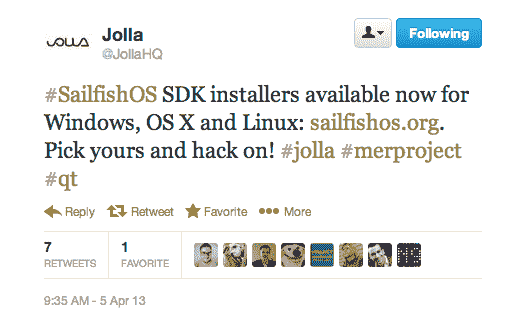

# Jolla 增加了适用于 Windows、OS X 和 Linux 的 Sailfish SDK 安装程序，推动更多开发者为其 MeeGo 平台开发本地应用 TechCrunch

> 原文：<https://web.archive.org/web/https://techcrunch.com/2013/04/05/jolla-launches-sdk-installers/>

# Jolla 为 Windows、OS X 和 Linux 添加了 Sailfish SDK 安装程序，以推动更多开发者为其 MeeGo 平台开发本地应用

为了在自己的智能手机操作系统 [Sailfish](https://web.archive.org/web/20221206153531/https://sailfishos.org/) 下点燃火种，[将 MeeGo 火炬带出诺基亚](https://web.archive.org/web/20221206153531/https://beta.techcrunch.com/2012/11/21/jolla-meego-sailfish/)的芬兰初创公司 Jolla 在其平台游戏中迈出了下一步，[推出了 SDK 安装程序](https://web.archive.org/web/20221206153531/https://sailfishos.org/develop.html)，以鼓励开发者开发本地 Sailfish 应用。

它为 Windows、OS X 和 Linux 提供图形安装程序(32 位和 64 位版本)。SDK 本身是在 2 月份的世界移动通信大会贸易展上发布的 Jolla 在展会上向运营商大力推销了产品。

Jolla 对 Sailfish 的计划包括将操作系统授权给其他设备制造商，并为第三方创建定制的品牌版本。但它也打算开发自己的运行 Sailfish 的 Jolla 品牌手机硬件。虽然 Sailfish 将支持 Android、Qt 和 HTML5 应用程序，但 Jolla 希望原生应用程序成为组合的一部分——以充分利用 Sailfish UI 功能，并在寻求建立一个完全成熟的[生态系统](https://web.archive.org/web/20221206153531/https://beta.techcrunch.com/2012/10/02/meego-startup-jolla-zeroes-in-on-china-expects-e200m-backing-from-hong-kong-alliance/)时，适当地将平台带入生活。

旗鱼用户界面在去年 11 月芬兰的 Slush 启动活动上被[演示过。该软件非常注重可用性，使用推拉手势来导航和选择/查看内容，允许单手交互实现很多功能。该平台还支持真正的多任务处理——允许当前运行的应用程序在主屏幕上显示为交互式磁贴。然后，这些磁贴支持应用程序交互——让开发者有机会定制用户在 Sailfish 主屏幕上作为磁贴时如何与他们的应用程序交互。](https://web.archive.org/web/20221206153531/https://beta.techcrunch.com/2012/11/21/jolla-meego-sailfish/)

第一款 Jolla 品牌的 Sailfish 手机将于今年下半年上市，可能会及时占领圣诞市场。今年 2 月，TechCrunch 采访 Jolla 首席执行官马克·狄龙(Marc Dillon)时，他并没有预测第一款 Jolla 设备发布时会有多少本地旗鱼应用程序，只是说:“开发者对我们很感兴趣。”