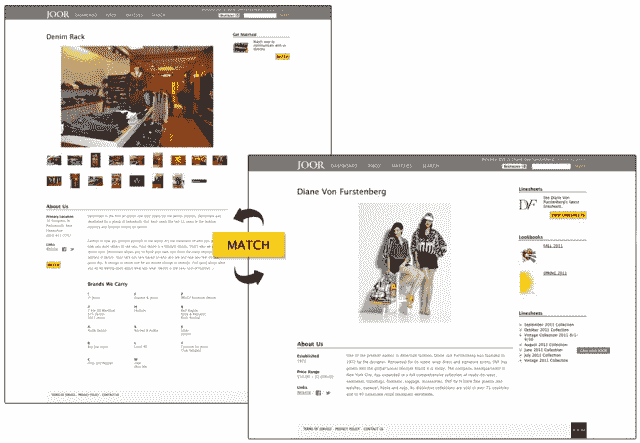

# JOOR 为私人在线时尚市场 TechCrunch 筹集了 225 万美元

> 原文：<https://web.archive.org/web/http://techcrunch.com/2011/07/19/joor-raises-2-25-million-for-private-online-fashion-marketplace/>

# JOOR 为私人在线时装市场筹集了 225 万美元

**独家-**[JOOR](https://web.archive.org/web/20230203102732/http://jooraccess.com/)，一个只对会员开放的当代时尚品牌和精品店的在线批发市场，[在一轮由 Battery Ventures 牵头的首轮融资中筹集了 225 万美元](https://web.archive.org/web/20230203102732/http://www.crunchbase.com/company/joor)，参与方包括 Lerer Ventures、Great Oaks VC、Landis Capital、Forerunner Ventures、William M. Smith 和 Richard Mishaan。

在创始人 Mona Bijoor(资深时尚买手)的领导下，该公司将利用额外的资金进行国际扩张，扩大其精品店、买手和时尚品牌网络。

JOOR 为零售时尚买家和品牌创造了一种相对新型的销售渠道，通过将贸易展和展厅的体验引入数字平台，努力为时尚品牌和买家节省大量宝贵的时间，并避免大量的麻烦。

B2B 市场只对被接受的会员开放，让时尚品牌与独立精品店和其他批发买家联系，进行在线交流和交易。

它的优势在于网络。JOOR 于 2010 年 3 月推出，从与 75 个品牌和 500 家精品店合作发展到与 250 多个品牌和 7，500 多家精品店合作。

类似的市场包括[而不仅仅是一本外观手册](https://web.archive.org/web/20230203102732/http://notjustalookbook.com/)、 [Erayo](https://web.archive.org/web/20230203102732/http://www.erayo.com/) 、 [Trunkt](https://web.archive.org/web/20230203102732/http://www.trunkt.com/) 和 [Balluun](https://web.archive.org/web/20230203102732/https://www.balluun.com/general/) 。

