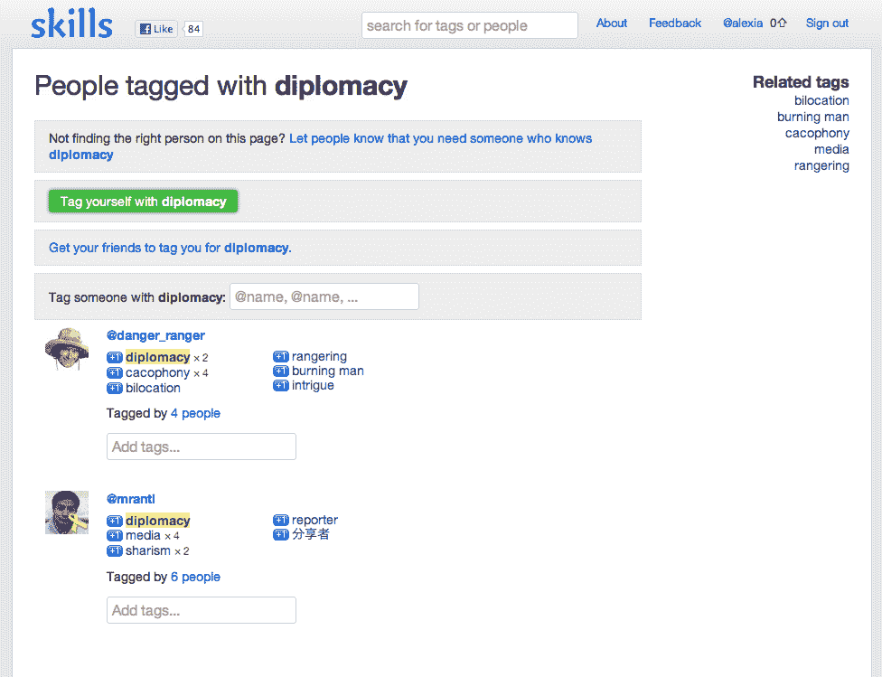

# 约书亚·沙赫特启动最新的美味实验室项目 skills . to 

> 原文：<https://web.archive.org/web/https://techcrunch.com/2012/03/28/joshua-schachter-launches-newest-tasty-labs-project-skills-to/>

# 约书亚·沙赫特启动了最新的美味实验室项目 Skills.to

创始人兼投资人 Joshua Schachter 花费了大量时间试图解决无法轻松找到相关事物和人的问题；最初是他的第一家创业公司 Delicious——据报道，他以 3000 万美元的价格将其出售给雅虎——现在是他在孵化器[美味实验室](https://web.archive.org/web/20221205130553/http://www.tastylabs.com/)的最新努力。Tasty Labs 从 [Andreessen Horowitz](https://web.archive.org/web/20221205130553/http://www.crunchbase.com/financial-organization/andreessen-horowitz "Andreessen Horowitz") 和其他人那里获得了 300 万美元的资金，在 8 月份推出了它的第一个项目( [Jig](https://web.archive.org/web/20221205130553/https://www.jig.com/) )，现在已经完成了它的第二个服务 [Skills.to](https://web.archive.org/web/20221205130553/http://www.skills.to/) 。

“有巨大的未满足的需求，”沙赫特说，他说他正在用指南针而不是具体的路线图来更有效地联系人们。他最终希望 Skills.to 变成一个可移植的声誉系统，“如果你能更容易地找到做事的人，那么你就能接触到全世界擅长自己工作的人。”

Skills.to 目前正在建立自己的数据集，因此它的核心功能包括用“天使投资者”和“Xgoogler”等技能类别来标记人们，或者搜索“iOS 开发者”等技能，这会显示带有该技能标签的 Twitter 帐户列表。Schachter 不太确定这个过程的最终结果会是什么，但最终希望通过 Twitter DM 或其他解决方案整合某种消息传递系统。

缺少一个漂亮的设计和一些明显的核心功能，Skills.to 仍然处于开始阶段，Schachter 正在使用 this 和 Jig 的迭代，以便在公众面前了解“需求”市场，“我是公开开发的粉丝，”他告诉我，“我不相信做八个月的开发然后发布一个产品。”

在与像 same 这样的公司相同的空间中，Skills.to 的最初感觉让人想起 Tagsona，这是一个雅虎内部工具，用于寻找从事类似项目的人。Schachter 告诉我，当用户反馈被整合时，最终的范围将超越简单的标记。他的最终目标不是建立类似 Klout 的东西，这更关乎影响力，而是将技能转化为人们可以在特定任务中找到谁是“世界上最好的”的地方。

虽然很明显，技能和夹具并不是完全成型的倡议，但沙赫特迭代这些项目的目标是探索社交软件的未来，创造超越“共享软件和机智评论”的产品，并推动人们朝着有目的的连接前进。

沙赫特专注于迎合早期采用者的技术，并尝试整合 Twitter，因为 Jig 主要专注于脸书。“我希望我们已经是第 37 次了，”他说。