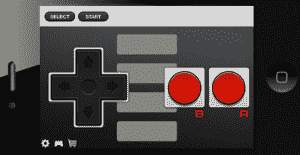

# Joypad 把你的 iPhone 变成了一个遥控器；推出新的 SDK，将 iOS 游戏引入 Apple TV 

> 原文：<https://web.archive.org/web/https://techcrunch.com/2011/10/03/joypad-turns-your-iphone-into-a-remote-control-launches-new-sdk-to-bring-ios-gaming-to-apple-tv/>

触摸设备彻底改变了移动游戏，就像它们彻底改变了整个移动空间一样。对于手机游戏，他们推出了一些令人惊叹的界面和控制器，让那些有幸在游戏机上玩雅达利的人后退一步，捏捏自己。当然，技术现在正把我们带向游戏机和触摸设备的融合。今天，像 Joypad Inc .这样的公司正在把我们的 iPhones 变成游戏控制器。 [Joypad 的同名免费应用](https://web.archive.org/web/20230203135407/http://itunes.apple.com/us/app/joypad-game-controller/id411422117?mt=8)通过蓝牙或 WiFi 直接与 iPad、Mac 和 PC 游戏同步，让游戏玩家将智能手机用作控制器，在各种 NES 风格的控制板上玩他们最喜欢的游戏。

游戏开发者也可以使用 Joypad 的免费 SDK，这需要大约 30 分钟来集成，以将 Joypad 支持添加到他们的游戏中。有了这些 SDK，游戏玩家可以用以前不可能的方式与他们喜欢的游戏互动。例如，当玩家达到一个新的级别，或解锁新的功能时，开发者可以实时向玩家推出一个新的按钮。这种功能为开发人员提供了一种新的方式来为控制器创建自定义布局，并与游戏体验进行更深入的集成。

 Joypad 最初是作为一种从你的 iPhone 上控制 Mac NES 模拟器的方式出现的。自 3 月份推出以来，该产品根据客户反馈不断改进，支持更多模拟器、多人游戏和 Windows。Joypad 的联合创始人 Lou Zell 告诉我，尽管早期客户的反馈很积极，但对于主流产品来说，设置太混乱了，因此该团队在 7 月发布了第一个开发人员 SDK，以消除所有最终用户设置。他说，现在它“工作正常”。

喜欢 Joypad 的另一个原因是，这个团队完全由两位创始人组成:托德·汉密尔顿(Todd Hamilton)和卢·泽尔(Lou Zell)。Joypad 是两位创始人的第三家创业公司，所有这些公司都是在合同工作期间自筹资金来偿还信用卡债务。他们的 SDK 的发布，以及所有最终用户设置的消除已经奏效。创始人已经看到了 Joypad 的早期牵引力，远远超过了他们以前的创业公司，他们的 iOS 应用程序下载了 50，000 次，迄今为止有 15 家公司使用他们的 SDK。看来第三次可能就是魅力所在。

由于这一早期的成功，该团队正在筹集一个小的种子轮，同时他们继续构建他们的产品。今天，Joypad 团队也将他们的 Unity SDK 从 alpha 中推出，这意味着现在更多高质量的 Mac 和 iOS 游戏可以提供 Joypad 支持——除了已经上线的 12 款游戏。

另一个很酷的部分是，现在 Joypad 有适用于 Mac、iOS 和 Unity iOS 的 SDK，它们的新功能将允许游戏玩家通过 iPhones 和 iPads 在 Apple TV 上玩 iOS 游戏。如果你是一个苹果设备迷，这将让你进入天堂，尤其是在预计明天发布的 iOS 5 之前。

多亏了 Airplay，Joypad 可以让你将你在 iPad 上玩的游戏无线移动到 Apple TV 上，让你从你的豆袋椅子上接管世界。Joypad 的 SDK 可以集成到 App Store 上的任何 iOS 游戏中，只需稍加修改，开发者就可以让他们的游戏 Joypad 和 Apple TV 兼容。

虽然 Joypad 提供了大量的控制器选项，并使开发人员可以轻松地为他们的游戏提供无线 iPhone 控制，但这家初创公司并不是该领域的唯一一家。6 月份，我们写了 Brass Monkey 收购 Emotely 的消息，该公司整合了 Brass Monkey 完全开发的控制器构建 SDK，支持 Flash、Unity3D 以及桌面游戏和应用程序，Emotely 能够使用 HTML5 为接口和通信层(通过 HTTP 和 WebSockets)构建控制器，这是天作之合。

Brass Monkey 和 Joypad 一起为希望在家庭游戏体验中增加额外水平的游戏玩家提供了一些很好的选择。随着开发人员对这些解决方案的了解和采用的增加，Joypad 的 iPad 游戏目录将会扩大，我们可能会有一个游戏改变者。

关于游戏手柄的更多信息，[点击这里](https://web.archive.org/web/20230203135407/http://itunes.apple.com/us/app/joypad-game-controller/id411422117?mt=8)在应用商店查看，或者点击这里找到[这家初创公司的 SDK。](https://web.archive.org/web/20230203135407/http://getjoypad.com/sdk.html)

以下是 Joypad 目前针对 Unity SDK 的游戏类型示例:

关于苹果电视黑客，[点击这里](https://web.archive.org/web/20230203135407/http://www.youtube.com/watch?v=j5i9NsvOF9o)查看 YouTubes。