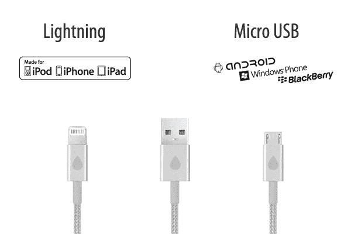

# juice 在 Kickstarter Can 上进行第二次尝试，juice+是一种铝制充电电缆，不会缠绕 TechCrunch

> 原文：<https://web.archive.org/web/https://techcrunch.com/2013/09/02/juicies-takes-a-second-kick-at-the-kickstarter-can-with-juicies-aluminum-tipped-charging-cables-that-wont-tangle/>

# juice 在 Kickstarter Can 上使用 juice+进行第二次尝试，这是一种铝制充电电缆，不会缠绕在一起

当 Kickstarter 项目进展顺利，足以在几年后引发续集时，这通常是一个积极的迹象。在 Juicies 的[案例中，初创公司 Juicies](https://web.archive.org/web/20221210001529/https://beta.techcrunch.com/2011/04/22/happy-day-of-special-significance-to-many-religions-we-have-brightly-colored-iphone-cables-for-you/ "Happy Day Of Special Significance To Many Religions! We Have Brightly Colored iPhone Cables For You!")最初是在一场成功的运动中建立起来的，该运动旨在制造一系列颜色的 30 针基座连接器电缆，[回归众筹网站](https://web.archive.org/web/20221210001529/http://www.kickstarter.com/projects/laudowicz/juicies-for-iphone-android-blackberry-and-windows)是关于为苹果的新 Lightning 标准制造电缆，以及在设计和材料方面与众不同的微型 USB 型号。

juice 电缆将使用阳极氧化铝的组合来屏蔽两端的连接器电路，以及各种旨在防止缠结和打结的编织绳，为您的设备充电。根据 Juicies 创始人劳伦斯·劳多维茨和汉尼斯·赖歇尔特的说法，这种新设计的既定目标是让我们每天用来给设备充电的电缆在设计和工艺方面符合设备本身的标准。

Laudowicz 和 Reichelt 是一个分开的团队，分别在火奴鲁鲁和德国不来梅工作。劳伦斯用最初的 Kickstarter 开始了他自己的第一个 Juicies 项目，但两人很快就配对了，从那以后，汉尼斯一直领导着该产品在欧洲的销售和分销。Reichelt 是经济学毕业生，有在西门子工作的经验，在中东做市场营销和市场研究，而 Laudowicz 是一名企业家，有古董买家和营销人员的工作经验。尽管他们之间分享的产品开发经验相对较少，但两人成功地建立了最初的 Juicies 在线业务，现在销售 30 针电缆、微型 USB 和五颜六色的 USB 扩展。

Juicies 是他们已经在做的工作的一种高级扭曲，从高级耳机制造商那里借鉴了一页，这些制造商通常采用编织电缆外壳设计。除了提供一种优质的感觉，编织电缆本身或彼此之间更不容易打结或缠结，这使得它们更容易匆忙地放入包中，然后再恢复。

 这家初创公司还需要为苹果当前一代移动设备更新其产品；Lightning 现在是苹果 iOS 硬件的主流标准，它的使用很可能会在 9 月份苹果推出新的 iPhone 硬件时完全取代 30 针。因此，Juicies 团队将通过其 MFI 计划使用来自苹果的 Lightning 连接器来创建其电缆，这是保证与苹果设备兼容的唯一方法。这可能是项目最大的潜在风险之一；苹果在向配件制造合作伙伴提供 MFI 认证的零件方面动作较慢，因此在供应方面可能存在瓶颈。它也是 MFI 项目可接受的 Lightning 连接器的唯一授权供应商。

Juicies 电缆的预计发货日期是 2014 年 1 月，但由于所需的 MFI 认证，生产过程的很大一部分不在项目创始人的控制之内，因此这个日期很可能会推迟，特别是在苹果预计于 9 月发布 iPhone 之后，配件制造商对 Lightning 组件重新产生兴趣的情况下。不过，该团队已经表明，它可以与苹果的 MFI 程序配合工作，并大规模推出产品，因此在这种情况下，支持者最终可能会物有所值，即使这比预期的时间长一点。