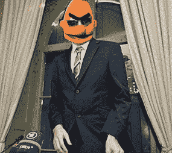

# 朱利安·阿桑奇获得嘎吱嘎吱提名？哦，真倒霉，金正日科技博客

> 原文：<https://web.archive.org/web/http://techcrunch.com/2011/01/08/julian-assange-nominated-for-a-crunchie-oh-bad-luck-kim-jong-il/>

# 朱利安·阿桑奇获得嘎吱嘎吱提名？哦，真倒霉，金正日

所以，嘎吱嘎吱的决赛入围名单已经[宣布](https://web.archive.org/web/20230202233019/https://techcrunch.com/2011/01/07/2010-crunchies-finalists/)并且——感谢你们，我们尊贵的读者们的投票——维基解密的[朱利安·阿桑奇](https://web.archive.org/web/20230202233019/https://techcrunch.com/2010/12/09/everyone-at-le-web-is-wrong-wikileaks-should-be-condemned-not-celebrated/)已经入围“年度创始人”类别。

当然，作为奖项的联合主持人之一，我必须被视为公正，绝不偏向或反对任何特定的被提名人。

例如，我认为提名一个令人毛骨悚然、自私自利、过失犯罪的强奸犯为“最佳创始人”，会向其他企业家发出一个令人震惊的混乱信息，这是非常不恰当的。同样，在 TechCrunch 的办公室里跑来跑去，尖叫着“你他妈的在开玩笑吗？朱利安·阿桑奇？”在我的肺可能会给人偏见的外观对那个油乎乎的小澳大利亚工具。所以我不会那么做。

相反，我想向在今年的投票中被残酷忽视的其他几个同样值得(而且很高调)的候选人表达我的同情。人们喜欢…

*   托尼·海沃德(最佳 CEO)
*   伯尼·麦道夫(最佳企业)
*   Craigslist 杀手(最佳定位服务)
*   [邪恶的伯特](https://web.archive.org/web/20230202233019/http://www.bertisevil.tv/)(最佳木偶)
*   迈克尔·维克(最佳社交应用)
*   金正日(最佳国际)
*   最佳天使
*   林赛·罗韩(最佳触摸界面)
*   冰岛的火山导致所有飞机停飞(最佳清洁技术/最佳时间下沉)
*   snooki(2010 年最佳新产品)

倒霉的家伙们——明年好运！