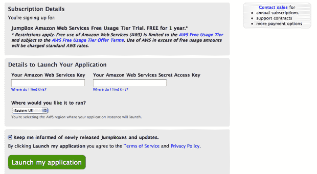

# JumpBox 现在在亚马逊的免费使用层 TechCrunch 上提供一键安装

> 原文：<https://web.archive.org/web/http://techcrunch.com/2011/02/14/jumpbox-now-offers-one-click-installs-on-amazons-free-usage-tier/>

# JumpBox 现在在亚马逊的免费使用层提供一键安装

去年 10 月，亚马逊推出了一项令开发者兴奋的功能:免费使用层，免费提供有限数量的 EC2、S3 和亚马逊其他云产品。这是一件大事，因为它让开发人员无需任何前期成本就可以推出新项目(他们只需在项目启动时开始支付)。但它对普通消费者来说并不是特别有用，他们不知道如何在亚马逊的云上建立项目。

现在 [JumpBox](https://web.archive.org/web/20230203002554/http://www.jumpbox.com/) ，一家提供“开源即服务”的初创公司，推出了一项功能，使这个免费使用层几乎任何人都可以访问。该功能支持一键安装 WordPress、Drupal、MediaWiki 和 Joomla——你输入你的 Amazon 密钥，创建一些 JumpBox 凭证，然后你就可以开始运行了。JumpBox 受益于接触新客户(他们也可能选择以高价安装其他应用程序)，亚马逊也受益于此，因为这些用户最终可能会达到免费使用层的极限，转而使用付费计划。

JumpBox 的好消息是，这项功能现在正在 AWS 免费使用层[主页](https://web.archive.org/web/20230203002554/http://aws.amazon.com/free/)上推广(你可以在右边看到推广小工具)。然而，我希望到达该网站的许多人已经知道如何在他们自己的服务器上安装 WordPress 或 Drupal。还要注意的是，这并不是唯一一个在云平台上提供一键安装的服务——我们之前已经写过提供一些类似功能的 [Standing Cloud](https://web.archive.org/web/20230203002554/http://www.standingcloud.com/) 。

