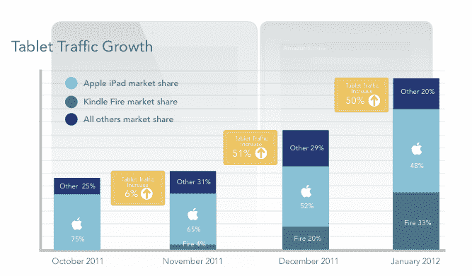

# Jumptap: Android 和 iOS 现在占所有移动广告流量的 91 %, Kindle Fire 占所有平板电脑使用量的 33%

> 原文：<https://web.archive.org/web/https://techcrunch.com/2012/03/06/jumptap-android-ios-now-91-of-all-mobile-ad-traffic-kindle-fire-33-of-all-tablet-use/>

# Jumptap: Android、iOS 现在占所有移动广告流量的 91%，Kindle Fire 占所有平板电脑使用量的 33%

Android 和苹果继续快速前进，给其他平台如何竞争留下了一个很大的问号，至少在美国市场:来自 [Jumptap](https://web.archive.org/web/20221205144638/http://www.jumptap.com/) 的新数据表明，在 1 月份，这两个平台占美国移动广告网络所有智能手机流量的 91 %,这是两个最具主导地位的手机平台的新高。

尽管苹果在去年推出 iPhone 4S 后，智能手机用户大幅增加，但 Jumptap 的数据显示，在平板电脑领域，它有一个强大的竞争对手 Kindle Fire，目前占网络上所有平板电脑流量的 33%。

虽然这些数字并没有确切地说明与 iPads 相比，Kindle Fire 设备的使用数量有多少(我们在这个问题上有更多的内容[在这里](https://web.archive.org/web/20221205144638/https://beta.techcrunch.com/2012/03/06/in-mobile-apps-free-aint-free-but-cambridge-university-has-a-plan-to-fix-it/))，但它确实指出了一个事实，即人们正在使用他们的亚马逊设备提供大量基于广告的服务。

Jumptap 的数据表明，尽管苹果(32.2%)和谷歌(58.8%)在美国每月 9500 万用户的广告网络中占据主导地位，但弱者似乎越来越弱:RIM 的黑莓平台的印象份额处于 6.7%的“新低”，而 Symbian 占 1.4%，Windows Mobile 更低:0.5%。

Jumptap 的预测是，尽管微软可能会因诺基亚的新 Windows Phones 系列手机而有所收获，但今年任何时候，垫底的三家公司的总印象都不会超过 10%。不过，这实际上为一些增长留下了空间…

在平板电脑领域，亚马逊被证明是一个强有力的竞争对手，至少在使用领域是如此。1 月份，它占所有平板电脑流量的 33%，正如你从下表中看到的，这一份额在过去三个月中迅速上升，甚至超过了平板电脑流量本身的增长。与此同时，苹果的份额为 48%，处于四个月来的最低水平。所有其他平板电脑制造商的合力也是如此。

**这是一个关键点，因为它表明那些购买 Kindle Fire 的人也在购买其背后以服务为导向的整个主张**:内容是苹果迄今为止能够说比任何其他 Android 平板电脑制造商做得更好的东西，但亚马逊的 appstore 应用程序组合，加上流媒体内容等产品似乎给了这个想法一个机会。这也向开发者表明，这是一个潜在的强大的开发平台。

还有待观察的是，作为周三新闻的结果，苹果是否会在未来几个月内产生另一个“新发布”效应。预计苹果将发布一款新的 iPad，在此过程中，苹果可能会看到 iPhone 4S 的推出对平板电脑市场的影响，正如上个季度苹果在智能手机市场的份额一样——根据大多数人的说法，与其他设备制造商相比，苹果的份额大幅上升。