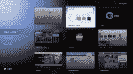
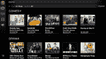
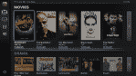
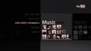
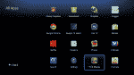

# 谷歌电视更新周日推出:更好的内容发现，安卓市场，但 Hulu 仍被封锁 

> 原文：<https://web.archive.org/web/http://techcrunch.com/2011/10/28/just-lipstick-on-a-pig/>

在正式推出一年后，谷歌电视终于准备好迎接黄金时段了。从周日开始，更新将首先推广到索尼互联网电视设备，随后罗技 Revue 设备将很快推出。现有用户可能会喜欢这次更新，因为它带来了重新设计的界面和 Android Market 的选择。这似乎正是该平台去年推出时应该有的样子。但是对于其他人来说，不管是那些想切断电缆的人还是那些想用网络视频来补充付费电视的人，这仍然是一个艰难的推销。一年前与谷歌电视相关的所有没落依然存在。虽然该系统可能不再是半生不熟的，但我仍然不确定谷歌电视是否值得在你的客厅中占有一席之地。

## 新刷的一层油漆

谷歌电视的第一个版本一团糟。屏幕之间的用户界面不一致，并且通常运行缓慢。搜索屏幕使用了完全不同的界面，主屏幕也不是为电视设计的。像大多数第一代谷歌产品一样，它感觉像一个测试版。

* * *

陈旧杂乱的谷歌电视主屏幕

更干净的新谷歌电视主屏幕

* * *

谷歌电视团队重新开始，使用 Android 作为设计模板。我不能谈论它的操作，因为我自己也在等待更新，但从我看到的屏幕和演示来看，新的界面完全不同，它最终看起来像一个真正的 10 英尺界面。主屏幕现在只有一行可定制的图标。它包含了最常用的应用程序，以及方便的时钟和通知链接。应用程序屏幕现在使用更自然的网格排列，而不是列表，Android Market 看起来像蜂窝一样。但在所有的用户界面变化中，谷歌电视工程师花了最多的时间来改进内容发现。

谷歌电视从来不是为脐带切割者设计的。它旨在与付费电视共存，但以无缝的体验呈现互联网视频和应用程序。最初的谷歌电视搜索应用程序是一个令人惊叹的工具，但在大媒体封锁免费流媒体网站后，这个工具就瘫痪了。这就是新的电视和电影应用程序的用武之地。

* * *

电视和电影

电视和电影

## 一切都与应用程序有关

将电视和电影应用程序视为一个新的指南。它试图将有线/卫星内容与主要付费流媒体服务的节目结合在一起。更好的是，它很智能，根据观看历史和偏好显示结果。说你想看*木板路帝国*。该指南介绍了所有可用的观看选项:当然是你的电视提供商的 HBO 频道，但也包括 HBO Go，以及网飞或亚马逊(如果它们可用的话)。这些信息以华丽的网格视图呈现，并配有封面和附加信息。在我上周与谷歌电视负责人 Mario Queiroz 的一次聊天中，他表示该团队的目标是为这项服务提供一个 API，旨在进一步改善搜索体验。

Android Market 自发布以来就一直在产品中缺失，是最新更新的一部分。该市场将只推出可以在电视上运行的 Android 应用，不需要触摸屏等特定硬件。800 个发布的应用中有 30 个会被特别介绍，包括美国消费者新闻与商业频道、福克斯新闻频道商业、Zillow 和 Aol HD——所以，你知道，你可能不会使用的应用。马里奥向我表示，HTML 5 谷歌电视应用程序并没有从标准的安卓应用程序中分离出来，因为对用户来说，它们仍然是应用程序。聪明。

* * *

新的 YouTube 应用程序

YouTube 后仰

YouTube 一直是谷歌电视的重要组成部分，新版本推出了一个完全重新设计的平台专用的倾斜 YouTube 应用程序。Windows Media Center 用户应该有宾至如归的感觉。该应用程序是微软老化的 HTPC 程序的虚拟克隆。左侧下方是一个快捷方式列表，而一个干净的标题布局用于内容，包括至少从截图上看起来是即将推出的 YouTube 频道。新的 YouTube 应用程序是在 GTV 团队发现用户使用 YouTube 的次数是预期的两倍之后开发的(可能是因为大型媒体屏蔽了其免费内容)。

Google +最终将进入谷歌电视，并有可能将该平台从死亡池中拯救出来。当然，Google +可能也需要一个救生圈。马里奥解释说，Google +的社交工具完全符合谷歌电视团队章程。从分享照片到电视探索，一切都可以成为社交体验，该团队正在与 Google +的孩子们密切合作，整合所有功能。当 Google +登陆 GTV 时——谷歌还没有宣布时间表——它可能会成为社交网络粉丝的必备。分享媒体是 Google +的优势之一，可以很好地融入 Google TV。

新的谷歌电视硬件似乎终于为消费者准备好了，但我不确定它是这项工作的最佳平台。第一个版本是设计元素、突兀的界面和奇怪的导航路径的大杂烩。新界面看起来很棒，可能感觉更自然，但谷歌电视仍然受到大媒体的阻碍。此次更新只解决了硬件和软件问题——这是一个工程师团队可以控制的事情。不幸的是，谷歌电视第一次没有成功，因为一个更大的根本问题仍未解决。

* * *

原始应用程序列表

新的应用菜单

## 历史课

谷歌电视是去年秋天科技媒体的宠儿。它被认为是下一个大事件，同时在客厅击败苹果，同时扰乱电视的消费方式。罗技预计其 299 美元的 Revue 谷歌电视将售出 50 万台。[索尼率先推出了互联网电视](https://web.archive.org/web/20230203062240/https://techcrunch.com/2010/10/12/sony-google-tv/)([MG 讨厌遥控器](https://web.archive.org/web/20230203062240/https://techcrunch.com/2010/10/05/google-tv-remote/))，几周后罗技型号也紧随其后。

早期的评论几乎普遍喜欢它，但是[然后大媒体攻击](https://web.archive.org/web/20230203062240/https://techcrunch.com/2010/10/21/abc-cbs-and-nbc-shut-out-google-tv-fox-and-mtv-still-available/)。突然间，美国广播公司、全国广播公司和哥伦比亚广播公司关闭了谷歌电视，福克斯和其他网络也紧随其后。Hulu、Fancast 和所有其他聚合流媒体网站也被封锁。它从未被设计成脐带切割者的机顶盒，但至少在它首次推出之前，它似乎是完美的 Hulu streamer。如果没有这些内容，谷歌电视就变成了一个美化了的 YouTube/网飞盒子，在类似设备售价 99 美元的情况下，以 299 美元的价格强行出售是非常困难的。

仅仅几个星期后，这个展示了如此多的承诺的平台就搁浅了，只是试图保持漂浮。谷歌电视很快变得默默无闻，罗技最终将 Revue 的价格下调了 2/3，降至 99 美元。谷歌电视发布时的负面报道实际上第一次就烧毁了谷歌电视，我不确定这种新的涂料能否覆盖灰烬。

在接下来的几天里，期待一个完整的谷歌电视 2.0 评论。这一重大更新保证了对该平台的另一种审视。然而，尽管我确信谷歌电视现在运行得像冠军一样，但它看起来仍然没有 Roku 的界面更友好，Boxee Box 仍然可以访问所有被谷歌电视阻止的免费内容。那么对于苹果用户来说，苹果电视提供了令人敬畏的统一体验。仍然没有任何谷歌电视独有的显著特征。

谷歌电视仍然停滞不前。这个最新的更新带来了大量的功能和改进的界面。但是它没有增加内容，内容才是王道。谷歌今天宣布，三星、Vizio 和其他未宣布的合作伙伴明年将推出新的硬件。新设备将使用更强大的芯片组，这可能会使谷歌电视如丝般流畅。但是 Hulu 和其他所有的东西在这个新的硬件上仍然会被屏蔽，让谷歌电视成为……一个美化了的 YouTube/网飞盒子。又来了。

奖金！谷歌刚刚发布了更多新应用的演示视频。下面是新的概述视频，其余的在这里。

http://www.youtube.com/watch?v = jmqvqgbcp 0 a & feature = autoshare