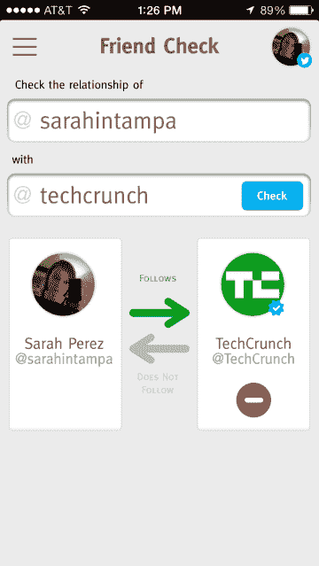

# JustUnfollow 是一款 Twitter & Instagram 好友管理应用，你可能会用到它 TechCrunch

> 原文：<https://web.archive.org/web/https://techcrunch.com/2013/08/09/justunfollow-is-a-twitter-instagram-friend-management-app-you-might-actually-use/>

让我直截了当地说明这一点:我个人不喜欢“帮助你更好地管理你的 Twitter 追随者”的服务，因为它们往往被那些试图利用系统以无机方式增加他们的受欢迎程度的人所使用。话虽如此，我*并不完全讨厌* JustUnfollow 新推出的、完全重新设计的移动应用。事实上，我甚至可能开始使用这个东西。

对于那些不熟悉的人来说，JustUnfollow 是 Twitter 好友管理业务的长期参与者，最初在 TechCrunch 上有一个有点不吉利的开始，当时创始人迈克尔·阿灵顿[写道该应用程序不能正常工作](https://web.archive.org/web/20230131005303/https://techcrunch.com/2010/02/22/twitter-tool-to-justunfollow-doesnt-work-starts-office-fight/)，导致一些内部办公室争斗。自那以后，该公司取得了进展——显然是修复了这个漏洞——加上 1 月份增加了对 Instagram 的支持，最近用户数量达到了约 400 万——高于去年 8 月的 100 万用户里程碑。

用于 [iOS](https://web.archive.org/web/20230131005303/https://itunes.apple.com/in/app/justunfollow/id528626975?mt=8) 和 [Android](https://web.archive.org/web/20230131005303/https://play.google.com/store/apps/details?id=com.justunfollow.android) 的 JustUnfollow 移动应用自去年推出以来已经被下载了 170 万次，帮助了这一增长。该公司现在的 Instagram 用户也超过了 100 万。

这些移动应用程序提供了各种工具来管理你的追随者，其中一些是免费的，其他的你可以“通过推特解锁”(我知道，呃)，或者你可以咬紧牙关购买订阅。个人有两种付费计划:4.99 美元/年，无限关注和不关注，加上 10，000 个白名单/黑名单账户，或 24.99 美元/年，最多 5 个 Twitter 账户。对于像社交媒体机构这样的企业，包括客户支持在内的扩展功能集的价格从每月 9.99 美元到每月 199 美元不等。

JustUnfollow 的付费客户群超过 3 万人，虽然他们还没有谈到收入，但创始人 Nischal Shetty 指出，他的 bootstraped 公司现在在印度的新慕白有一个 8 人的全职团队，他们就在那里。

在应用程序中，您可以查看哪些人没有关注您，您的粉丝，那些最近关注和未关注您的人，不活跃的粉丝，您的整个粉丝群，等等。还可以复制别人的关注者，检查个人关系互惠(嗯， [@ferenstein](https://web.archive.org/web/20230131005303/https://twitter.com/ferenstein) ，wtf？等等， [@TechCrunch](https://web.archive.org/web/20230131005303/https://twitter.com/techcrunch) 不关注我？天啊。)您也可以将用户列入白名单和黑名单，如上所述。

我不得不承认，我并不是这类东西的目标市场，所以我发现它很吸引人有点令人惊讶。毕竟，我不太关心我的推特粉丝群的每日进出。我知道有很多人和我一样，被定期关注和不关注带来的头痛所困扰，以至于他们已经放弃了。换句话说，我个人不会关注或不关注任何人，真的，我也不在乎每天跟踪这些数据。(如果我有，我可以使用 Twitter 现在发送的普通电子邮件，其中包括可以点击的按钮，让你追踪你的新粉丝。)

但我喜欢在自己的时间里分批做这种事情——回顾我应该添加谁，或者清理那些很久以前就放弃 Twitter 的账户——就像那些后来继续前进的老创业公司一样(例如，雅虎)。

很可能，在 JustUnfollow 应用上说服我的不是功能集——这些相同的工具在网络上随处可见，包括像 FriendorFollow 这样的竞争对手。让应用程序令人愉快的是与设计相结合的功能。JustUnfollow 感觉很现代，很有吸引力，使用和理解起来也很简单。这足以让我多年来第一次开始考虑管理我的 Twitter 关注者。

JustUnfollow 在 [iOS 这里](https://web.archive.org/web/20230131005303/https://itunes.apple.com/in/app/justunfollow/id528626975?mt=8)和[安卓这里](https://web.archive.org/web/20230131005303/https://play.google.com/store/apps/details?id=com.justunfollow.android)可用。(我应该指出，一些 iOS 用户在 App Store 评论中报告了应用崩溃的问题。我没有经历过这个问题，所以你的里程可能会有所不同，就像他们说的那样。)