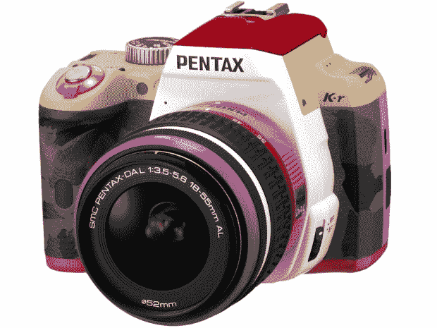
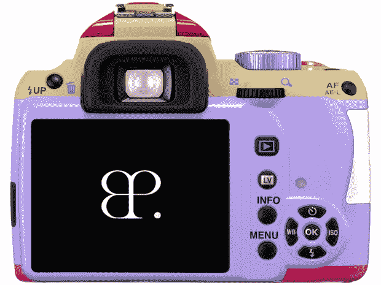

# “K-r BONNIE PINK MODEL”:又一款宾得 DSLR 特别版 

> 原文：<https://web.archive.org/web/http://techcrunch.com/2011/02/04/k-r-bonnie-pink-model-yet-another-pentax-dslr-special-edition/>

# “K-r BONNIE PINK MODEL”:又一款宾得 DSLR 特别版

宾得似乎对拥有[时髦设计](https://web.archive.org/web/20230203035646/http://search.beta.techcrunch.com/query.php?s=pentax+colors)的数码相机情有独钟，这次是[宾得 K-r](https://web.archive.org/web/20230203035646/http://www.crunchgear.com/2010/09/09/pentax-announces-k-r-dslr-for-800/) 将获得限量版待遇。宾得今天[公布了](https://web.archive.org/web/20230203035646/http://www.camera-pentax.jp/k-r/news/20110204.html)【JP】所谓的 K-r BONNIE PINK MODEL”，该相机的重新设计版本，于去年[发布](https://web.archive.org/web/20230203035646/http://www.crunchgear.com/2010/09/09/pentax-announces-k-r-dslr-for-800/)。

邦妮·平克是一位相当著名的日本流行歌星的名字。

从技术上来说，宾得没有改变任何东西，除了增加了一个显示歌手标志的开机屏幕。买家将获得与相机捆绑在一起的阿达 L 18-55mm F3.5-5.6 AL BONNIE 粉色模型镜头。

这款相机将仅限于 100 台(价格:1100 美元)。宾得将于下个月开始销售:如果你想买一台，但不住在日本，可以去专门的网上商店 [Rinkya](https://web.archive.org/web/20230203035646/http://www.rinkya.com/) 问问。