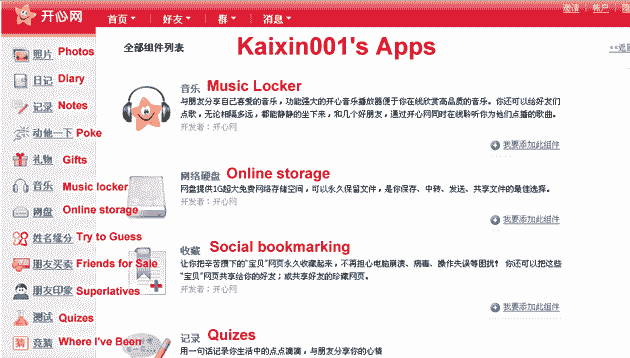
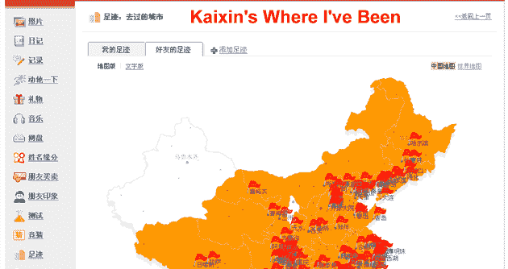
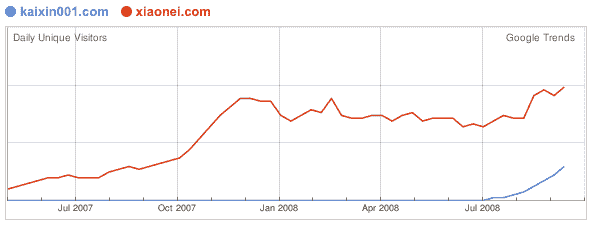
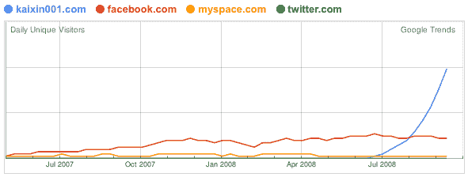

# 开心网 001:中国社交网络的苹果

> 原文：<https://web.archive.org/web/https://techcrunch.com/2008/10/16/kaixin001-chinas-apple-of-social-networks/>

# 开心网 001:中国社交网络的苹果

***编者按:**这篇客座博文由艾伦·拉特利奇(Alan Rutledge)撰写，他曾在谷歌 Picasa 和雅虎 Overture 背后的创业孵化器 [Idealab](https://web.archive.org/web/20230327222228/http://www.idealab.com/) 担任开发人员。*

* * *

[开心网 001](https://web.archive.org/web/20230327222228/http://www.kaixin001.com/) ，中国[脸书克隆战争](https://web.archive.org/web/20230327222228/https://techcrunch.com/2008/04/30/chinese-facebook-clone-xiaonei-raises-a-staggering-430-million/)的最新成员，是中国发展最快的社交网络，自 2008 年 5 月上线以来的前 5 个月已经积累了惊人的 750 万用户。该网站仅在 9 月份就将 Twitter 的流量增加了两倍，目前是 Alexa 全球第 250 大最受欢迎的网站。

与定位于大学生的竞争对手校内网相比，开心网 001 以更简单的用户界面吸引了白领上班族，对年长的观众来说更直观。这是中国的一个重要细节，四分之一的大学生没有电脑，只能步行去网吧按分钟付费才能进入校内网。相比之下，白领上班族平均每天花九个小时在电脑前。

开心网 001 的成功仅仅是因为它只克隆了最成功的脸书应用程序，并在其他任何人之前将其引入中国市场。他们克隆的病毒点击的例子有:

*   **老友记出售**:女性在这个游戏中拥有不公平的优势，这要感谢中国拥有[世界上最高的男女比例之一](https://web.archive.org/web/20230327222228/http://www.msnbc.msn.com/id/5953508)。
*   停车大战:具有讽刺意味的是，大多数中国人买不起真正的汽车，这使得这个游戏更加引人注目。
*   **我喜欢**:直到最近的打击行动，中国的同类产品允许你上传你的全部音乐收藏并与你的朋友分享。
*   我去过的地方:这个应用默认为中国的一个省的地图，因为大多数人从来没有离开过这个国家。

一个值得注意的非克隆产品是在线存储，这是一个基于云的文件共享应用，可以追溯到[脸书对点对点文件共享的早期尝试](https://web.archive.org/web/20230327222228/http://www.thecrimson.com/article.aspx?ref=503946)，当时以 Napster 闻名的肖恩·帕克还是这家羽翼未丰的初创公司的总裁。

硅谷可能会避免公然克隆，但在中国和世界其他地方，克隆是从较低投资风险中受益的金融支持者的期望。克隆太慢实际上已经伤害了校内网，现在它被开心网 90%的月增长率所掩盖。

作为一个 20 人起步、资源有限的初创公司，开心网为什么要开发所有的应用？在西方世界拥抱开放网络平台的时候，这种方法给我们的印象是反直觉的，甚至是倒退的。然而，中国的网络平台面临着几个关键问题:

*   **获得资本的渠道有限**:风险资本在中国很稀缺。相比之下，迄今为止，已有近 2.5 亿美元投入到脸书的申请中。
*   疲软的在线广告市场:中国网络公司严重依赖虚拟商品和微交易；这两种模式都不适用于开心网的大多数应用。
*   猖獗的软件盗版:在中国，由于盗版导致软件市场停滞不前，工作机会有限，因此开发第三方应用程序的开发人员相对较少。
*   **语言障碍**:大多数开源语言和文档主要以英语提供。本来可以成为优秀程序员的中国人正在努力克服这个额外的障碍。

校内网上的 700 个第三方应用质量参差不齐。开心 001 只有 25 个应用程序，但它保留了对质量的完全控制，并拥有所需的速度和专注，比竞争对手更快地将精心调整的病毒式流行带到中国市场——事后看来，这或许是更好的策略。

成千上万的人经常访问 kaixin.com，而不是正确的 kaixin001.com 域名。最近，校内网的母公司购买了 Kaixin001 域名，并计划推出一个“开心网 001”克隆版，以窃取竞争对手的用户。这实际上使辛凯成为了克隆人的克隆人的克隆人。太神奇了。

开心网是由一位来自 Sina.com 的前高管创建的。最近完成了来自[北极光风险投资](https://web.archive.org/web/20230327222228/http://www.nlightvc.com/)的 400-500 万美元的首轮投资。

